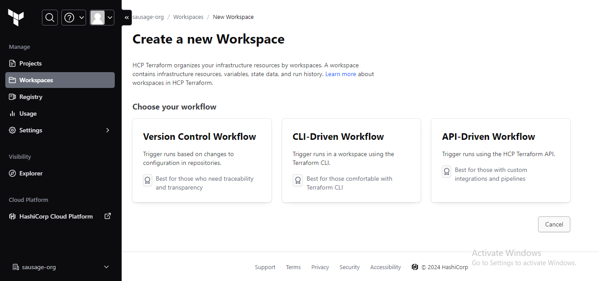

# IMPROVING CLOUD INFRASTRUCTURE AUTOMATION PART 4

## Automate Infrastructure With IaC using Terraform. Part 4 - Terraform Cloud

### What Terraform Cloud is and why use it

By now, you should be pretty comfortable writing Terraform code to provision Cloud infrastructure using **Configuration Language (HCL)**. Terraform is an open-source system, that you installed and ran a Virtual Machine (VM) that you had to create, maintain and keep up to date. In Cloud world it is quite common to provide a managed version of an open-source software. Managed means that you do not have to install, configure and maintain it yourself - you just create an account and use it "as A Service".

**Terraform Cloud** is a managed service that provides you with Terraform CLI to provision infrastructure, either on demand or in response to various events.

By default, Terraform CLI performs operation on the server whene it is invoked, it is perfectly fine if you have a dedicated role who can launch it, but if you have a team who works with Terraform - you need a consistent remote environment with remote workflow and shared state to run Terraform commands.

Terraform Cloud executes Terraform commands on disposable virtual machines, this remote execution is also called remote operations.

Instead of running the Terraform codes in Project-18 from a command line, rather it is being executed from Terraform Cloud console. The AMI is built with PACKER while ANSIBLE is used to configure the infrastructure after its been provisioned with the Terraform script.

TASKS

- Build AMIs using Packer
- Update the terraform script with the AMI IDs generated from packer build
- Create terraform cloud and backend
- Run terraform script
- Update Ansible script with values from Terraform output
- RDS endpoints for wordpress and tooling
- Database name, password and username for wordpress and tooling
- Access point ID for wordpress and tooling
- Internal Load balancer DNS for Nginx reverse proxy
- Run the Ansible script
- Access the website through the browser.

PREREQUISITE

- Install ANSIBLE
- Install PACKER.
- Configure AWS CLI.

### What is Packer?

Packer is an open source tool for creating identical machine images for multiple platforms from a single source configuration. Packer is lightweight, runs on every major operating system, and is highly performant, creating machine images for multiple platforms in parallel.


### STEP 1 - Building AMI for reverse proxy and webservers using packer

We write packer code which helps us create AMIs for each of the following mentioned servers. A sample of the code can be found [here](https://github.com/temitayo-ob/2-company-website.git) packer code setup

For each of the following .pkr.hcl files, we run the following commands

```
- packer fmt <name>.pkr.hcl
- packer validate <name>.pkr.hcl
- packer build <name>.pkr.hcl
```


### STEP 2 - Migrate your .tf codes to Terraform Cloud

Let us explore how we can migrate our codes to Terraform Cloud and manage our AWS infrastructure from there:

1. Create a Terraform Cloud account

2. Create an organization



3. Configure a workspace

We will use version control workflow as the most common and recommended way to run Terraform commands triggered from our git repository.

Create a new repository in your GitHub and give it an appropriate name, push your Terraform codes developed in the previous projects to the repository.

Choose version control workflow and you will be promped to connect your GitHub account to your workspace - follow the prompt and add your newly created repository to the workspace.

Move on to "Configure settings", provide a description for your workspace and leave all the rest settings default, click "Create workspace".


4. Configure variables

Terraform Cloud supports two types of variables: environment variables and Terraform variables. Either type can be marked as sensitive, which prevents them from being displayed in the Terraform Cloud web UI and makes them write-only.

Set two environment variables: AWS_ACCESS_KEY_ID and AWS_SECRET_ACCESS_KEY, set the values that you used in Project 16. These credentials will be used to provision your AWS infrastructure by Terraform Cloud.

After you have set these 2 environment variables - yout Terraform Cloud is all set to apply the codes from GitHub and create all necessary AWS resources.


5. Now it is time to run our Terrafrom scripts, Refer to [this](https://github.com/temitayo-ob/2-company-website.git) repository for guidiance on how to refactor your enviroment to meet the new changes above **(inclusion of packer to build AMI and Ansible to configure the infrastructure)** and ensure you go through the README.md file. 

6. Run `terraform plan` and `terraform apply` from web console

Switch to "Runs" tab and click on "Queue plan manualy" button. If planning has been successfull, you can proceed and confirm Apply - press "Confirm and apply", provide a comment and "Confirm plan"

Check the logs and verify that everything has run correctly. Note that Terraform Cloud has generated a unique state version that you can open and see the codes applied and the changes made since the last run.


7. Test automated `terraform plan`

By now, you have tried to launch plan and apply manually from Terraform Cloud web console. But since we have an integration with GitHub, the process can be triggered automatically. Try to change something in any of `.tf` files and look at "Runs" tab again - plan must be launched automatically, but to apply you still need to approve manually. Since provisioning of new Cloud resources might incur significant costs. Even though you can configure "Auto apply", it is always a good idea to verify your plan results before pushing it to apply to avoid any misconfigurations that can cause 'bill shock'.


Replece AMI ids generated earlier into out .auto.tfvars


### STEP 3 - Ansible Dynamic Inventory

Its time to configure our infrastructure using Ansible dynamic inventory.

A dynamic inventory is a script written in Python, PHP, or any other programming language. It comes in handy in cloud environments such as AWS where IP addresses change once a virtual server is stopped and started again.

We make use of dynamic inventory to get Ip address of our servers created based on their tag names and hence we are able to run the required role on each server.

- Sign into your bastion server and configure aws credentials using `aws configure` (bastion server can connect to our webservers in the private subnets via ssh), and test connections to aws console, clone your repo into your server.


We make use of dynamic inventory to get Ip address of our servers created based on their tag names and hence we are able to run the required role on each server.


### Note- update your codes with your newly provisioned RDS endppoint for the tooling and webservers and also update the database login details, also the EFS mount access points. we also need to update the nginx codes with the internal load balancer DNS name.


-  Run ansible playbook and confirm health checks on the aws console for the nginx and web servers.**(dont forget to update the roles path in the ansible.cfg file before running ansible-playbook)**.


- Access the website from the browser


- We successfully Introduced Terraform Cloud, Ansible & Packer to Automate AWS Cloud Solution for 2 Company Websites.

- Destroy infrastructure when completed


