# MONITORING INFRASTUCTURE IN AWS (CLOUDWATCH AND CLOUDTRAIL)

## Introduction to Monitoring Infrastructure in AWS

### Monitoring Infrastructure in AWS (Cloudwatch, Cloud trail)

Imagine you've just launched your startup's new application on Amazon Web Services (AWS). Excitedly, you see traffic start to flow in as users begin to interact with your service. However, with success comes responsibility. As your application grows, so does the complexity of managing its underlying infrastructure. How do you ensure that everything continues to run smoothly? How do you detect and address issues before they impact your users? This is where monitoring your infrastructure becomes crucial.

Monitoring, refers to the process of observing and collecting data about the performance, health, and behavior of systems, applications, networks, or infrastructure components. The primary goal of monitoring is to ensure that these systems operate effectively, efficiently, and securely, while also detecting and addressing any issues or anomalies in a timely manner.

### AWS CloudWatch and CloudTrail

AWS CloudWatch is a monitoring and observability service provided by Amazon Web Services (AWS). It allows users to collect and track metrics, monitor logs, set alarms, and automatically react to changes in AWS resources and applications running on the AWS infrastructure. CloudWatch provides insights into the performance, health, and operational status of AWS resources and applications, helping users to troubleshoot issues, optimize resource utilization, and ensure the reliability of their systems.

AWS CloudTrail on the other hand is also a service provided by Amazon Web Services (AWS) that enables governance, compliance, operational auditing, and risk auditing of your AWS account. CloudTrail records and logs all API activity in your AWS account, providing a comprehensive trail of events that can be used for security analysis, resource change tracking, troubleshooting, and compliance auditing.

### Monitoring AWS EC2 using CloudWatch

Now that we an idea of what AWS CloudWatch and CloudTrail is all about, let launch an EC2 instance and monitor it

### Step 1: Create an IAM Role With CloudWatchFull Access and SSMFullAccess

1. Navigate to the IAM console.

2. In the IAM Console navigation click on roles.

3.  Create a role with CloudWatchFullAccess and SSMFullAccess policy

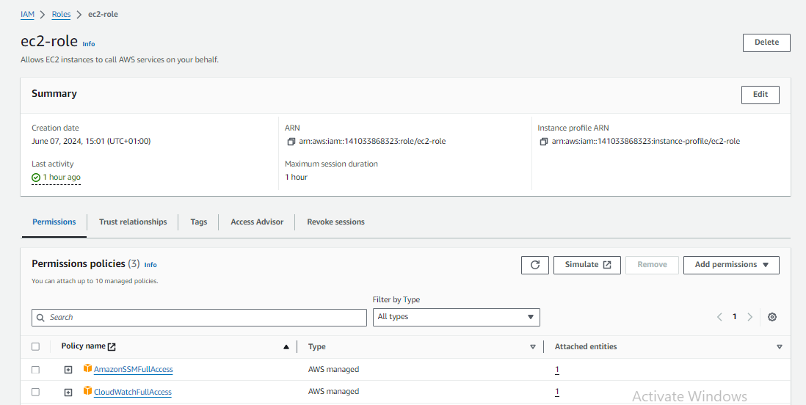

## Create A Parameter In System Manager

Now that we have created an IAM role, we need to create a paramater in the system manager console. By doing this, we will be able to define the metrics we want to monitor for our EC2 instance

1. Navigate to the AWS System Manager Console

2. In the AWS System Manager navigate menu, select parameter store

3. Create a new parameter and paste the code snippet below

```
{
	"metrics": {
		"append_dimensions": {
			"InstanceId": "${aws:InstanceId}"
		},
		"metrics_collected": {
			"mem": {
				"measurement": [
					"mem_used_percent"
				],
				"metrics_collection_interval": 180
			},
            "disk": {
				"measurement": [
                     "disk_used_percent"
				],
				"metrics_collection_interval": 180
			}
		}
	}
}
```
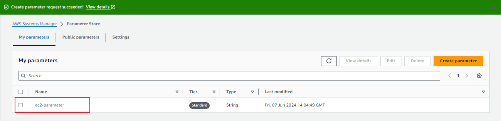
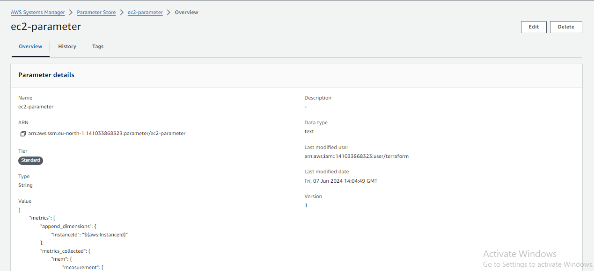

The parameters above are a configuration file for the CloudWatch agent, which defines the metrics that will be collected from your EC2 instance and sent to CloudWatch.

1. "metrics": This is the top-level key in the configuration file, indicating that it contains the definitions for the metrics to be collected.

2. "append_dimensions": This section specifies dimensions to be appended to all collected metrics. Dimensions are key-value pairs that help identify the source of the data in CloudWatch. In this case, the dimension "InstanceId" is appended, and its value is populated dynamically with the instance ID of the EC2 instance where the CloudWatch agent is installed.

- "InstanceId": "${aws:InstanceId}": This line specifies that the value of the "InstanceId" dimension should be dynamically populated with the instance ID of the EC2 instance.

3. "metrics_collected": This section defines the specific metrics to be collected from the EC2 instance.

- "mem": This subsection specifies memory-related metrics to be collected

   - "measurement": This is an array of specific memory metrics to collect. In this case, only "mem_used_percent" is specified, which represents the percentage of memory used on the instance.
   - "metrics_collection_interval": This parameter specifies how frequently (in seconds) the metrics should be collected. Here, memory metrics will be collected every 60 seconds.

- "disk": This subsection specifies disk-related metrics to be collected.

   - "measurement": This is an array of specific disk metrics to collect. Only "disk_used_percent" is specified, representing the percentage of disk space used on the instance.
   - "metrics_collection_interval": Similar to the memory section, this parameter specifies how frequently disk metrics will be collected, which is every 60 seconds.

### Create an EC2 Instance, Attach the role created in Step 1

Now that we have created an IAM Role and also created a parameter in the Account System Manager Console, let's create an EC2 instance and that roles we created earlier. But note that SSM will have access to the parameter we created and by attaching the role to the EC2 instance, EC2 will also have access to the parameters

1. Navigate to the EC2 console, select instances. Click on launch instance on the top right

2. Now we will need to launch an `Amazon linux 2 instance` and attach the role we created in `step 1`.Follow the images below to attach IAM role to your instance

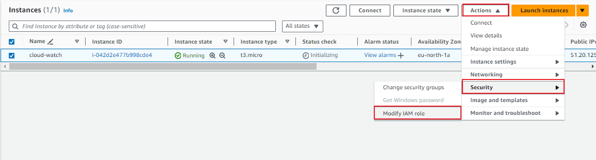

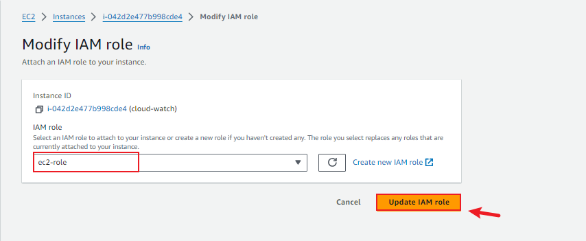

3. Install CloudWatch agent. Create a file name script.sh and past the shell script below.

`sudo nano script.sh`

- Paste the shell script below

```
#!/bin/bash
wget https://s3.amazonaws.com/amazoncloudwatch-agent/linux/amd64/latest/AmazonCloudWatchAgent.zip
unzip AmazonCloudWatchAgent.zip
sudo ./install.sh
sudo /opt/aws/amazon-cloudwatch-agent/bin/amazon-cloudwatch-agent-ctl -a fetch-config -m ec2 -c ssm:/alarm/AWS-CWAgentLinConfig -s
```

- Make the file executable

`sudo chmod +x script.sh`

- Save and run the file

`./script.sh`

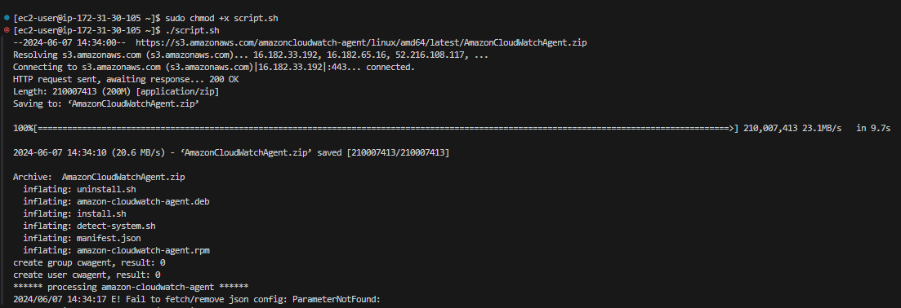

4. Start the CloudWatch agent

` sudo /opt/aws/amazon-cloudwatch-agent/bin/amazon-cloudwatch-agent-ctl -m ec2 -a start`

5. Verify if CloudWatch is installed and successfully running

`sudo /opt/aws/amazon-cloudwatch-agent/bin/amazon-cloudwatch-agent-ctl -m ec2 -a status`

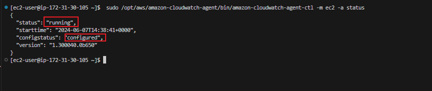

## Step 4: Monitor Your Metric In CloudWatch

Before we can monitor our EC2 instance metrics, create a new policy and attach it to our IAM role so that the role does not lack permissions to perform the ec2:DescribeTags action, which is necessary for the CloudWatch agent to retrieve EC2 instance tags.

1. Create a new Policy

- In the IAM console navigation menu, click on policy and on the top right, select create policy. Use the Json code snippet below for your policy, and attach the policy to the role created earlier.

```
{
    "Version": "2012-10-17",
    "Statement": [
        {
            "Effect": "Allow",
            "Action": [
                "ec2:DescribeTags"
            ],
            "Resource": "*"
        }
    ]
}

```

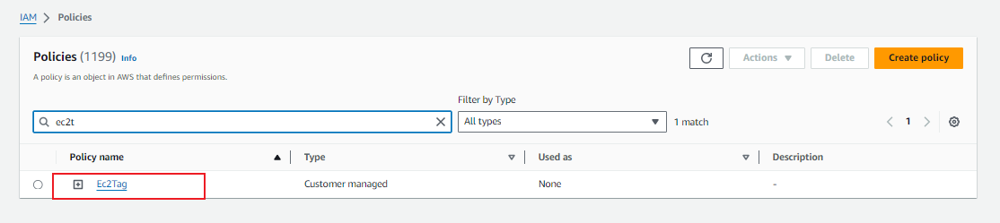

2. Let's recall the parameters we created for our EC2 metric, now let's view the metric on CLoudWatch console.

- Navigate to the CloudWatch console . In the navigation menu, select all metrics.

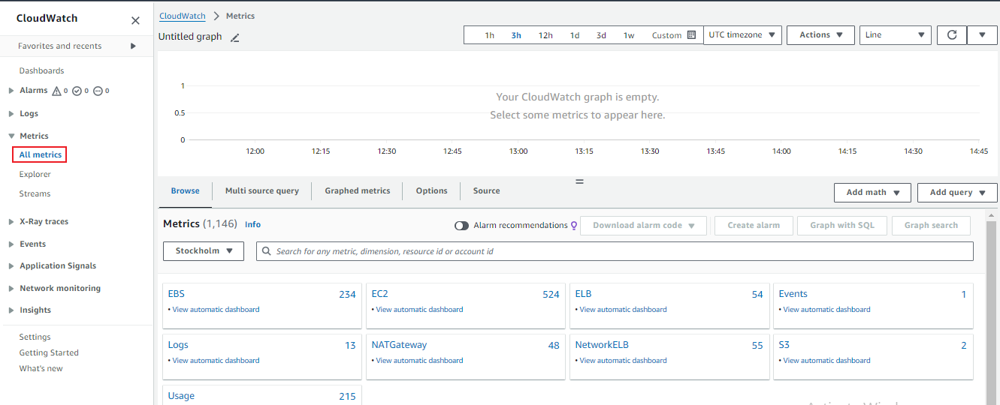

- Select the browser tab and. Search and click on CWAgent

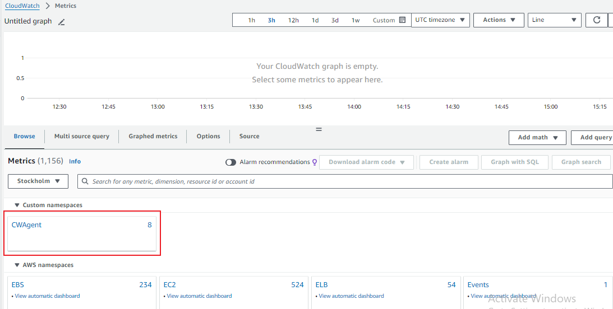

- Select either of the two as highlighted in the image below to view any of the metric we defined in our parameter.

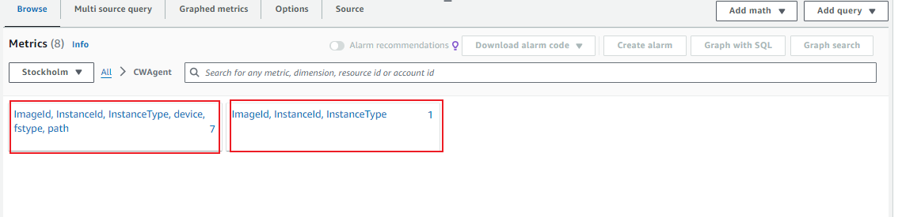

- We can view our metric the memory percent of our EC2 instane


You have successfuully installed and cofigured CloudWatch to monitor your EC2 instance.

To monitor more metrics, you can go to the parameter store and edit the parameter we created then add more parameters to it. Follow the [AWS official documentation](https://docs.aws.amazon.com/AmazonCloudWatch/latest/monitoring/CloudWatch-Agent-Configuration-File-Details.html) to read more on parameters syntax for metrics

Thank you.


