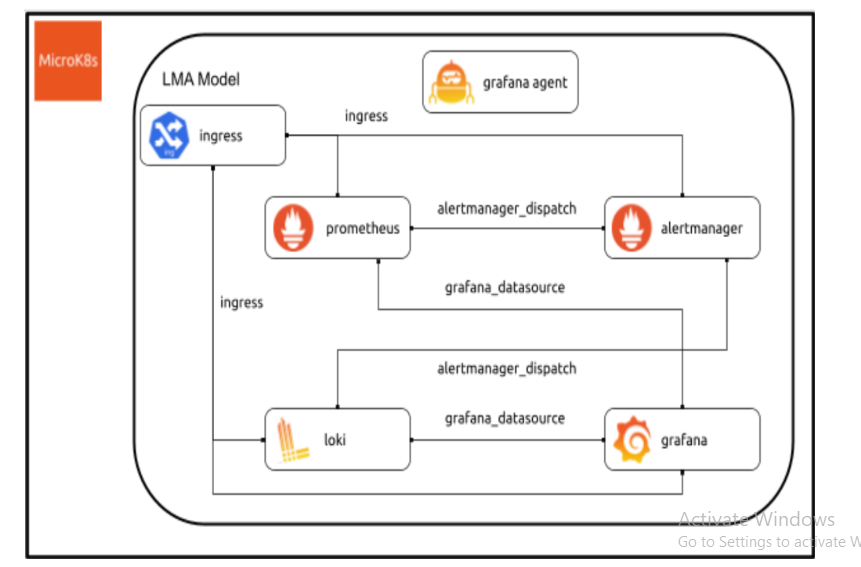
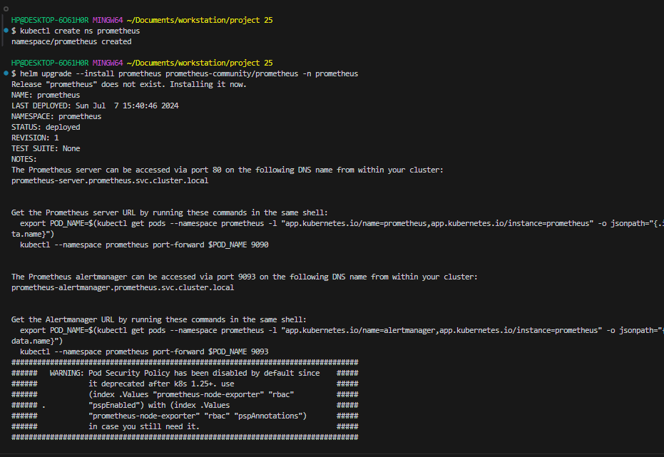
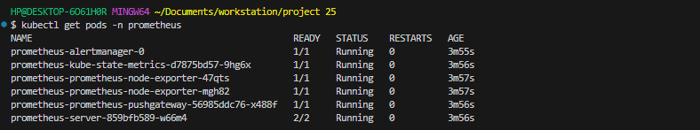
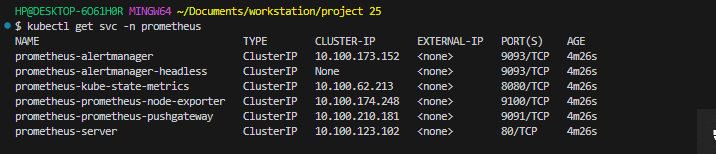
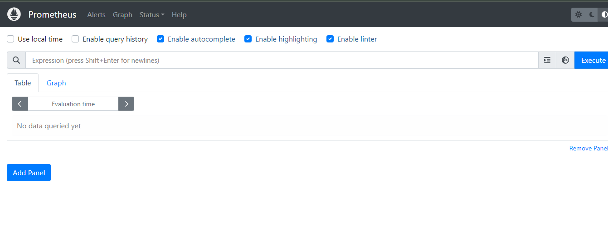
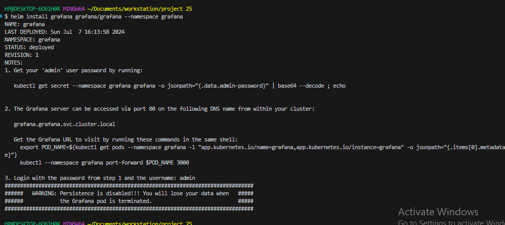
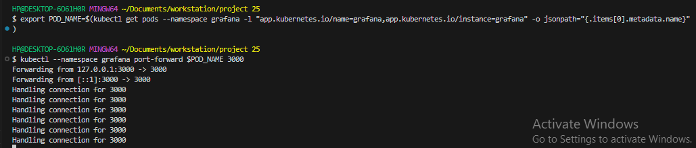
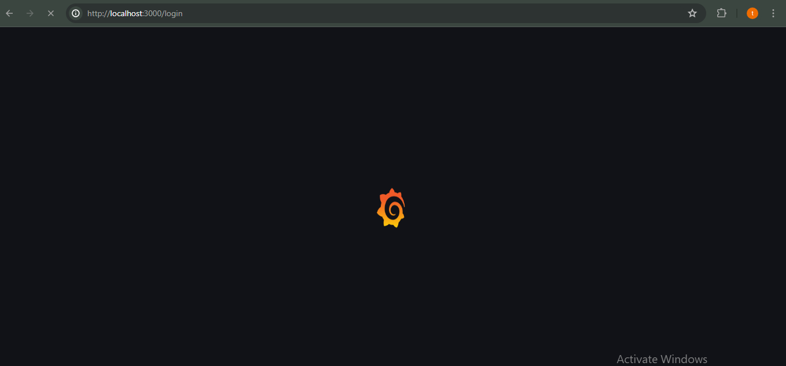
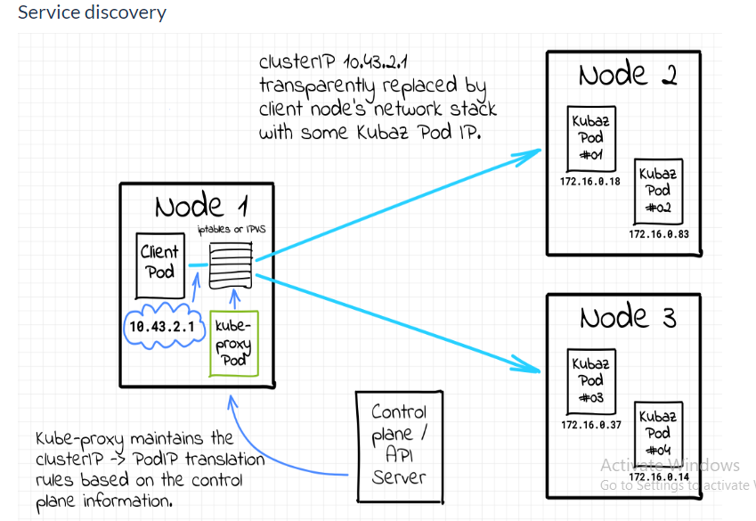
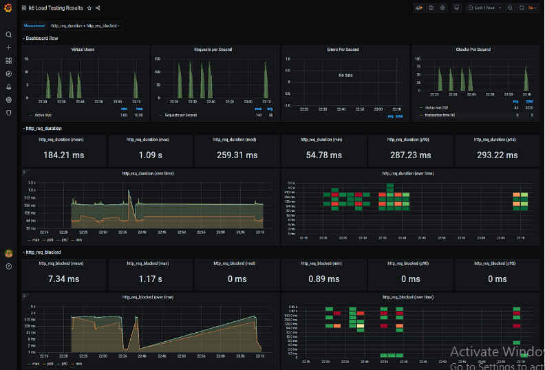

### MONITORING IN KUBERNETES

Monitoring in Kubernetes is essential for gaining visibility into the health, performance, and resource utilization of your containerized applications, enabling proactive troubleshooting, optimization, and ensuring the overall stability of your Kubernetes environment

## Deploying and configuring monitoriing tools for HA (Prometheus, Alert Manager, Grafana)



Observability and Monitoring are related concepts in the field of software development. However they have distinct purpose in spite of their similarities.

Monitoring is a subset of observability. Its invloves the process of collecting data and information about a system's behavior, performance, and health. Tools or systems are set up to track metrics,logs, events of the system(application)

Monitoring is primarily concerned with measuring and alerting on predefined indicators or thresholds, such as CPU usage, memory usage, error rates, or response times.

In a nutshell monitoring tells or alerts you when something goes wrong with the system(application).

You will agree with me that knowing what is wrong with the system is not enough. We need to find out why things went wrong and come up with proactive measures to prevent it from happening again. This is where Observability comes in.

Observability is a broader and more holistic approach to understanding and troubleshooting complex systems. It emphasizes the ability to gain insights and understanding from the system's internal behavior and state based on the available data. Observability focuses on generating meaningful and actionable insights from the collected data, going beyond simple monitoring and alerting.

Observability involves instrumenting the system to produce high-quality, fine-grained data that can be used to analyze the system's behavior and diagnose issues effectively. It typically involves capturing detailed logs, metrics, traces, and other telemetry data, which are then analyzed through various tools and techniques. By leveraging this comprehensive set of data, observability enables engineers to understand the cause-and-effect relationships within the system, trace the flow of requests, identify performance bottlenecks, and debug complex issues.

### The Three Pillars of Observability

The three pillars of observability are:

1. Metrics
2. Logs
3. Traces

### Metrics

Metrics can be a wide range of values, monitored over a period of time. Metrics are often key performance indicators such as CPU capacity, memory usage, latency, or anything else that provides insights into the health and performance of your system. The changes in these metrics allows teams to gain a better understanding of the end performance of the system. Metrics provide modern businesses a measurable means by which to improve the user experience

Prometheus is a popular choice for collecting metrics data from applications

### Logs

Logs are the historical records of your systems. They are time-stamped and often come in either binary or plain text as well as structured logs which combine text and metadata, making them easier to query. Logs allow you to look back and see what’s gone wrong within a system

Tools like Grafana Loki, Greylog are example of tools used to collect log data from applications

### Traces

Traces are a way to record a user’s journey through your application or system. A trace records the user’s interaction and requests within the system, starting from the user interface through to the backend systems, and then back to the user once their request has been processed. Every operation performed, from clicking on a tab within your application to that tab loading in the GUI, is recorded as part of the trace. This becomes especially useful when a single request goes through the multiple containerized microservices that are so common in today’s complex applications. Traces help SREs and other ITOps and DevOps team members quickly identify chokepoints or breakdowns within the application or system.

Jaeger, Zipkin and other enterprise tools like datadog, newrelic are good for collecting tracing data of application.

By combining the various forms of telemetry data(logs, metrics, traces) DevOps teams are able to understand the internal state of the systems they are responsible for. They are able to respond to incidence quickly, set good Service Level Agreement(SLA), and based on the insight they gather, come up with proactive measures to minimize downtime.

### Deploying Prometheus, Grafana, Loki in a Kubernetes cluster

In this section we go over steps to install and configure monitoring tools. We will be deploying Prometheus for collecting metrics, Loki for logs and finally Grafana for visualizing the data.

### Installing Prometheus

Step 1: Make sure you have Helm installed and initialized in your Kubernetes cluster. If you haven't done so, you can follow the Helm installation guide [here](https://helm.sh/docs/intro/install/)

Step 2: Add the Prometheus Helm chart repository:

`helm repo add prometheus-community https://prometheus-community.github.io/helm-charts`

Step 3: Update your local Helm chart repository cache:

`helm repo update`

Step 4: Install the Prometheus chart with a release name of your choice (e.g., "prometheus-release") in the "prometheus" namespace:

`helm install prometheus prometheus-community/prometheus --namespace prometheus --generate-name`



Step 5: Verify that Prometheus is running:

`kubectl get pods -n prometheus`



Step 6: Get the Prometheus service details:

`kubectl get svc -n prometheus`



Step 7: Access Prometheus from a web browser:

`kubectl port-forward svc/prometheus-<release-name> 9090:9090 -n prometheus`



### Installing Grafana Loki

Step 1: Make sure you have Helm installed and initialized in your Kubernetes cluster. If you haven't done so, you can follow the Helm installation guide: https://helm.sh/docs/intro/install/

Step 2: Add the Bitnami Helm chart repository:

`helm repo add bitnami https://charts.bitnami.com/bitnami`

Step 3: Update your local Helm chart repository cache:

`helm repo update`

Step 4: Install the Grafana Loki chart with a release name of your choice (e.g., "loki-release") in the desired namespace:

`helm install loki bitnami/loki --namespace loki --generate-name`

Step 5: Verify that Grafana Loki is running:

`kubectl get pods -n loki`

Step 6: Get the Loki service details:

`kubectl get svc -n loki`

Step 7: Access Grafana Loki from a web browser:

`kubectl port-forward svc/loki-<release-name> 3100:3100 -n loki`

### Installing Grafana

Step 1: Add the Grafana Helm chart repository:

`helm repo add grafana https://grafana.github.io/helm-charts`

Step 2: Update your local Helm chart repository cache:

`helm repo update`

Step 3: Install the Grafana chart with a release name of your choice (e.g., "grafana-release") in the desired namespace:

`helm install grafana grafana/grafana --namespace grafana --generate-name`



Step 4: Verify that Grafana is running:

`kubectl get pods -n grafana`

Step 5: Get the Grafana service details:

`kubectl get svc -n grafana`

Step 6: Access Grafana from a web browser:

`kubectl port-forward svc/grafana-<release-name> 3000:3000 -n grafana`






So far we installed the monitoring tools using default configurations. However you can customize the configurations of the tools to suit your environment by making alterations in helm values.yaml file.


### Configuring Prometheus and Loki as Datasources to Grafana Prometheus

Step 1: Locate the values.yaml file for your Grafana Helm chart installation

Step 2: Open the values.yaml file in a text editor.

Step 3: Find the datasources section in the values.yaml file like the example below:

```
datasources:
  datasources.yaml:
    apiVersion: 1
    datasources:
```

Step 4: Add the configuration below:

```
datasources:
  datasources.yaml:
    apiVersion: 1
    datasources:
      - name: Prometheus
        type: prometheus
        access: proxy
        url: prometheus-server.<namespace>.svc.cluster.local:9090
        jsonData:
          timeInterval: "5s"
```

Replace the namespace placeholder with the namespace where prometheus is installed

Step 5: Upgrade your Grafana Helm release with the modified values.yaml file:

`helm upgrade <release-name> grafana/grafana -f values.yaml -n grafana`

Step 6: Verify that the Grafana pod is running:

`kubectl get pods -n grafana`

### Loki

Step 1: Locate the values.yaml file for your Grafana Helm chart installation.

Step 2: Open the values.yaml file in a text editor.

Step 3: Find the datasources section in the values.yaml file like the example below:

```
datasources:
  datasources.yaml:
    apiVersion: 1
    datasources:
      - name: Prometheus
        type: prometheus
        access: proxy
        url: prometheus-server.<namespace>.svc.cluster.local:9090
        jsonData:
          timeInterval: "5s"
```

Step 4: Add the configuration below:

```
datasources:
  datasources.yaml:
    apiVersion: 1
    datasources:
      - name: Prometheus
        type: prometheus
        access: proxy
        url: prometheus-server.<namespace>.svc.cluster.local:9090
        jsonData:
          timeInterval: "5s"

      - name: Loki
        type: loki
        url: loki.<namespace>.svc.cluster.local:3100
```

In the configuration file above, we added loki as a second datasource to grafana. Take a good look at the subtle differences with the earlier one.

Step 5: Upgrade your Grafana Helm release with the modified values.yaml file:

`helm upgrade <release-name> grafana/grafana -f values.yaml -n grafana`

Step 6: Verify that the Grafana pod is running:

`kubectl get pods -n grafana`

### Setting Up Alerts on Prometheus

Step 1: Define alert rules: Create or modify an alert rule file in Prometheus' configuration like the example below: The file should have a .rules extention. Example alerts.rules.

```
groups:
- name: example-group
  rules:
  - alert: HighErrorRate
    expr: sum(rate(http_server_errors_total{status="500"}[5m])) > 10
    for: 1m
    labels:
      severity: critical
    annotations:
      summary: High error rate on {{ $labels.instance }}
      description: "The rate of HTTP 500 errors is above the threshold"
```

In this example configuralion file above, an alert named "HighErrorRate" is defined. It triggers when the rate of HTTP 500 errors exceeds 10 errors per second over a 5-minute window. The alert remains active for at least 1 minute

Step 2: Mount the alert rule file into the Prometheus container: Update your Prometheus deployment configuration to mount the alert rule file into the Prometheus container. You can do this by modifying the Prometheus configuration file or using Kubernetes ConfigMaps or Secrets.

```
apiVersion: apps/v1
kind: Deployment
metadata:
  name: prometheus
  namespace: prometheus
spec:
  # ...
  template:
    spec:
      volumes:
      - name: alert-rules
        configMap:
          name: prometheus-alert-rules
      containers:
      - name: prometheus
        image: prom/prometheus:latest
        volumeMounts:
        - name: alert-rules
          mountPath: /etc/prometheus/alerts
        # ...
```
Step 3: Configure Prometheus to reload alert rules: Modify the Prometheus configuration to include a rule file discovery configuration. This enables Prometheus to automatically discover and reload the alert rule files.

Add the following configuration to your Prometheus configuration file (typically prometheus.yml):

```
rule_files:
  - /etc/prometheus/alerts/*.rules
```

Step 4: Apply the updated Prometheus configuration: Apply the updated Prometheus configuration to your Prometheus deployment or configuration management tool. This step ensures that Prometheus uses the new alert rules and reloads them accordingly.

Step 5: Monitor the alerts: Prometheus will continuously evaluate the alert rules based on the configured scrape intervals. If an alert condition is met, Prometheus will trigger the alert and send it to the configured alert manager (e.g., Alertmanager).

Configure the alert manager in your Prometheus configuration to define the destination for alerts. The Alertmanager can then handle the alerts, including sending notifications or performing other actions based on the defined rules.

Here's an example of configuring the Alertmanager in prometheus.yml:

```
alerting:
  alertmanagers:
  - static_configs:
    - targets:
      - alertmanager:9093
```

Step 6: Monitor and manage alerts in the Alertmanager: Access the Alertmanager UI to monitor and manage the alerts. The Alertmanager provides a web interface where you can view triggered alerts, configure notification receivers (e.g., email, Slack, PagerDuty), silence alerts, and more.

To access the Alertmanager UI, open your web browser and navigate to the URL of the Alertmanager, which is typically in the format: http://:. Replace and with the appropriate values for your setup.


## Service discovery



Service discovery in Kubernetes monitoring refers to the process of automatically detecting and keeping track of the available services and their corresponding endpoints within a Kubernetes cluster. In Kubernetes, services are an abstraction layer that enables communication between different components or microservices within the cluster.

Monitoring in Kubernetes involves collecting and analyzing data about the health, performance, and availability of various resources and services running in the cluster. Service discovery plays a crucial role in monitoring because it allows monitoring tools and systems to dynamically discover and monitor the services without requiring manual configuration.

Here's how service discovery works in Kubernetes monitoring:

1. Kubernetes Services: In Kubernetes, services are created to expose and enable communication between sets of pods. Each service has a stable virtual IP address and a DNS name. Services can be of different types, such as ClusterIP, NodePort, or LoadBalancer, depending on the desired networking configuration.

2. DNS-Based Service Discovery: Kubernetes uses DNS-based service discovery to provide a dynamic way of resolving service names to their corresponding IP addresses. Each service gets a DNS entry automatically assigned to it within the cluster's DNS. Monitoring tools can leverage this DNS resolution mechanism to discover and monitor the services.

3. Monitoring Tools: Monitoring tools deployed in the Kubernetes cluster can use the DNS names of services to discover and monitor them. They can periodically query the DNS to obtain the IP addresses of services or use the Kubernetes API to get the list of available services and their endpoints. Once the monitoring tools have the IP addresses, they can monitor the services' health, response times, resource utilization, and other metrics.

4. Dynamic Updates: Service discovery in Kubernetes monitoring is dynamic because services and their endpoints can change frequently due to scaling, updates, or failures. Monitoring tools should be able to handle these dynamic updates and adjust their monitoring targets accordingly. They may use mechanisms such as watching the Kubernetes API for changes, re-resolving DNS entries, or utilizing the Kubernetes event stream to stay up to date with service changes.

By leveraging service discovery in Kubernetes monitoring, organizations can automate the process of monitoring their services, reduce manual configuration, and ensure that monitoring remains accurate and up to date as the cluster evolves.


## Performance testing and monitoring



Performance testing and monitoring are two critical aspects of ensuring the optimal performance and stability of software applications. Let's understand each concept individually:


### Performance Testing:

Performance testing is a type of software testing that evaluates how a system performs under specific conditions and workload. The primary goal is to measure and analyze various performance attributes such as response time, throughput, scalability, resource utilization, and stability. By conducting performance testing, organizations can identify potential bottlenecks, determine system capacity limits, and assess the overall performance of the application. Key steps in performance testing include:

1. Test Planning: Define the performance testing objectives, scenarios, workload patterns, and success criteria.

2. Test Environment Setup: Set up the test environment that closely resembles the production environment, including hardware, software, and network configurations.

3. Test Scripting: Develop scripts that simulate user actions, interactions, and transactions, representing realistic user scenarios.

4. Test Execution: Run the performance tests with varying loads, user concurrency, and other parameters to measure and record performance metrics.

5. Performance Analysis: Analyze the collected data, identify performance bottlenecks, and tune the system configuration or code as necessary.

6. Reporting: Document the test results, performance metrics, and any issues or recommendations for improvement.

Performance testing can be conducted using various techniques like load testing, stress testing, endurance testing, and spike testing. These tests help ensure that the application can handle expected user loads, peak traffic, and extended usage periods without performance degradation.

### Performance Monitoring:
Performance monitoring involves continuously tracking and measuring the performance of a live application or system in real-time. It provides insights into the application's behavior, resource utilization, and performance metrics during actual usage. The primary purpose of performance monitoring is to detect issues, identify performance degradation, and troubleshoot problems promptly. Key aspects of performance monitoring include:

1. Monitoring Metrics: Determine the relevant performance metrics to monitor, such as response time, throughput, CPU and memory utilization, network latency, database performance, etc.

2. Monitoring Tools: Employ monitoring tools and frameworks that can collect, aggregate, and visualize performance data from various sources, such as application logs, system logs, server metrics, and network traffic.

3. Alerting: Configure alerting mechanisms to notify the operations team or developers when performance thresholds are breached or anomalies are detected.

4. Analysis and Troubleshooting: Analyze the collected performance data, correlate events, and identify the root causes of performance issues. This may involve debugging code, optimizing configurations, or scaling resources.

5. Capacity Planning: Use performance monitoring data to forecast future resource requirements, identify potential scaling needs, and make informed decisions regarding capacity planning.

Performance monitoring is an ongoing process that helps maintain the desired level of performance, identify and resolve issues proactively, and ensure a smooth user experience.

Both performance testing and monitoring are essential for assessing and maintaining the performance of applications. Performance testing is typically conducted during the development and testing stages to validate performance expectations, while performance monitoring is performed in production environments to continuously monitor and optimize application performance.


