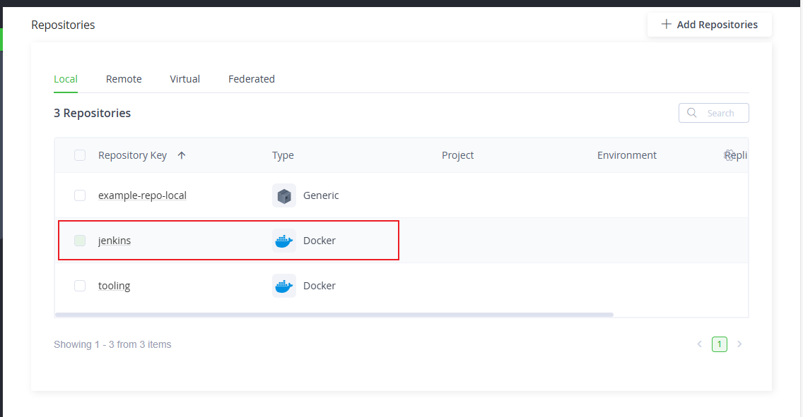

# ETTING UP PRIVATE REPOSITORIES AND PREPARING CI PIPELINES WITH JENKINS

In this project, we have quite a lot of exciting things to do. Lets get right into it.

As a follow up from previous project, the first thing we will need to do is create a repository in Artifactory which will serve as a private docker registry. Having a private registry in an enterprise means that there is more control over the containers deployed there. You have control over the secured traffic to the registry, control over storage and you can rely more on the availability of your images.

In Artifactory, you can setup either local, remote or virtual repositories. It doesn’t matter if it is for docker, helm, or standard software binaries.

Artifactory hosts two kinds of repositories: local and remote. Both local and remote repositories can be aggregated under virtual repositories, in order to create controlled domains for artifacts resolution and search, as we will see in the next sections.

### Local Repositories

Local repositories are physical locally-managed repositories that one can deploy artifacts into. Artifacts under a local repository are directly accessible via a URL pattern such as https://tooling.artifactory.sandbox.svc.darey.io/artifactory/`/`.

### Remote Repositories

A remote repositories serves as a caching proxy for a repository managed at a remote URL (including other Artifactory remote repository URLs). Artifacts are stored and updated in remote repositories according to various configuration parameters that control the caching and proxying behavior. You can remove cached artifacts from remote repository caches but you cannot manually deploy anything into a remote repository.

Artifacts under a remote repository are directly accessible via a URL pattern of

- https://tooling.artifactory.sandbox.svc.darey.io/artifactory/`/`** or

- https://tooling.artifactory.sandbox.svc.darey.io/artifactory/`-cache/`

The second URL will only serve already cached artifacts while the first one will fetch a remote artifact in the cache URL (2nd one) only if it is not already stored in the first URL.

### Virtual Repositories

A virtual repository (or “repository group”, if you prefer this term) aggregates several repositories under a common URL. The repository is virtual in the sense that you can resolve and get artifacts from it but you cannot deploy anything to it.

By default, Artifactory uses a global virtual repository that is available at https://tooling.artifactory.sandbox.svc.darey.io/artifactory/repo This repository contains all local and remote repositories.

### Lets create a local repository for docker.

- Click on administration, Repositories , and Add repositories as shown in the image below.


- Since we are exploring Local Repositories, select Local Repository

- Type Docker in the search box or select the Docker icon


- In the Repository Key box, type in the name of the repository you whish to create. For example tooling. So that all the docker images for tooling app can be pushed there.


- Click on the Create Local Repository button.

- Now you can see that a Docker Repository for tooling has been created.


- Create a second Local Repository for Jenkins



### Lets create a Virtual Repository 

Remember, a virtual repository aggregates several repositories under a common URL. You can get artifacts from it but you cannot deploy anything to it.

- Select virtual Repository

- Name the virtual Repository as you deem fit, click on the create Virtual Repository button


- Now that the virtual repository is created, it is time to add local repositories to it. You can see in the image below that it is a virtual repo, and it will only be used by Docker.

- Scroll down the page to see the local repositories. This is where you select which local repository that will be part of the virtual repository. Click on the double arrows to move them.


- Once moved, you will see them in the included items section.


- To see the address of the virtual repository, simply click on the square icon at the top left, click on Artifacts and select the repository you wish to see more information on.


### Push docker images to the repository

You can either pull and push docker images to the local repository for each application, or simply pull from the virtual repository.

Lets get docker images from docker hub and push to our private registry.

- First you will need to login to the docker registry.

Update the docker daemon.json file as below

```
{
  "builder": {
    "gc": {
      "defaultKeepStorage": "20GB",
      "enabled": true
    }
  },
  "experimental": false,
  "features": {
    "buildkit": true
  },
  "insecure-registries": ["http://tooling.artifactory.sausage.online:80"]
}
```

Update the docker config.json file as below

To manually set your credentials or if your using Docker V1 copy the following snippet to your config.json file

```
{
        "auths": {
            "https://tooling.artifactory.sausage.online": {
                "auth": "username:password", (converted to base 64)
                "email": "obisakin@yahoo.com"
                }
        }
}

username = admin
password = Password1
base 64 encode admin:Password1 = YWRtaW46T255ZWthMTIzNDU2Nzg5

{
        "auths": {
            "https://tooling.artifactory.sausage.online": {
                "auth": "YWRtaW46T255ZWthMTIzNDU2Nzg5",
                "email": "obisakin@yahoo.com"
                }
        }
}
```


`docker login tooling.artifactory.sausage.online`

docker login -u <USER_NAME> -p <USER_PASSWORD> <Artifactory Host IP Address>

- A successful login will create a file here ~/.docker/config.json Explore this file and see how the authentication data is stored. The auth section is an encoding of your username and password. You can try to decode it with base64 to see the output.

- Pull the Jenkins image from Docker hub

`docker pull jenkins/jenkins:jdk11`

- Tag the image so that it can pushed to Artifactory

`docker tag jenkins/jenkins:jdk11 https://tooling.artifactory.sausage.online/jenkins/jenkins:jdk11`

docker tag <IMAGE_ID> artprod.mycompany/<DOCKER_REPOSITORY>:<DOCKER_TAG>

- Push the docker image to Artifactory

`docker push tooling.artifactory.sausage.online/jenkins/jenkins:jdk11`


## Jenkins pipeline for Business Applications

In earlier projects, pipeline for the Tooling app was based on Ansible. This time, we are containerising the same application. Since the app will be running inside a kubernetes cluster within a Pod container, then the approach to CI/CD will be different.

There will be different elements to CI/CD here. The build of the application, and the deployment into kubernetes.

- The Dockerfile used to build the tooling app’s docker image will have its own CI/CD pipeline
- The helm charts used to deploy the application into kubernetes will require its own CI/CD pipeline

Therefore, we will begin with the first one. But without jumping straight to creating pipelines, we must also consider the best way to automate the deployment and configuration of the CI/CD tool (Jenkins) such that it is fit for purpose, and can be easily recreated with the exact same config.

### Self Challenge Task:

- Using helm, deploy Jenkins and sonarqube into the tools namespace.
- Configure TLS based ingress for both Jenkins and Sonarqube. (Use the Helm Values to configure Ingress directly)
- Create a Multibranch pipeline for the tooling app.
- Connect the tooling app from Github https://github.com/darey-devops/tooling

If you were able to successfully implement that challenge, then thumbs up to you.

Lets go through each of the steps.

### Deploy Jenkins with helm

Phase 1 – Deploy without any custom configuration to the Helm Values (Do the whole of this part yourself)

1. Without any custom configuration, get the Jenkins Helm chart from artifacthub.io, and deploy using the default values.
2. Configure DNS for jenkins and route traffic to the ingress controller load balancer
3. Deploy an ingress without TLS
4. Ensure that you are able to access the configured URL


5. Ensure that you are able to logon to Jenkins.


6. Update the Ingress and configure TLS for the URL


Phase 2 – Use an override values file to customize Jenkins deployment

The default helm values file has so many configuration tweaks to customize Jenkins. We will explore some of these and ensure that all desired configuration is done using the helm values only. For example, using another YAML file to configure the ingress is removed.

Tasks:

1. Configure Jenkins Ingress using Helm Values
2. Automate Jenkins plugin installation
3. Automating Jenkins Configuration As Code (JCasC)
4. Automating Jenkins backups to AWS S3

Lets get started 

1. Configure Jenkins Ingress using Helm Values

- Delete the previous Ingress using kubectl delete command.

```
kubectl delete ing ingress-tooling -n tools
ingress.networking.k8s.io "ingress-tooling" deleted
```

- Create a new file and name it jenkins-values-overide.yaml
- Find the below section in the default values file. Copy and paste it exactly in the jenkins-values-overide.yaml

```
controller:
  # Used for label app.kubernetes.io/component
  componentName: "jenkins-controller"
  image: "jenkins/jenkins"
  # tag: "2.387.1-jdk11"
  tagLabel: jdk11
  imagePullPolicy: "Always"
```

- Then do a helm upgrade using the jenkins-values-overide.yaml file

`helm upgrade -i jenkins jenkins/jenkins -f jenkins-values-overide.yaml -n tools`

- This should do an upgrade, but without any specific changes to the existing deployment. Thats because no configuration change has occured. All we now have is a shortened values file that can be easily read without too many options. With this file you can now start making configuration updates.

- To configure Jenkins ingress directly from the helm values, simply search for the ingress: section in the default values file and copy the entire section to the override values file. The default one should look similar to this

```
ingress:
enabled: false
   # Override for the default paths that map requests to the backend
paths: []
   # - backend:
   # serviceName: ssl-redirect
   # servicePort: use-annotation
   # - backend:
   # serviceName: >-
   # {{ template "jenkins.fullname" . }}
   # # Don't use string here, use only integer value!
   # servicePort: 8080
   # For Kubernetes v1.14+, use 'networking.k8s.io/v1beta1'
   # For Kubernetes v1.19+, use 'networking.k8s.io/v1'
apiVersion: "extensions/v1beta1"
labels: {}
annotations: {}
   # kubernetes.io/ingress.class: nginx
   # kubernetes.io/tls-acme: "true"
   # For Kubernetes >= 1.18 you should specify the ingress-controller via the field ingressClassName
   # See https://kubernetes.io/blog/2020/04/02/improvements-to-the-ingress-api-in-kubernetes-1.18/#specifying-the-class-of-an-ingress
   # ingressClassName: nginx
   # Set this path to jenkinsUriPrefix above or use annotations to rewrite path
   # path: "/jenkins"
   # configures the hostname e.g. jenkins.example.com
hostName:
tls:
   # - secretName: jenkins.cluster.local
   # hosts:
   # - jenkins.cluster.local
```

- Given the ingress section copied above, attempt to update it with values for your specific ingress. Have a look through the ingress file you used to create the ingress previously and see what sections you require to update the values. For example

1. Enable the ingress value from false to true
2. Add the annotations you already used to create the ingress before
3. Add the hostname
4. Update the tls section with the secreName and hosts information.


- The final output should look similar to this

```
ingress:
    enabled: true
    apiVersion: "extensions/v1beta1"
    annotations: 
      kubernetes.io/ingress.class: nginx
      cert-manager.io/cluster-issuer: "letsencrypt-prod"
  
    hostName: tooling.jenkins.sausage.online
    tls:
    - secretName: tooling.jenkins.sausage.online
      hosts:
        - tooling.jenkins.sausage.online
```

- Now upgrade the Jenkins deployment with helm upgrade command. Remember to specify the override yaml file with the -f file.

2. Automate Jenkins plugin installation

Jenkins rely heavily on plugins to extend its CI capabilities. As you know already, Blueocean is one of the widely used Jenkins plugin that gives much better experience. There are loads of other plugins that you may require to use as business requirements, and technical needs change.

Manually installing Jenkins plugins is definitely a bad idea. As a DevOps engineer, you want to be able to rely on your automated processes, thereby reducing manual configurations as much as possible.

There are 2 possible options to this.

1. You could use Helm values to automate plugin installation

2. You could package the required plugins as part of the Jenkins image.

Which ever option works just fine, Its a matter of choice and unique environment setup in an organisation.

Option 1 is the easiest and most straight forward approach. But it may slow down initial deployment of Jenkins since it has to download the plugins. Also, if the kubernetes workers are completely closed from the internet. Hence, downloading plugins over the internet will not work, in this case Option 2 is the way out.

In the original values file, search for installPlugins: and you should see a section like below.

```
  # List of plugins to be install during Jenkins controller start
  installPlugins:
    - kubernetes:3600.v144b_cd192ca_a_
    - workflow-aggregator:581.v0c46fa_697ffd
    - git:4.11.3
    - configuration-as-code:1429.v09b_044a_c93de

  # Set to false to download the minimum required version of all dependencies.
  installLatestPlugins: true

  # Set to true to download latest dependencies of any plugin that is requested to have the latest version.
  installLatestSpecifiedPlugins: false

  # List of plugins to install in addition to those listed in controller.installPlugins
  additionalPlugins: []
```

In the override yaml file, you can add the installPlugins: and additionalPlugins: so that your updated override values file will look like the below.

```
controller:
  ingress:
    enabled: true
    apiVersion: "extensions/v1beta1"
    annotations: 
      cert-manager.io/cluster-issuer: "letsencrypt-production"
      kubernetes.io/ingress.class: nginx
    hostName: tooling.jenkins.sausage.online
    tls:
    - secretName: tooling.jenkins.sausage.online
      hosts:
        - tooling.jenkins.sausage.online

  installPlugins:
    - kubernetes:4029.v5712230ccb_f8
    - workflow-aggregator:596.v8c21c963d92d
    - git:5.1.0
    - configuration-as-code:1670.v564dc8b_982d0

  additionalPlugins: []
```

If you need to include more plugins, you can use the additionalPlugins: [] key. the [] there simply means the key has a default null value and it is a list data type. Hence to start adding more plugins you simply need to update that section like below.

```
  additionalPlugins:
    - blueocean:1.27.9
    - credentials-binding:642.v737c34dea_6c2
    - git-changelog:3.35
    - git-client:4.5.0
    - git-server:99.va_0826a_b_cdfa_d
```

If you are wondering how to get the correct plugin version number, it is already provided on the same website where each plugin is documented at https://plugins.jenkins.io/

Lets take the Blue Ocean plugin as an example. Navigate to https://plugins.jenkins.io/blueocean/ and see the Version section as shown below.


Option 2 requires an extra overhead. Because you must create a Dockerfile for the Jenkins Controller or (Master), package the Jenkins docker image with the plugins already installed, then update the image: value in the helm values override file. The good thing about this approach, despite its overhead is that even when the Kubernetes cluster is locked down in a private network, the dependencies are already packaged into the image and there is no need to download anything from the internet.

Lets see what this process would look like.

- Create a folder structure and empty files like below

```
     ├── Dockerfile
     └── scripts
         └── plugins.txt
             plugins2.txt
```

- Update the Dockerfile with below content

```
FROM jenkins/jenkins:lts-jdk11

COPY --chown=jenkins:jenkins scripts/plugins.txt /usr/share/jenkins/ref/plugins.txt

RUN jenkins-plugin-cli -f /usr/share/jenkins/ref/plugins.txt
```

Self Challenge Task: Analyse the above Dockerfile and attempt to summarise each step.

- Update the plugins.txt file with below list of plugins.

```
workflow-basic-steps:1010.vf7a_b_98e847c1 
blueocean:1.27.3 
credentials-binding:523.vd859a_4b_122e6
git:5.0.0 
git-changelog:3.0 
git-client:4.2.0
git-server:1.9 
blueocean-bitbucket-pipeline:1.27.3 
cloudbees-bitbucket-branch-source:800.va_b_b_9a_a_5035c1 
blueocean-git-pipeline:1.27.3 
blueocean-pipeline-api-impl:1.27.3 
pipeline-model-definition:2.2125.vddb_a_44a_d605e
github-branch-source:1703.vd5a_2b_29c6cdc
```

- Run docker commands to build, tag and push the docker image to my dockerhub account and pull from there first.

```
docker build . -t onyekaonu/jenkins:lts-jdk11.01

docker push onyekaonu/jenkins:lts-jdk11.0
```

- push the docker image to the artifactory registry you created in previous project.

- Update the Jenkins helm values and point the new image to the private docker registry for Jenkins. Also, ensure that the values file have these keys set:

```
 installPlugins: false
 additionalPlugins: []
```

`helm upgrade -i jenkins jenkins/jenkins -f jenkins-values-overide.yaml -n tools`

- Login to Jenkins and verify that the plugins have been installed.

  - kubectl exec -it jenkins-0 -c jenkins -n tools -- bash

  - Another way to verify the installation of the plugins is to exec into the pod container and check the filesystem. The command
  `ls -ltr /var/jenkins_home/plugins/ | grep blueocean`

  should return files relating to the plugin. If it returns empty, then the plugin has not been installed.

Lets install the complete plugins for jenkins image with the below necessary plugins. Below is the exact plugins2.txt file used for that image tag.

```
ace-editor:1.1
ansicolor:1.0.2
antisamy-markup-formatter:159.v25b_c67cd35fb_
apache-httpcomponents-client-4-api:4.5.14-150.v7a_b_9d17134a_5
authentication-tokens:1.4
badge:1.9.1
blueocean-bitbucket-pipeline:1.27.3
blueocean:1.27.3
blueocean-jwt:1.27.3
blueocean-git-pipeline:1.27.3 
blueocean-pipeline-api-impl:1.27.3
blueocean-rest-impl:1.27.3
bootstrap4-api:4.6.0-5
bootstrap5-api:5.2.2-2
bouncycastle-api:2.27
branch-api:2.1071.v1a_188a_562481
build-blocker-plugin:1.7.8
build-monitor-plugin:1.13+build.202205140447
buildtriggerbadge:251.vdf6ef853f3f5
cloudbees-bitbucket-branch-source:800.va_b_b_9a_a_5035c1
credentials-binding:523.vd859a_4b_122e6
checks-api:1.8.1
cloudbees-folder:6.758.vfd75d09eea_a_1
command-launcher:90.v669d7ccb_7c31
configuration-as-code:1569.vb_72405b_80249
config-file-provider:3.11.1
credentials:1189.vf61b_a_5e2f62e
dashboard-view:2.466.vdfefd95a_b_f8d
dependency-check-jenkins-plugin:5.2.0
display-url-api:2.3.7
disk-usage:0.28
durable-task:504.vb10d1ae5ba2f
echarts-api:5.4.0-1
email-ext:2.92
font-awesome-api:6.3.0-1
git:5.0.0 
git-changelog:3.0 
git-client:4.2.0
git-server:1.11
github-branch-source:1703.vd5a_2b_29c6cdc
groovy-postbuild:2.5
greenballs:1.15.1
handlebars:3.0.8
hashicorp-vault-plugin:360.v0a_1c04cf807d
htmlpublisher:1.31
jackson2-api:2.14.2-319.v37853346a_229
jacoco:3.3.2.1
jdk-tool:63.v62d2fd4b_4793
job-dsl:1.81.1
jquery-detached:1.2.1
jquery3-api:3.6.1-2
jsch:0.1.55.61.va_e9ee26616e7
junit:1166.1168.vd6b_8042a_06de
kubernetes-client-api:6.4.1-208.vfe09a_9362c2c
kubernetes-credentials:0.10.0
kubernetes:3743.v1fa_4c724c3b_7
ldap:659.v8ca_b_a_fe79fa_d
lockable-resources:2.18
mailer:448.v5b_97805e3767
mask-passwords:3.3
matrix-auth:3.1.5
matrix-project:785.v06b_7f47b_c631
metrics:4.2.13-420.vea_2f17932dd6
momentjs:1.1.1
pipeline-build-step:488.v8993df156e8d
pipeline-graph-analysis:202.va_d268e64deb_3
pipeline-input-step:466.v6d0a_5df34f81
pipeline-milestone-step:111.v449306f708b_7
pipeline-model-api:2.2125.vddb_a_44a_d605e
pipeline-model-definition:2.2125.vddb_a_44a_d605e
pipeline-model-extensions:2.2125.vddb_a_44a_d605e
pipeline-rest-api:2.28
pipeline-stage-step:305.ve96d0205c1c6
pipeline-stage-tags-metadata:2.2125.vddb_a_44a_d605e
pipeline-stage-view:2.28
plain-credentials:143.v1b_df8b_d3b_e48
plugin-util-api:3.0.0
popper-api:1.16.1-3
parameterized-scheduler:1.1
rebuild:1.34
role-Onu:587.588.v850a_20a_30162
scm-api:631.v9143df5b_e4a_a
script-security:1229.v4880b_b_e905a_6
snakeyaml-api:1.33-90.v80dcb_3814d35
soapui-pro-functional-testing:1.7
sonar:2.14
simple-theme-plugin:136.v23a_15f86c53d
ssh-credentials:305.v8f4381501156
structs:324.va_f5d6774f3a_d
token-macro:321.vd7cc1f2a_52c8
trilead-api:2.84.v72119de229b_7
text-finder:1.21
uno-choice:2.6.4
variant:59.vf075fe829ccb
workflow-basic-steps:1010.vf7a_b_98e847c1 
workflow-aggregator:596.v8c21c963d92d
workflow-api:1208.v0cc7c6e0da_9e
workflow-cps-global-lib:609.vd95673f149b_b
workflow-cps:3641.vf58904a_b_b_5d8
workflow-durable-task-step:1234.v019404b_3832a
workflow-job:1284.v2fe8ed4573d4
workflow-multibranch:733.v109046189126
workflow-scm-step:408.v7d5b_135a_b_d49
workflow-step-api:639.v6eca_cd8c04a_a_
workflow-support:839.v35e2736cfd5c
```
Ensure that all the installed plugins are using the latest version. Visit https://plugins.jenkins.io/, then search for the plugin to get the latest version number.

- Update the Dockerfile with below content

```
FROM jenkins/jenkins:2.426.1-lts-jdk11

COPY --chown=jenkins:jenkins scripts/plugins3.txt /usr/share/jenkins/ref/plugins3.txt

RUN jenkins-plugin-cli -f /usr/share/jenkins/ref/plugins3.txt
```

- Run docker commands to build, tag and push the docker image to my dockerhub account and pull from there first.

```
docker build . -t temitayo/jenkins:2.426.1-lts-jdk11

docker push temitayo/jenkins:2.426.1-lts-jdk11
```
- Update the Jenkins helm values and point the new image to the private docker registry for Jenkins.


1. Automating Jenkins Configuration As Code (JCasC)

Managing infrastructure “as code” is not only when you provision compute resources in the cloud or on-premise. Being able to reproduce and/or restore an entire environment within minutes extends beyond compute resource provisioning, but also its configuration. There is so much configuration that can be done with Jenkins. Manually updating such configs from the user interface (UI) is not sustainable. Imagine creating a lot of folders to manage multiple projects and pipelines from the Jenkins UI and losing the Jenkins installation afterwards. You will have to manually recreate all the folders again. With Jenkins Configuration As Code (JCasC), this process can be automated and all configurations in Jenkins can now be represented as “code”

To start managing Jenkins as code, search for JCasC: within the default yaml values file. That is the section where configuration as code needs to be configured.

Copy that section out of the default and put it in the override yaml file.

```
JCasC:
  defaultConfig: true
  configScripts: {}
    # welcome-message: |
      # jenkins:
          # systemMessage: Welcome to our CI\CD server. This Jenkins is configured and managed 'as code'.
    # Ignored if securityRealm is defined in controller.JCasC.configScripts and
    securityRealm: |-
      local:
        allowsSignup: false
        enableCaptcha: false
        users:
        - id: "${chart-admin-username}"
          name: "Jenkins Admin"
          password: "${chart-admin-password}"
    # Ignored if authorizationOnu is defined in controller.JCasC.configScripts
    authorizationOnu: |-
      loggedInUsersCanDoAnything:
        allowAnonymousRead: false
```

The configScripts: {} key shows that it is empty. The curly brackets {} indicates that it is configured to hold a dictionary type of data. This means that it can hold sub-keys with their own respective key and values. As you can see in the example below it.


```
    configScripts: {}
    #  welcome-message: |
    #    jenkins:
    #      systemMessage: Welcome to our CI\CD server.  This Jenkins is configured and managed 'as code'.
```

To enable that section, simply remove the {} and uncomment the first key welcome-message. You can write whatever you want in the systemMessage. For example.

```
    configScripts:
      welcome-message: |
        jenkins:
          systemMessage: Welcome to temitayo's CI\CD server.  This Jenkins is configured and managed 'as code'. Please do not update Manually
```
Upgrade Jenkins with the latest update and you should see the system message like below.


The JCasC functionality is actually a Jenkins plugin. It is one of the most interesting plugins that makes configuring Jenkins very easy. It’s source code can be found here https://github.com/jenkinsci/configuration-as-code-plugin

Without the JCasC plugin, setting up Jenkins is a complex process, as both Jenkins and its plugins require some tuning and configuration, with dozens of parameters to set within the web UI manage section.

Experienced Jenkins users rely on groovy init scripts to customize Jenkins and enforce the desired state. Those scripts directly invoke Jenkins API and, as such, can do everything (at your own risk). But they also require you to know Jenkins internals and are confident in writing groovy scripts on top of Jenkins API.

The Configuration as Code plugin is an opinionated way to configure Jenkins based on human-readable declarative configuration files. Writing such a file should be feasible without being a Jenkins expert.

To see some examples of the different configuration that can be done as code with Jenkins, navigate to the demo folder in the source code here https://github.com/jenkinsci/configuration-as-code-plugin/tree/master/demos

Now let’s see the latest configuration applied to Jenkins through JCasC and Helm;

1. Navigate to Configuration as code section in Jenkins UI. Click on Configuration as Code

2. Click on View Configuration

3. You will see the updated code configuration here.


Another example of automating Jenkins as code, is to create a multibranch pipline as part of Jenkins bootstrapping. Rather than going into the console to manually configure a pipeline.

Lets automate the creation of the tooling application’s pipeline.

### Step 1

First we need to create the credential to connect to the Github account where the tooling app is. If you have been following the PBL projects from Project 6, then you should already have the tooling app forked into your github account. If not, go ahead and fork it from here – Tooling App https://github.com/darey-devops/tooling

1. Follow the below steps. NOTE: There is minimal guide on how to do the things listed below

2. Create an access token from GitHub so that Jenkins can use it to connect to the Github account. https://github.com/settings/tokens

Z2hwX2VWanNscjJ4NWdJamNkdnFYdXJhVDFObHlmVTdwZDFSTjhWbg==

3. Using base64, encode the generated token

Create a secret in the same namespace where Jenkins is installed - tools. Name the key github or whatever you wish. It doesn’t matter what it is called. But, take note of the name you used because it will be used elsewhere. See an example below. Replace the value with the encoded token you created earlier.

```
apiVersion: v1
kind: Secret
metadata:
  name: github
  namespace: tools
type: Opaque
data:
  github_token: Z2hwX0tqZDFyNEVJbUZubGwyTEtuN3NjY3hjYnFoUndnbTJwRmw4dA==
```

`kubectl apply -f jenkins-secret.yaml -n tools`

In the Jenkins values file, you will set the values correctly so that the secret created above can be used. If you click here to see the documentation in artifacthub.io https://artifacthub.io/packages/helm/jenkinsci/jenkins?modal=values&path=controller.initScripts, as shown in the image below.

Let’s analyse what is written there.

- ‘name’ is a name of an existing secret in same namespace as jenkins. This refers to the secret created above. github
- ‘keyName’ is the name of one of the keys inside current secret. This refers to the key specified in the secret. github_token
- the ‘name’ and ‘keyName’ are concatenated with a ‘-‘ in between. Therefore we will have this github-github_token

In the values file, we now need to update the key additionalExistingSecrets:

```
  additionalExistingSecrets:
  - name: github
    keyName: github_token
```

Note: This is just to make Jenkins aware of the secret. We still need to use it in the credentials section so that Jenkins can connect to Github with it.

```
  JCasC:
    configScripts: 
      welcome-message: |
        jenkins:
          systemMessage: Welcome to temitayo's Multi-tenant CI\CD server. This Jenkins is configured and managed strictly 'as code'. 
      pipeline: |
        jobs:
          - script: >
              folder('temitayo') {
                displayName('temitayo')
                description('Contains temitayo's Jenkins Pipelines')
              }
```
When you apply the latest changes, you should be able to see the folder created. But it doesn’t have any pipline.


Now, Lets create a pipline that will automatically be added to the folder upon installation.

The entire overide values file should look like this.

```
controller:
  componentName: "jenkins-controller"
  image:
    repository: "jenkins/jenkins"
    tag:
    tagLabel: jdk17
    pullPolicy: "Always"
    
  ingress:
    enabled: true 
    apiVersion: "extensions/v1beta1"
    annotations: 
      kubernetes.io/ingress.class: nginx
      cert-manager.io/cluster-issuer: "letsencrypt-prod"
    hostName: jenkins.thesausage.online
    tls: 
    - secretName: jenkins.thesausage.online
      hosts:
        - jenkins.thesausage.online
  installPlugins:
    - kubernetes:4253.v7700d91739e5
    - workflow-aggregator:600.vb_57cdd26fdd7
    - git:5.2.2
    - configuration-as-code:1810.v9b_c30a_249a_4c
  additionalPlugins: 
    - blueocean:1.25.5
    - credentials-binding:1.24
    - git-changelog:3.0
    - git-client:3.6.0
    - git-server:1.9
  additionalExistingSecrets: 
   - name: github
     keyName: github_token
  JCasC:
    defaultConfig: true
    configScripts: 
      welcome-message: |
        jenkins:
          systemMessage: Welcome to temitayo's CI\CD server. This Jenkins is configured and managed 'as code'.
      pipeline: |
        jobs:
          - script: >
              folder('tayo') {
                displayName('tayo')
                description('Contains tayo's Jenkins Pipelines')
              }
          - script: >
              multibranchPipelineJob('tayo/tooling-app') {
                branchSources {
                  git {
                    remote('https://github.com/temitayo-ob/tooling.git')
                    credentialsId('github')
                    id('tooling-app')
                  }
                }
              }
      security-config: |
        credentials:
            system:
              domainCredentials:
              - credentials:
                - usernamePassword:
                    id: github
                    username: temitayo-ob
                    password: ${github-github_token}
                    scope: GLOBAL
                    description: Github
```

The most important part you must take note of is the credentials section where the secret we created earlier is used. Remember, the first part is the secret name github, while the second part is the “key name” used in the secret. github_token. Both are concatenated with an “hyphen”

- You can see the multiPipelineJob now created.

- All the branches have automatically triggered their respective pipeliines.

This implementation is ideal, and gives the confidence of a re-usable code and infrastructure, should anything go wrong, you can easily recreate all you have configured.


