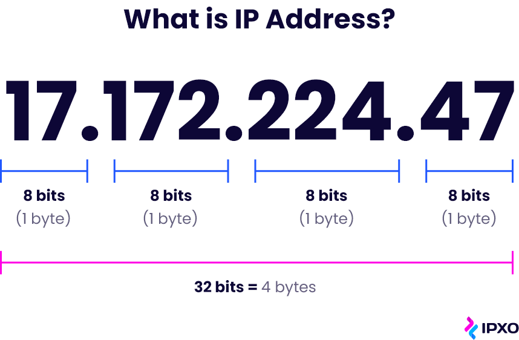
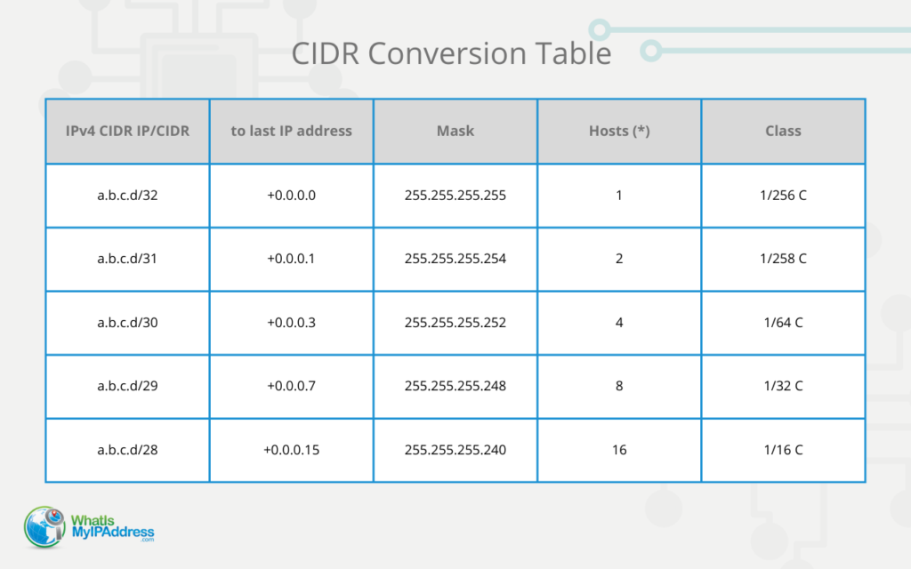
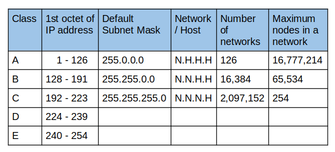
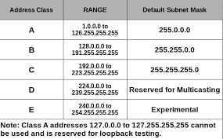

# UNDERSTANDING IP ADDRESSES AND CIDR NOTATION 

### INTRODUCTION TO IP ADDRESSES

An ***internet protocol*** address is a unique address that identifies devices on a network (internet or local network), They contain location information and allow devices to be addressable, its the way with which the internet differentiates between devices, making it an enssential part of how the internet works.

An ip address is a string of numbers separated by periods, generaly expressed as four set of numbers. each number set can range from `0.0.0.0 - 255.255.255.255`. ip addresses are allocated and maintaine by the internet assigned numbers authority (IANA). A typical ip address looks like this 

`192.168.0.4`

each section beign 8bits and therfore called an octet, in total an ip address is a 32bit address.

### SUBNETTING AND SUBNET MASK

The process of dividing a network into smaller network sections is called subnetting. This can be useful for many different purposes and helps isolate groups of hosts from each other to deal with them more easily. It increases routing efficiency, which helps to enhance the security of the network and reduces the size of the broadcast domain.

IP Subnetting designates high-order bits from the host as part of the network prefix. This method divides a network into smaller subnets. It aqlso reduces tghe routing table sizes.

***SUBNET MASK*** 

A subnet mask is a 32 bits address used to distinguish between a network address and a host address in IP address. A subnet mask identifies which part of an IP address is the network address and the host address. They are not shown inside the data packets traversing the Internet. They carry the destination IP address, which a router will match with a subnet.

### CIDR NOTATION AND IP AGGREGATION

Classless Inter-Domain Routing (CIDR) is an IP address allocation method that improves data routing efficiency on the internet.

IP Address Aggregator

IP Address Aggregator is a utility developed to automate minimization process and convert bunch of IPv4 addresses into smallest continuous range(s) possible. IP aggregation is commonly performed by network engineers working with BGP & routers. This utility will help webmasters to configure server firewalls, apache .htaccess files, address masks and so on.

### IP ADDRESS CLASSES AND PRIVATE IP ADDRESS RANGES

What is Classful Addressing?

Classful addressing is a network addressing the Internet’s architecture from 1981 till CIDR was introduced in 1993.

This addressing method divides the IP address into five separate classes based on four address bits.

***Class A Network***

This IP address class is used when there are a large number of hosts. In Class A network type, the first 8 bits identify the network, and the remaining 24 bits for the host into that network.

An example of a Class A address is 102.168.212.226. Here, “102” helps you identify the network and 168.212.226 identify the host.

Class A addresses 127.0.0.0 to 127.255.255.255 cannot be used and is reserved for loopback and diagnostic functions.

***Class B Network***

In this IP address, the class decimal number that can be between 128 to 191. The first 16 bits help you identify the network, The other remaining 16 bits indicate the host within the network.

An example of Class B IP address is 168.212.226.204, where 168.212 identifies the network and 226.204 helps you identify the network host.

***Class C Network***

Class C is a type of IP address that is used for the small network. In this class,the first 24 bits are used to identify the network and 8 bits for the network host address. This IP ranges between 192 to 223. Mostly local area network used Class C IP address to connect with the network.

Example for a Class C IP address:

192.168.178.1

***Class D Network***

Class D addresses are only used for multicasting applications. Class D is never used for regular networking operations. This class addresses the first three bits set to “1” and their fourth bit set to use for “0”. Class D addresses are 32-bit network addresses. All the values within the range are used to identify multicast groups uniquely.

Therefore, there is no requirement to extract the host address from the IP address, so Class D does not have any subnet mask. Example for a Class D IP address: 227.21.6.173

***Class E Network***

Class E IP address is defined by including the starting four network address bits as 1, which allows you too to incorporate addresses from 240.0.0.0 to 255.255.255.255. However, E class is reserved, and its usage is never defined. Therefore, many network implementations discard these addresses as undefined or illegal.

Example for a Class E IP address:

243.164.89.28

### LIMITATIONS OF CLASSFUL IP ADDRESSING

Here are the limitations of the classful IP addressing method:

Risk of running out of address space soon Class boundaries did not encourage efficient allocation of address space Rules for assigning Network ID: The network ID will be assigned based on the below-given rules:

- The network ID cannot start with 127 because 127 belongs to class A address and is reserved for internal loopback functions. 

- All bits of network ID set to 1 are reserved for use as an IP broadcast address and cannot be used. 

- All bits of network ID are set to 0, They are used to denote a particular host on the local network and should not be routed.

### ADVANCED TOPICS IN IP ADDRESSING

 These include 
 
 - Routing protocols: Which are used to exchange information about network destinations between devices on a network. They are an important component of advanced TCP/IP networking topics, as they play a key role in determining the best path for data to travel from one device to another, There are several types of routing protocols that can be used depending on the need.
 
 - Virtual Private Networks (VPNs): A VPN is a technology that enables users to connect to a private network over the internet securely. It is often used in the context of advanced TCP/IP networking topics to securely extend a private network over a public network, such as the internet.

There are several types of VPNs, including:

Remote-Access VPNs: These allow users to connect to a private network remotely, such as their home or office. Site-to-Site VPNs: These VPNs allow organizations to connect multiple sites over a public network, such as the internet, to create a single, private network. Mobile VPNs: These VPNs allow users to securely connect to a private network using a laptop or mobile device while on the go. Virtual LAN (VLAN) VPNs: These VPNs allow users to create virtual networks within a larger network, segment traffic, and improve security. By using a VPN, organizations can securely connect to a private network from a remote location, connect multiple sites over a public network, or create virtual networks within a larger network. This can help to improve security, enable remote access, and optimize network performance.

 - Quality of Service (QoS): QoS is a set of technologies and techniques used to manage and optimize network performance. It is often discussed in the context of advanced TCP/IP networking topics to ensure that critical applications and services receive the bandwidth and resources they need to operate effectively which is a set of technologies and techniques that are used to manage and optimize network performance.

 
 - Domain Name System (DNS): DNS is a hierarchical, distributed database that is used to translate human-readable domain names (such as www.example.com) into machine-readable IP addresses (such as 192.168.1.1). It is often discussed in the context of advanced TCP/IP networking topics as a critical component of the internet’s infrastructure.

 There are several key components of DNS, including:

Domain names: These are the human-readable names used to identify websites and other resources on the internet. DNS servers: These are the servers that store and manage the DNS database and respond to DNS queries from clients. DNS records are the entries in the DNS database that map domain names to IP addresses and other information. DNS protocols: These are the protocols that are used to communicate between DNS servers and clients. By understanding how DNS works, organizations can more effectively manage their online presence, optimize their use of DNS resources, and improve the performance and reliability of their networks.

 - Network Address Translation (NAT), which is a technique that is used to allow devices on a private network to communicate with devices on a public network.

By understanding these and other advanced topics in TCP/IP networking, organizations can more effectively design, manage, and optimize their networks.

Network Address Translation (NAT)

Network Address Translation (NAT) is a technique that allows devices on a private network to communicate with devices on a public network, such as the internet. It is often used to allow devices on a local network to access the internet without needing a public IP address.

There are several benefits to using NAT, including:

- Security: NAT can help to improve security by hiding the IP addresses of devices on the private network from the public network.

- Resource conservation: NAT can help to conserve resources by allowing multiple devices on a private network to share a single public IP address. This can be useful when a limited number of public IP addresses are available. 

- Improved performance: NAT can help improve a network’s performance by reducing the number of IP addresses that need to be routed over the internet. This can reduce the load on the network and improve overall performance. NAT is a useful technique for allowing devices on a private network to communicate with devices on a public network while maintaining security and conserving resources.
