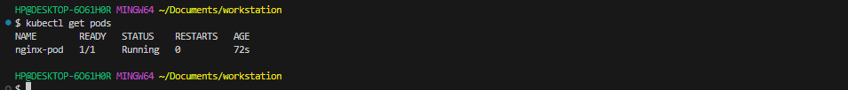
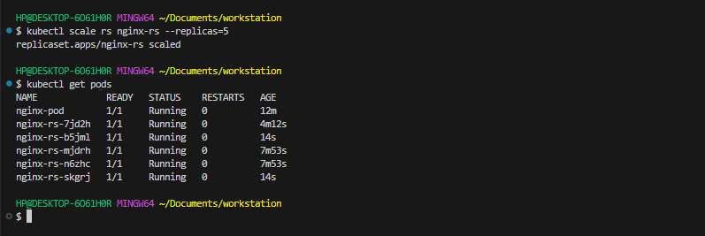
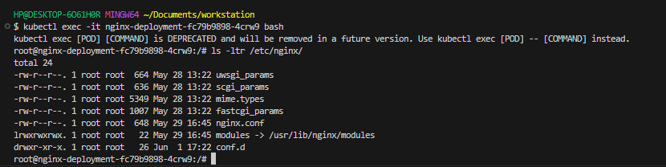
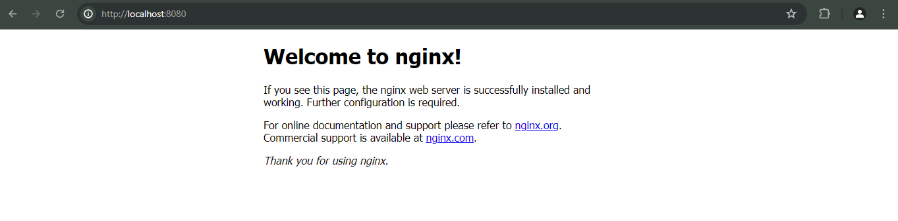
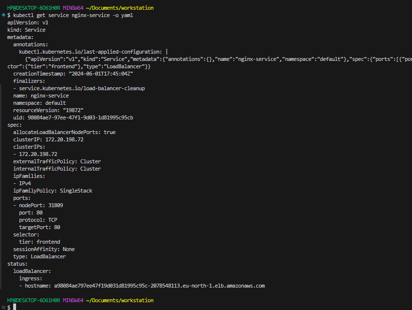

#   DEPLOYING SOFTWARE INTO K8'S AND CHOOSING THE RIGHT KUBERNETES CLUSTER SET UP

## Deploying Applications Into Kubernetes Cluster

Within this project we are going to learn and see in action following:

1. Deployment of software applications using YAML manifest files with following K8s objects:

- Pods
- ReplicaSets
- Deployments
- StatefulSets
- Services (ClusterIP, NodeIP, Loadbalancer)
- Configmaps
- Volumes
- PersistentVolumes
- PersistentVolumeClaims …and many more

2. Difference between stateful and stateless applications

- Deploy MySQL as a StatefulSet and explain why

3. Limitations of using manifests directly to deploy on K8s

- Working with Helm templates, its components and the most important parts – semantic versioning

- Converting all the .yaml templates into a helm chart

4. Deploying more tools with Helm charts on AWS Elastic Kubernetes Service (EKS)

- Jenkins
- MySQL
- Ingress Controllers (Nginx)
- Cert-Manager
- Ingress for Jenkins
- Ingress for the actual application

5. Deploy Monitoring Tools

- Prometheus
- Grafana

6. Hybrid CI/CD by combining different tools such as: Gitlab CICD, Jenkins. And, you will also be introduced to concepts around GitOps using Weaveworks Flux.

## DEPLOYING APPLICATIONS INTO KUBERNETES CLUSTER

This project demonstrates how containerised applications are deployed as pods in Kubernetes and how to access the application from the browser.

## Step 1 Creating the EKS cluster 

Created an EKS cluster using cloud formation template to create network infrastructure for the eks vpc and its dependencies, stack template [url](https://s3.eu-north-1.amazonaws.com/cf-templates-79vj2ln2of0j-eu-north-1/2024152CPX-template1ca9ziwg5o2r ) and AWS EKS to provision my cluster and master node.

Connect to the cluster with the below command

`aws eks update-kubeconfig --region us-east-2 --name terraform-eks-demo`


## Step 2 : Creating A Pod For The Nginx Application

### Understanding the common YAML fields for every Kubernetes object 

Every Kubernetes object includes object fields that govern the object’s configuration:

- kind: Represents the type of kubernetes object created. It can be a Pod, DaemonSet, Deployments or Service.
- version: Kubernetes api version used to create the resource, it can be v1, v1beta and v2. Some of the kubernetes features can be released under beta and available for general public usage.
- metadata: provides information about the resource like name of the Pod, namespace under which the Pod will be running, labels and annotations.
- spec: consists of the core information about Pod. Here we will tell kubernetes what would be the expected state of resource, Like container image, number of replicas, environment variables and volumes.
- status: consists of information about the running object, status of each container. Status field is supplied and updated by Kubernetes after creation. This is not something you will have to put in the YAML manifest.

### Deploying a Pod

Lets see what it looks like to have a Pod running in a k8s cluster. This section is just to illustrate and get you to familiarise with how the object’s fields work. Lets deploy a basic Nginx container to run inside a Pod.

- apiVersion is v1
- kind is Pod
- metatdata has a name which is set to nginx-pod
- The spec section has further information about the Pod. Where to find the image to run the container – (This defaults to Docker Hub), the port and protocol.

The structure is similar for any Kubernetes objects, and you will get to see them all as we progress.

1. Create a Pod yaml manifest - `nginx-pod.yaml`

```
apiVersion: v1
kind: Pod
metadata:
    name: nginx-pod
spec:
    containers:
    - image: nginx:latest
      name: nginx-pod
      ports:
        - containerPort: 80
          protocol: TCP
```

2. Apply the manifest with the help of kubectl

`kubectl apply -f nginx-pod.yaml`

3. Get an output of the pods running in the cluster

`kubectl get pods`




4. If the Pods were not ready for any reason, for example if there are no worker nodes, you will see something like the below output.

NAME READY STATUS RESTARTS AGE nginx-pod 0/1 Pending 0 111s

5. To see other fields introduced by kubernetes after you have deployed the resource, simply run below command, and examine the output. You will see other fields that kubernetes updates from time to time to represent the state of the resource within the cluster. -o simply means the output format.

```
kubectl get pod nginx-pod -o yaml 

kubectl describe pod nginx-pod
```


Running the following commands to inspect the setup:

`kubectl get pod nginx-pod -o wide`


## Step 3 : Creating A Replica Set

Let us create a rs.yaml manifest for a ReplicaSet object:

```
#Part 1
apiVersion: apps/v1
kind: ReplicaSet
metadata:
  name: nginx-rs
spec:
  replicas: 3
  selector:
    matchLabels:
      app: nginx-pod
#Part 2
  template:
    metadata:
      name: nginx-pod
      labels:
         app: nginx-pod
    spec:
      containers:
      - image: nginx:latest
        name: nginx-pod
        ports:
        - containerPort: 80
          protocol: TCP
```

`kubectl apply -f rs.yaml`


The manifest file of ReplicaSet consist of the following fields:

- apiVersion: This field specifies the version of kubernetes Api to which the object belongs. ReplicaSet belongs to apps/v1 apiVersion.
- kind: This field specify the type of object for which the manifest belongs to. Here, it is ReplicaSet.
- metadata: This field includes the metadata for the object. It mainly includes two fields: name and labels of the ReplicaSet.
- spec: This field specifies the label selector to be used to select the Pods, number of replicas of the Pod to be run and the container or list of containers which the Pod will run. In the above example, we are running 3 replicas of nginx container.

Let us check what Pods have been created:

`kubectl get pods`

we see three ngix-pods with some random suffixes (e.g., -5c4xs) – it means, that these Pods were created and named automatically by some other object (higher level of abstraction) such as ReplicaSet.

Try to delete one of the Pods:

`kubectl delete pod <pod id>`

`kubectl get pods`

You can see that we still have all 3 Pods, but one has been recreated (can you differentiate the new one?)


Explore the ReplicaSet created:

`kubectl get rs -o wide`


Notice, that ReplicaSet understands which Pods to create by using SELECTOR key-value pair

### Get detailed information of a ReplicaSet 

To display detailed information about any Kubernetes object, you can use 2 differen commands:

- kubectl describe %object_type% %object_name% (e.g. kubectl describe rs nginx-rs)

- kubectl get %object_type% %object_name% -o yaml (e.g. kubectl describe rs nginx-rs -o yaml)

Try both commands in action and see the difference. Also try get with -o json instead of -o yaml and decide for yourself which output option is more readable for you.


### Scale ReplicaSet up and down:

In general, there are 2 approaches of Kubernetes Object Management: imperative and declarative.

Let us see how we can use both to scale our Replicaset up and down:

**Imperative:**

We can easily scale our ReplicaSet up by specifying the desired number of replicas in an imperative command, like this:

`kubectl scale rs nginx-rs --replicas=5`

` kubectl get pods`



Scaling down will work the same way, so scale it down to 3 replicas.

**Declarative:**

Declarative way would be to open our rs.yaml manifest, change desired number of replicas in respective section

```
spec:
  replicas: 3
```
and applying the updated manifest:

`kubectl apply -f rs.yaml`

There is another method – ‘ad-hoc’, it is definitely not the best practice and we do not recommend using it, but you can edit an existing ReplicaSet with following command:

`kubectl edit -f rs.yaml`

### Advanced label matching

As Kubernetes mature as a technology, so does its features and improvements to k8s objects. ReplicationControllers do not meet certain complex business requirements when it comes to using selectors. Imagine if you need to select Pods with multiple lables that represents things like:

- Application tier: such as Frontend, or Backend
- Environment: such as Dev, SIT, QA, Preprod, or Prod

So far, we used a simple selector that just matches a key-value pair and check only ‘equality’:

```
  selector:
    app: nginx-pod
```    

But in some cases, we want ReplicaSet to manage our existing containers that match certain criteria, we can use the same simple label matching or we can use some more complex conditions, such as:

```
 - in
 - not in
 - not equal
 - etc...
```

Let us look at the following manifest file:

```
apiVersion: apps/v1
kind: ReplicaSet
metadata: 
  name: nginx-rs
spec:
  replicas: 3
  selector:
    matchLabels:
      env: prod
    matchExpressions:
    - { key: tier, operator: In, values: [frontend] }
  template:
    metadata:
      name: nginx
      labels: 
        env: prod
        tier: frontend
    spec:
      containers:
      - name: nginx-container
        image: nginx:latest
        ports:
        - containerPort: 80
          protocol: TCP
```          

In the above spec file, under the selector, matchLabels and matchExpression are used to specify the key-value pair. The matchLabel works exactly the same way as the equality-based selector, and the matchExpression is used to specify the set based selectors. This feature is the main differentiator between ReplicaSet and previously mentioned obsolete ReplicationController.

` kubectl get rs nginx-rs -o wide`

## Step 4: Creating Deployment

Do not Use Replication Controllers – Use Deployment Controllers Instead Kubernetes is loaded with a lot of features, and with its vibrant open source community, these features are constantly evolving and adding up.

Previously, you have seen the improvements from ReplicationControllers (RC), to ReplicaSets (RS). In this section you will see another K8s object which is highly recommended over Replication objects (RC and RS).

A Deployment is another layer above ReplicaSets and Pods, newer and more advanced level concept than ReplicaSets. It manages the deployment of ReplicaSets and allows for easy updating of a ReplicaSet as well as the ability to roll back to a previous version of deployment. It is declarative and can be used for rolling updates of micro-services, ensuring there is no downtime.

Officially, it is highly recommended to use Deplyments to manage replica sets rather than using replica sets directly.

Let us see Deployment in action.

1. Delete the ReplicaSet

`kubectl delete rs nginx-rs`

2. Understand the layout of the deployment.yaml manifest below. Lets go through the 3 separated sections: 

```
# Section 1 - This is the part that defines the deployment
apiVersion: apps/v1
kind: Deployment
metadata:
  name: nginx-deployment
  labels:
    tier: frontend

# Section 2 - This is the Replica set layer controlled by the deployment
spec:
  replicas: 3
  selector:
    matchLabels:
      tier: frontend

# Section 3 - This is the Pod section controlled by the deployment and selected by the replica set in section 2.
  template:
    metadata:
      labels:
        tier: frontend
    spec:
      containers:
      - name: nginx
        image: nginx:latest
        ports:
        - containerPort: 80
```

Putting them altogether

```
apiVersion: apps/v1
kind: Deployment
metadata:
  name: nginx-deployment
  labels:
    tier: frontend
spec:
  replicas: 3
  selector:
    matchLabels:
      tier: frontend
  template:
    metadata:
      labels:
        tier: frontend
    spec:
      containers:
      - name: nginx
        image: nginx:latest
        ports:
        - containerPort: 80
```

`kubectl apply -f deployment.yaml`

Run commands to get the following

- Get the Deployment


- Get the Replicaset


- Get the pods 


- Scale the replicas in the Deployment to 15 Pods

`kubectl scale deployment/nginx-deployment --replicas=15`


- Exec into one of the Pod’s container to run Linux commands

`kubectl exec -it <pod name> bash`

-List the files and folders in the Nginx directory

` ls -ltr /etc/nginx/`



- Check the content of the default Nginx configuration file


## Step 5 : Accessing The Nginx Application Through A Browser

Now you have a running Pod, ReplicaSet and a Deployment with the application. What’s next?

The ultimate goal of any solution is to access it either through a web portal or some application (e.g., mobile app). We have a Pod with Nginx container, so we need to access it from the browser. But all you have is a running Pod that has its own virtual IP address created by kubernates which cannot be accessed through the browser. To achieve this, we need another Kubernetes object called Service to accept our request and pass it on to the Pod.

A service is an object that accepts requests on behalf of the Pods and forwards it to the Pod’s IP address. If you run the command below, you will be able to see the Pod’s IP address. But there is no way to reach it directly from the outside world.

`kubectl get pod nginx-pod  -o wide`


Let us try to access the Pod through its IP address from within the K8s cluster. To do this,

1. We need an image that already has curl software installed. You can check it out here

`dareyregistry/curl`

2. Run kubectl to connect inside the container

`kubectl run curl --image=dareyregistry/curl -i --tty`

3. Run curl and point to the IP address of the Nginx Pod

`# curl -v 10.0.3.85:80`


4. Port-forward your host machine's port (your laptop) to the Pod's port

`kubectl port-forward pod/<name of the pod> <HOSTS port>:<PODS port> -n <namespace>`

Example: `kubectl port-forward pod/nginx-pod 8000:80 -n default`

If the use case for your solution is required for internal use ONLY, without public Internet requirement. Then, this should be OK. But in most cases, it is NOT!

Assuming that your requirement is to access the Nginx Pod internally, using the Pod’s IP address directly as above is not a reliable choice because Pods are ephemeral. They are not designed to run forever. When they die and another Pod is brought back up, the IP address will change and any application that is using the previous IP address directly will break.

All types of service


**Cluster ip**

To solve this problem, kubernetes uses Service – An object that abstracts the underlining IP addresses of Pods. A service can serve as a load balancer, and a reverse proxy which basically takes the request using a human readable DNS name, resolves to a Pod IP that is running and forwards the request to it. This way, you do not need to use an IP address. Rather, you can simply refer to the service name directly.

Let us create a service to access the Nginx Pod

1. Create a Service yaml manifest file: nginx-service.yaml

```
apiVersion: v1
kind: Service
metadata:
  name: nginx-service
spec:
  selector:
    tier: frontend
  ports:
    - protocol: TCP
      port: 80 # This is the port the service is listening on or the port of the service
      targetPort: 80 # This is the port the container is listening on or the port of the pod
```

- port: 80: The port at which the service listens on ie the port of the service

- targetPort: This is the port the application on the pod is forwarding traffic to or listens on ie the port of the pod

2. Create a nginx-service resource by applying your manifest

`kubectl apply -f nginx-service.yaml`

`kubectl get service`


The TYPE column in the output shows that there are different service types.

- ClusterIP
- NodePort
- LoadBalancer &
- Headless Service

Since we did not specify any type, it is obvious that the default type is ClusterIP

Now that we have a service created, how can we access the app? Since there is no public IP address, we can leverage kubectl's port-forward functionality.

`kubectl port-forward svc/<nane of the service> <HOST port>:<SVC port> -n <namespace>`

Example:

`kubectl port-forward svc/nginx-service 8080:80`

8080 is an arbitrary port number on your laptop or client PC, and we want to tunnel traffic through it to the port number of the nginx-service 80.

In case of connection error at port 10250, open this port in the security group.

Unfortunately, this will not work quite yet. Because there is no way the service will be able to select the actual Pod it is meant to route traffic to. If there are hundreds of Pods running, there must be a way to ensure that the service only forwards requests to the specific Pod it is intended for.

To make this work, you must reconfigure the Pod manifest and introduce labels to match the selectors key in the field section of the service manifest.

1. Update the Pod manifest with the below and apply the manifest:

```
apiVersion: v1
kind: Pod
metadata:
  name: nginx-pod
  labels:
    tier: frontend 
spec:
  containers:
  - image: nginx:latest
    name: nginx-pod
    ports:
    - containerPort: 80
      protocol: TCP
```

Notice that under the metadata section, we have now introduced labels with a key field called tier and its value frontend. This matches exactly the selector key in the service manifest.

The key/value pairs can be anything you specify. These are not Kubernetes specific keywords. As long as it matches the selector, the service object will be able to route traffic to the Pod.

Apply the manifest with:

`kubectl  port-forward svc/nginx-service 8080:80`

Then go to your web browser and enter localhost:8080 – You should now be able to see the nginx page in the browser.



**NodePort**

This allows us to reach the application directly from the port of the node/ec2 instance that the pod/application is running on. When you specify a port on the node, you can access the application with just the public ip address:port of the instance with out doing port forwarding.

```
apiVersion: v1
kind: Service
metadata:
  name: nginx-service
spec:
  type: NodePort
  selector:
    tier: frontend
  ports:
      # By default and for convenience, the `targetPort` is set to the same value as the `port` field.
    - port: 80
      targetPort: 80
      # Optional field
      # By default and for convenience, the Kubernetes control plane will allocate a port from a range (default: 30000-32767)
      nodePort: 30009
```

nodePort: The port of the node/instance

**LoadBalancer**

USING AWS LOAD BALANCER TO ACCESS YOUR SERVICE IN KUBERNETES. 

Note: You will only be able to test this using AWS EKS. You don not have to set this up in current project yet. In the next project, you will update your Terraform code to build an EKS cluster.

You have previously accessed the Nginx service through ClusterIP, and NodeIP, but there is another service type – Loadbalancer. This type of service does not only create a Service object in K8s, but also provisions a real external Load Balancer (e.g. Elastic Load Balancer – ELB in AWS)

To get the experience of this service type, update your service manifest and use the LoadBalancer type. Also, ensure that the selector references the Pods in the replica set.

```
apiVersion: v1
kind: Service
metadata:
  name: nginx-service
spec:
  type: LoadBalancer
  selector:
    tier: frontend
  ports:
    - protocol: TCP
      port: 80 # This is the port the service is listening on or the port of the service
      targetPort: 80 # This is the port the container is listening on or the port of the pod
```

Apply the configuration:

`kubectl apply -f nginx-service-LB.yaml`

Get the newly created service :

`kubectl get service nginx-service`


An ELB resource will be created in your AWS console.


A Kubernetes component in the control plane called Cloud-controller-manager is responsible for triggering this action. It connects to your specific cloud provider’s (AWS) APIs and create resources such as Load balancers. It will ensure that the resource is appropriately tagged:


Get the output of the entire yaml for the service. You will see some additional information about this service in which you did not define them in the yaml manifest. Kubernetes did this for you.

`kubectl get service nginx-service -o yaml`



1. A clusterIP key is updated in the manifest and assigned an IP address. Even though you have specified a Loadbalancer service type, internally it still requires a clusterIP to route the external traffic through.


2. In the ports section, nodePort is still used. This is because Kubernetes still needs to use a dedicated port on the worker node to route the traffic through. Ensure that port range 30000-32767 is opened in your inbound Security Group configuration.


3. More information about the provisioned loadbalancer is also published in the .status.loadBalancer field.

Copy and paste the load balancer’s address to the browser, and you will access the Nginx service


Now, as we have got acquaited with most common Kubernetes workloads to deploy applications:


it is time to explore how Kubernetes is able to manage persistent data.

## Step 7: Persisting data for pods

Deployments are stateless by design. Hence, any data stored inside the Pod’s container does not persist when the Pod dies.

If you were to update the content of the index.html file inside the container, and the Pod dies, that content will not be lost since a new Pod will replace the dead one.

Let us try that:

1. Scale the Pods down to 1 replica.

2. Exec into the running container 

    `kubectl exec -it <pod name> bash`

3. Install vim so that you can edit the file

```
apt-get update
apt-get install vim
```

4. Update the content of the file and add the code below /usr/share/nginx/html/index.html

```
<!DOCTYPE html>
<html>
<head>
<title>Welcome to DAREY.IO!</title>
<style>
    body {
        width: 35em;
        margin: 0 auto;
        font-family: Tahoma, Verdana, Arial, sans-serif;
    }
</style>
</head>
<body>
<h1>Welcome to DAREY.IO!</h1>
<p>I love experiencing Kubernetes</p>

<p>Learning by doing is absolutely the best Onu at 
<a href="https://darey.io/">www.darey.io</a>.<br/>
for skills acquisition
<a href="https://darey.io/">www.darey.io</a>.</p>

<p><em>Thank you for learning from DAREY.IO</em></p>
</body>
</html>
```

5. Check the browser – You should see this


6. Now, delete the only running Pod

7. Refresh the web page – You will see that the content you saved in the container is no longer there. That is because Pods do not store data when they are being recreated – that is why they are called ephemeral or stateless. (But not to worry, we will address this with persistent volumes in the next project)


Storage is a critical part of running containers, and Kubernetes offers some powerful primitives for managing it. Dynamic volume provisioning, a feature unique to Kubernetes, which allows storage volumes to be created on-demand. Without dynamic provisioning, DevOps engineers must manually make calls to the cloud or storage provider to create new storage volumes, and then create PersistentVolume objects to represent them in Kubernetes. The dynamic provisioning feature eliminates the need for DevOps to pre-provision storage. Instead, it automatically provisions storage when it is requested by users.

To make the data persist in case of a Pod’s failure, you will need to configure the Pod to use following objects:

- Persistent Volume or pv – is a piece of storage in the cluster that has been provisioned by an administrator or dynamically provisioned using Storage Classes.

- Persistent Volume Claim or pvc. Persistent Volume Claim is simply a request for storage, hence the "claim" in its name.


But where is it requesting this storage from?..

In the next project,

1. You will use Terraform to create a Kubernetes EKS cluster in AWS, and begin to use some powerful features such as PV, PVCs, ConfigMaps.

2. You will also be introduced to packaging Kubernetes manifests using Helm

3. Experience Dynamic provisioning of volumes to make your Pods stateful, using Kubernetes Statefulset

4. Deploying applications into Kubernetes using Helm Charts And many more awesome technologies

Thank you.