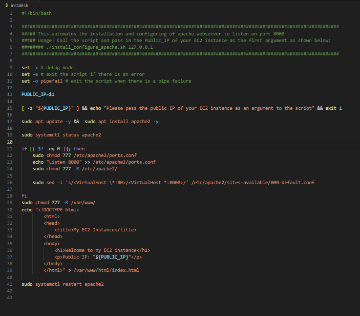
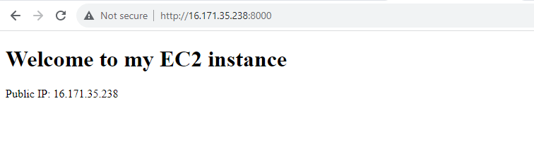
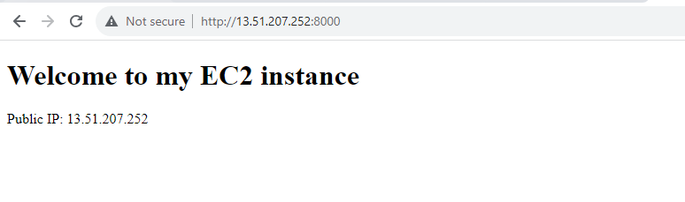
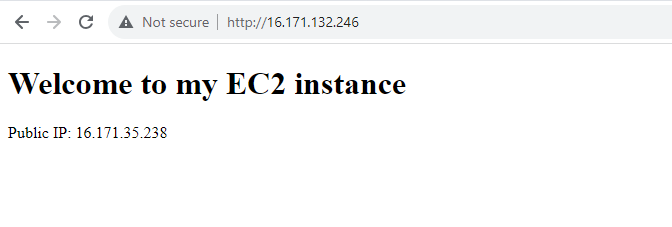
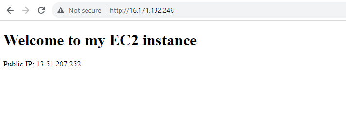

# AUTOMATING LOADBALANCER CONFIGURATION AND SHELL SCRIPTING

This project shows how tyo automate the setup and maintenance of your load balancer using a freestyle job,enhancing efficiency and reducing manual effort.

## AUTOMATE THE DEVELOPMENT OF WEBSERVERS

We will be writing a shell script to automate the entire process of seting up our backend webservers.

### DEPLOYING AND CONFIGURING THE WEBSERVERS

All the process we need to deploy has been codified in a shell script, and we will create an implement using the steps below to run the script.

*Step 1:* Provision 2 EC2 instances running ubunto 20.04 to act as our servers

*Step 2:* Open port 8000 to allow traffic form anywhere using the security group.

*Step 3:* connect to the web server using SSH client

*Step 4:* Open a file, paste the script and close the file using the command:

`sudo vi install.sh`

*Step 5:* Change the permission on the file to make it executable

`sudo chmod +x install.sh`

*Step 6:* Run the shell script using the command below

`./install.sh PUBLIC_IP`

Ensure to run the script on the two servers.

### DEPLOYING AND CONFIGURING NGINX LOAD BALANCER   

All steps in the implementing of a load balancer has also been codified into a shell script, we shall also create the script and run it using the steps below:

*Step 1:* on the terminal run 

`sudo vi nginx.sh`

*Step 2:* Copy and paste the script into the file save and close the file

*Step 3:* Change the permission on the file to make it executable

`sudo chmod +x nginx.sh`

*Step 4:* Run the script with the following command

`./nginx.sh PUBLIC_IP Webserver-1 Webserver-2`

you will also notice the load balancer toggles between the two webservers, shown by the change in public IP pictured above.

Thank you.

