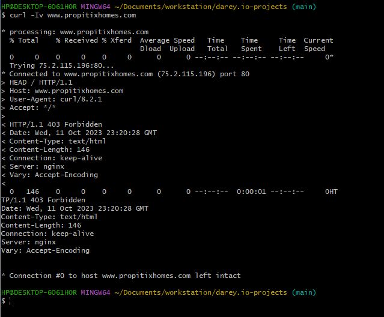
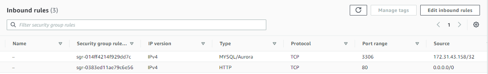
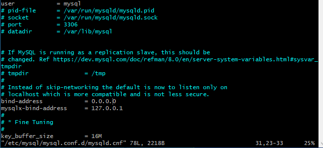
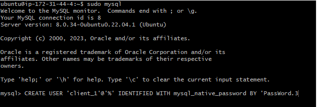
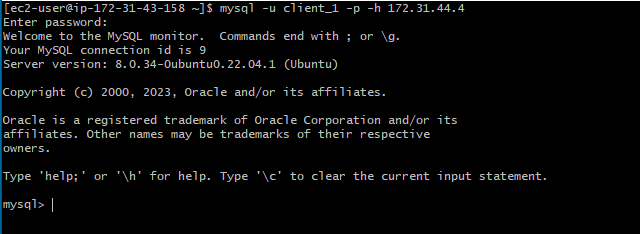
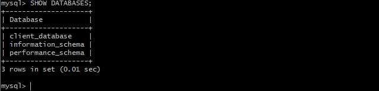

# UNDERSTANDING CLIENT-SERVER ARCHITECTURE WITH MYSQL

Client-server refers to an architecture in which 2 or more computers are connected together over a network to send and receive requests between one another.

in their communication , each machine has its own role: the machine sending the requests is usually reffered to as *Client* and the machine responding(serving) is called the *server*.

### EXAMPLE:

A real example of a LAMP STACK website deployed commercially is `www.propitixhomes.com`, The website can be reached from our browser over the Internet from anywhere in the world.

assuming we type `www.propitixhomes.com` in our browser, It means our browser is considered the **client**. Its essentially sending requests to the remote server, and in turn , would be expecting some kind of response from the remote server.

if we run a `curl` command on our terminal: 

`$ curl -Iv www.propitixhomes.com`

You can see that the request from the url are being served from a computer with an ip address  `75.2.115.196` on port `80`.

## IMPLEMENTING A CLIENT SERVER ARCHITECTURE USING MYSQL DATABASE MANAGEMENT SYSTEM (DBMS).

To demonstrate a basic client-server using **MYSQL RDBMS**, Follow the below instructions.

1. Create and configure 2 linux-based servers(EC2 instances in AWS).

`Server A name - **mysql server**`

`Server B name - **mysql client**`

2. On `mysql server` install Mysql-server software.

3. On `Mysql server` install Mysql-client software.

4. By default both EC2 virtual servers are located in the same local virtual network. so they can communicate with eachother using using **local IP addresses**. Use `mysql server's` local IP address to connect from `mysql client`.

Mysql servers use TCP port 3306 by default, so you will have to open it by creating a new *inbound rule* entry into the `mysql server` security groups.For extra security allow access only specific to the private local ip address of your `mysql server`.

5. U might need to configure Mysql server to allow connections from remote hosts.

`sudo vi /etc/mysql/mysql.conf.d/mysqld.cnf `

Replace `127.0.0.1` with `0.0.0.0` like this:

6. To connect `mysql client` remotely to `mysql server` database engine without using `SSH`. Using the mysql utility.

Connect to the `mysql server` mysql console and create a new user and password combination using:

`CREATE USER 'Client_1'@'%' IDENTIFIED BY 'PassWord.3';`

 Create a new database using:

`CREATE DATABASE 'client_database';`

And give user permission over the `client_database`:

`GRANT ALL ON client_database.* TO 'client_1'@'%';`

Save and exit.

From the client server run:

`mysql -u Client_1 -p -h 172.31.44.4`

Using the private Ip of the Server.

7. Check that you can successfully connect to the mysql remote server and can perform sql queries:

`Show databases;`

If you can see output similar to the image above, then you have deployed a fully functioning Mysql client-server set up.

Thank you.

