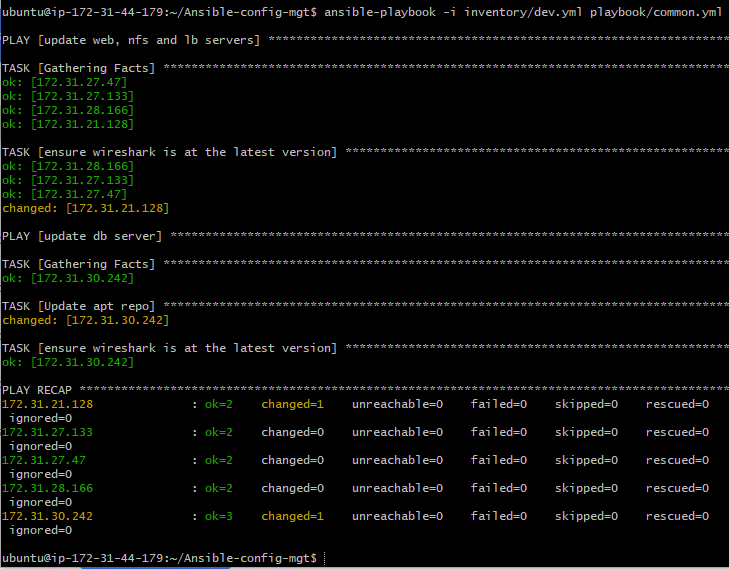

# ANSIBLE-AUTOMATE PROJECT

experience the power of automation with Ansible in this project, simplifying complex tasks and streamlining your IT infrastructure.

## ANSIBLE CONFIGURATION MANAGEMENT- AUTOMATE PROJECT 7 TO 10

A jump server (bastion host) is an intermediary server through which access to internal network can be provided. If you think about the current architect you are working on, ideally, the webservers would be inside a secured network which cannot be reached directly from the internet. That means even DevOps engineers cannot `ssh` into web servers directly and can only acccess through a jump server. It provides better security and reduces attack surface.

On the diagram below the virtual private network (VPC) is divided into two subnets - Public subnet has public addresses and Private subnet is only reached by private ip addresses.


## ***STEP 1:*** STEP 1INSTALL AND CONFIGURE ANSIBLE ON EC2 INSTANCE

- Create a webserver with the name tag `jenkins-ansible`, we will use this server to run playbooks.


-  In your Github account create a new repository and name it `ansible-configure-mgt`.

-  install Ansible 

```
sudo apt update
sudo apt install ansible
```

Check your ansible version by running `ansible --version`


- Configure jenkins build job to archive your repository content every time you change it, this will solidify your jenkins configuration skills acquired in project 9.

1. Create a new Freestyle project `ansible`in Jenkins and point it to your `ansible-config-mgt` repository.

2. Configure Webhook in GitHub and set webhook to trigger `ansible` build.


3. Configure a Post-build job to save all (**) files.

4. Test your setup by making some change in README.MD file in master branch and make sure that builds starts automatically and Jenkins saves the files (build artifacts) in following directory.

 `ls /var/lib/jenkins/jobs/ansible/builds/<build_number>/archive/`

 ## ***STEP 2:*** PREPARE YOUR DEVELOPMENT ENVIROMENT USING VISUAL STUDIO CODE.

 1. install VSCode.

 2. Configure it to connect to your newly created Github repository.

 3. Clone down your ansible-config-mgt repo to your Jenkins-Ansible instance.

 `git clone <ansible-config-mgt repo link>`

 #  BEGIN ANSIBLE DEVELOPMENT

 ## ***STEP 3:*** BEGIN ANSIBLE DEVELOPMENT

 1. In your `ansible-config-mgt` GitHub repository, create a new branch that will be used for development of a new feature.

 2. Checkout the newly created feature branch to your local machine and start building your code and directory structure

 3. Create a directory and name it `playbooks` - it will be used to store all your -playbook files.

 4. Create a directory and name it `inventory`- it will be used to keep to keep your host organised.

 5. Within the playbook folder, create your first playbook, and name it `comon.yml`,

 6. Within the inventory folder, create an inventory file () for each enviroment (development, staging, testing and production) `dev`, `staging`, `uat`, and `prod` respectively. 

 

 ## ***STEP 4:*** SET UP AN ANSIBLE INVENTORY

 An Ansible inventory file defines the hosts and groups of hosts upon which commands, modules, and tasks in a playbook operate. Since the intention is to execute Linux commands on remote hosts, and ensure that it is the intended configuration on a particular server that occurs. It is important to have a way to organize our hosts in such an Inventory.

 Save below inventory structure in the `inventory/dev` file to start configuring your development servers. Ensure to replace the IP addresses according to your own setup.

 Ansible uses TCP port 22 by default, which means it needs to `ssh` into target servers from Jenkins-Ansible host – for this you can implement the concept of `ssh-agent`. Now you need to import your key into `ssh-agent`:

```
 eval `ssh-agent -s`
 ssh-add <path-to-private-key>
```

Confirm the key has been added with this command, you should see the name of your key: 

`ssh-add -l`

Now, ssh into your Jenkins-Ansible server using ssh-agent: 

`ssh -A <username>@public-ip`

Also notice, that there are two different user names for RHEL-based servers is `ec2-user` and for Ubuntu is `Ubuntu`

Update your inventory/dev.yml file with this snippet of code:

```
[nfs]
<NFS-Server-Private-IP-Address> ansible_ssh_user=ec2-user

[webservers]
<Web-Server1-Private-IP-Address> ansible_ssh_user=ec2-user
<Web-Server2-Private-IP-Address> ansible_ssh_user=ec2-user

[db]
<Database-Private-IP-Address> ansible_ssh_user=ec2-user 

[lb]
<Load-Balancer-Private-IP-Address> ansible_ssh_user=ubuntu
```

Adjust to fit your server user names


## ***STEP 5:*** CREATE A COMMON PLAYBOOK

We would give Ansible the instructions on what you needs to be performed on all servers listed in `inventory/dev`. 

In `common.yml` playbook you will write configuration for repeatable, re-usable, and multi-machine tasks that is common to systems within the infrastructure.

Update your playbooks/common.yml file with following code:

```
---
- name: update web, nfs and db servers
  hosts: webservers, nfs, db
  become: yes
  tasks:
    - name: ensure wireshark is at the latest version
      yum:
        name: wireshark
        state: latest
   

- name: update LB server
  hosts: lb
  become: yes
  tasks:
    - name: Update apt repo
      apt: 
        update_cache: yes

    - name: ensure wireshark is at the latest version
      apt:
        name: wireshark
        state: latest
```


The playbook above is divided into two parts, each of them is intended to perform the same task: install **wireshark utility** (or make sure it is updated to the latest version) on your RHEL 8 and Ubuntu servers. It uses **root** user to perform this task and respective package manager: `yum` for RHEL 8 and `apt` for Ubuntu.

## ***STEP 6:*** UPDATE GIT WITH THE LATEST CODE

We need to push our local repository to the remote repository on Github.

Now you have a separate branch, you will need to know how to raise a pull request, get your branch  peer reviewed and merged to the `master` branch.

Commit your code into Github

1. Use git command to add, commit and push your branch to github.

```
git status
git add <selected files>
git commit -m "commit message"
```
2. Create a pull request
3. Have your code reviewed and merged to the `main` branch.

Once your code changes appear in master branch – Jenkins will do its job and save all the files (build artifacts) to /var/lib/jenkins/jobs/ansible/builds/<build_number>/archive/ directory on Jenkins-Ansible server.


## ***STEP 7:*** RUN ANSIBLE TEST

1. Setup your vscode to connect to your instance and run your play book command.

`cd ansible-config-mgt`

`ansible-playbook -i inventory/dev.yml playbooks/common.yml`


**NOTE- I HAVE TWO SERVERS RUNNING ON DIFFERENT KEY PAIRS SO THE SSH AGENT COULDNT CONNECT TO THE INSTANCE FOR VERIFICATION--- TO CORRECT THIS, I CREATED AN SSH KEY PAIR ON THE JENKINS SERVER USING `SSH-KEYGEN` AND COPIED THE PUBLIC KEY TO THE `AUTHORIZED_KEYS` OF THE WEB SERVERS AND RAN THE ANSIBLE PLAYBOOK AGAIN.**




If your command ran successfully, go to each of the servers and confirm if wireshark has been installed by running `which wireshark` or `wireshark --version`.

Your updated Ansible architecture now looks like this:


You can update the playbook to run a simple task and go over the full `checkout -> change codes -> commit -> PR -> merge -> build -> ansible-playbook` cycle again to see how easily you can manage servers of any size with just one command.


Thank you.
