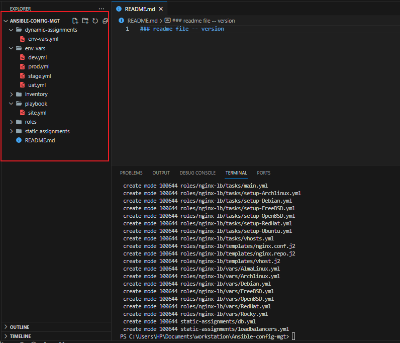
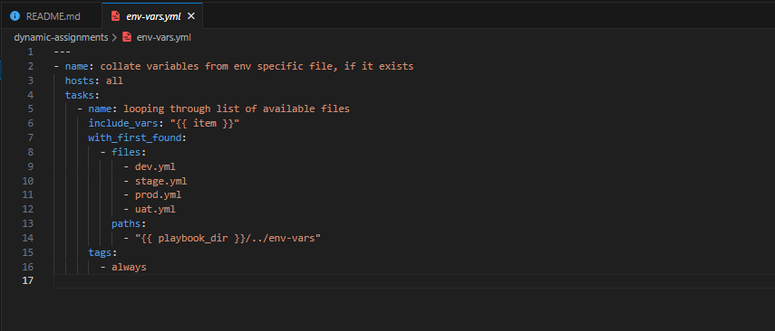
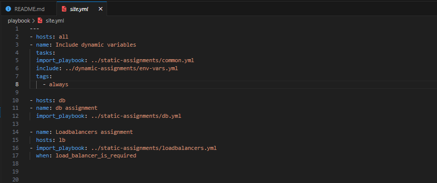
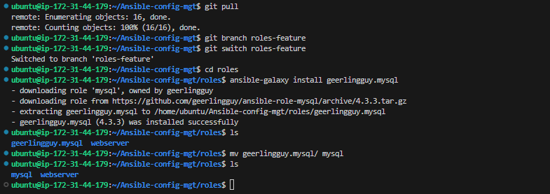
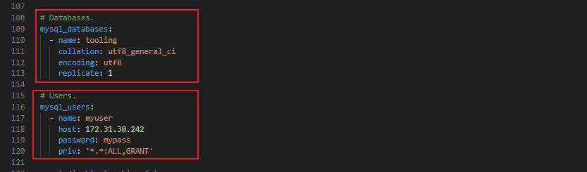
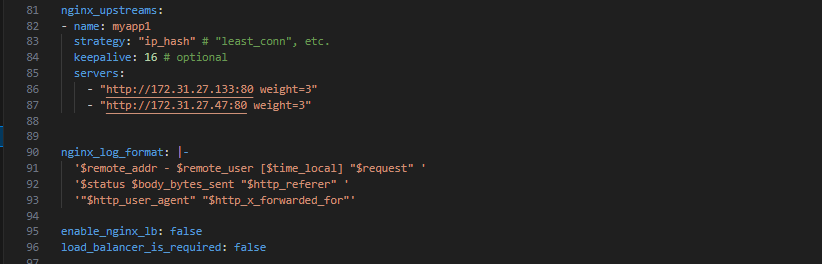
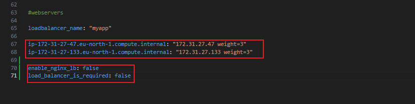
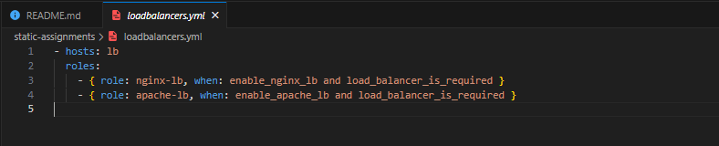
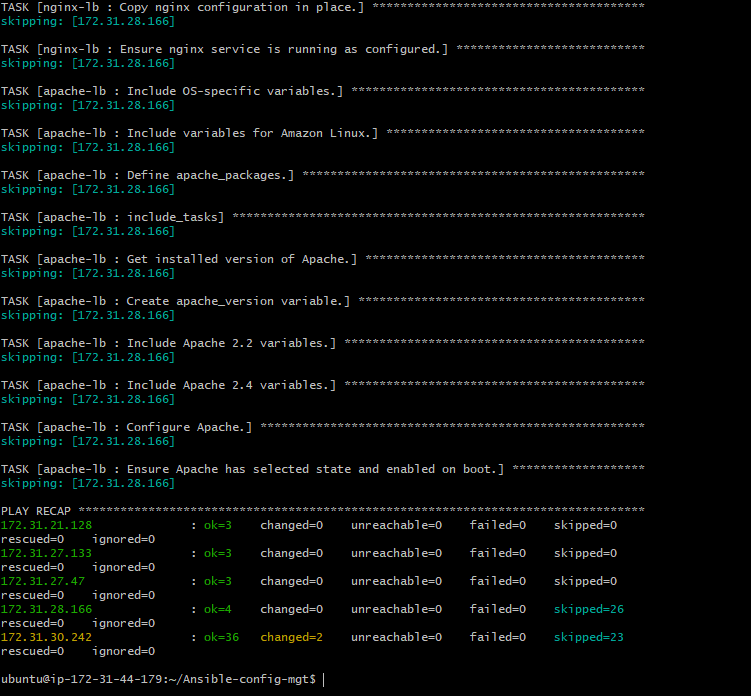

INTRODUCING DYNAMIC ASSIGNMENT INTO OUR STRUCTURE

In your `https://github.com/<your-name>/ansible-config-mgt` GitHub repository start a new branch and call it `dynamic-assignments`.

Create a new folder, name it `dynamic-assignments`. Then inside this folder, create a new file and name it `env-vars.yml`. We will instruct `site.yml` to `include` this playbook later.

Your GitHub shall have following structure by now.

File sturcture should now be:

```
├── dynamic-assignments
│   └── env-vars.yml
├── inventory
│   └── dev
    └── stage
    └── uat
    └── prod
└── playbooks
    └── site.yml
└── roles (optional folder)
    └──...(optional subfolders & files)
└── static-assignments
    └── common.yml
```

Since we will be using the same Ansible to configure multiple environments, and each of these environments will have certain unique attributes, such as servername, ip-address etc., we will need a way to set values to variables per specific environment.

For this reason, we will now create a folder to keep each environment’s variables file. Therefore, create a new folder `env-vars`, then for each environment, create new YAML files which we will use to set variables.

Your layout should now look like this.

```
├── dynamic-assignments
│   └── env-vars.yml
├── env-vars
    └── dev.yml
    └── stage.yml
    └── uat.yml
    └── prod.yml
├── inventory
    └── dev
    └── stage
    └── uat
    └── prod
├── playbooks
    └── site.yml
└── static-assignments
    └── common.yml
    └── webservers.yml
```



Now paste the instruction below into the `env-vars.yml` file.

```
---
- name: collate variables from env specific file, if it exists
  hosts: all
  tasks:
    - name: looping through list of available files
      include_vars: "{{ item }}"
      with_first_found:
        - files:
            - dev.yml
            - stage.yml
            - prod.yml
            - uat.yml
          paths:
            - "{{ playbook_dir }}/../env-vars"
      tags:
        - always
```



## UPDATE SITE.YML WITH DYNAMIC ASSIGNMENTS

Update `site.yml` file to make use of the dynamic assignment. (At this point, we cannot test it yet. We are just setting the stage for what is yet to come. So hang on to your hats)

site.yml should now look like this.

```
---
- hosts: all
- name: Include dynamic variables 
  tasks:
  import_playbook: ../static-assignments/common.yml 
  include: ../dynamic-assignments/env-vars.yml
  tags:
    - always

-  hosts: webservers
- name: Webserver assignment
  import_playbook: ../static-assignments/webservers.yml
```



## UPDATE SITE.YML WITH DYNAMIC ASSIGNMENTS

Now it is time to create a role for MySQL database – it should install the MySQL package, create a database and configure users. But why should we re-invent the wheel? There are tons of roles that have already been developed by other open source engineers out there. These roles are actually production ready, and dynamic to accomodate most of Linux flavours. With Ansible Galaxy again, we can simply download a ready to use ansible role, and keep going.

On your Webserver Create a new branch and name `roles-feature`

### Download Mysql Ansible Role

We will be using a MySQL role developed by *geerlingguy*

Inside `role` directory create your new MySQL role with 

`ansible-galaxy install geerlingguy.mysql` 

and rename the folder to `mysql`.

`mv geerlingguy.mysql/ mysql`



Read `readme.md` file, and edit roles configuration to use correct credentials for Mysql required for the `tooling` website.



You can at this point upload our changes to github, create a pull request and merge to the `main` branch.

```
git add .
git commit -m "Commit new role files into GitHub"
git push --set-upstream origin roles-feature
```

### LOAD BALANCER ROLES

We want to be able to choose between load balancer to use, `Nginx` or `Apache`, so we need to have two roles respectively.

Inside roles directory create your new Nginx role with 

`ansible-galaxy install geerlingguy.nginx`

and rename the folder to `nginx-lb`

`mv geerlingguy.nginx/ nginx-lb`

Inside roles directory create your new Apache role with 

`ansible-galaxy install geerlingguy.apache`

and rename the folder to `apache-lb`

`mv geerlingguy.apache/ apache-lb`

*Note*: 

- Since you cannot use both `Nginx` and `Apache` load balancer, you need to add a condition to enable either one – this is where you can make use of variables.

- Declare a variable in `defaults/main.yml` file inside the Nginx and Apache roles. Name each variables `enable_nginx_lb` and `enable_apache_lb` respectively.

- Set both values to false like this `enable_nginx_lb: false` and `enable_apache_lb: false`.

- Declare another variable in both roles `load_balancer_is_required` and set its value to `false` as well





- Update both `static-assignment` and `site.yml` files respectively to refer the roles.

`loadbalancers.yml`
```
- hosts: lb
  roles:
    - { role: nginx, when: enable_nginx_lb and load_balancer_is_required }
    - { role: apache, when: enable_apache_lb and load_balancer_is_required }
```



`site.yml`
```
     - name: Loadbalancers assignment
       hosts: lb
         - import_playbook: ../static-assignments/loadbalancers.yml
        when: load_balancer_is_required 
```


Now you can make use of `env-vars\uat.yml` file to define which loadbalancer to use in UAT environment by setting respective environmental variable to `true`.


You will activate load balancer, and enable `nginx` by setting these in the respective environment’s env-vars file.

```
enable_nginx_lb: true
load_balancer_is_required: true
```

The same must work with `apache` LB, so you can switch it by setting respective environmental variable to `true` and other to `false`.

To test this you can update your inventory for each enviroment and run your play book against each enviroment.

*Note* - Make sure you are connected using ssh-agent

Run the playbook against the `dev.yml` enviroment.

`ansible-playbook -i inventry/dev.yml playbook/site.yml`



Thank you.
