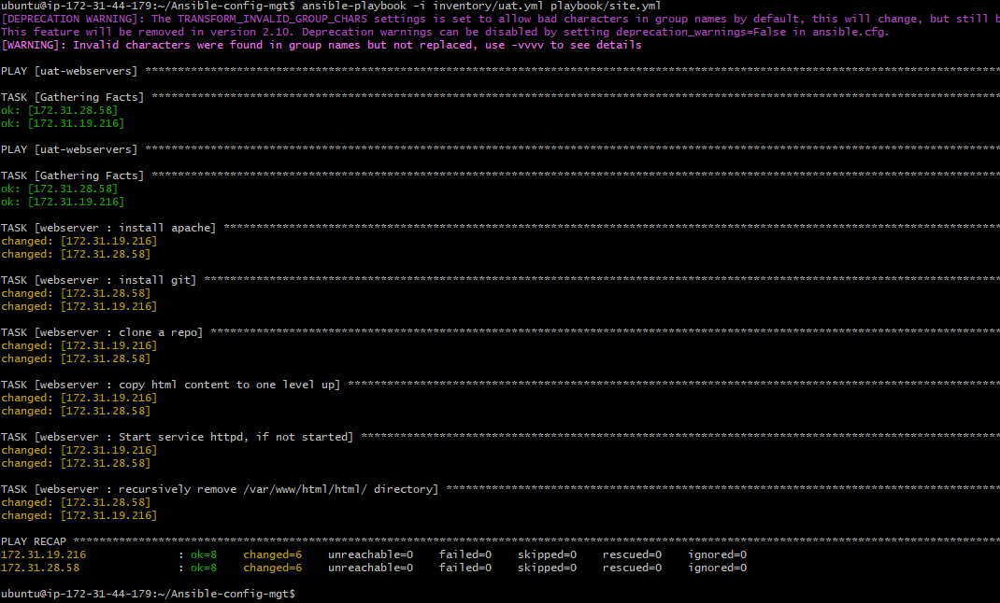

# ANSIBLE REFACTORING, ASSIGNMENTS AND IMPORTS

In this project we will be working to improve our codes in the `ansible-config-mgt` repository.It teaches how to refacctor your ansible code, to create assignments, and learn how to use the import functionality.

## CODE REFACTORING

This is basically making changes to the source code without changing expected behaviour of the software, Main idea is to enhance the code readability,increase maintainability and extensibility, reduce complexity, add proper comments without affecting logic.

## REFACTOR ANSIBLE CODE BY IMPORTING OTHER PLAYBOOKS INTO SITE.YML

### Step 1 - Jenkins job enhancement

1. Go to your `jenkins-ansible` server and create a new directory called `ansible-config-artifact` we will store there all the artifacts after each build.

`sudo mkdir /home/ubuntu/ansible-config-artifact`

2. Change permissions to this directory, so jenkins could sve files there 

`chmod -R 0777 /home/ubuntu/ansible-config-artifact`

3. Go to jenkins web console -->Manage jenkins -> Manage Plugins -> on `available` tab search for `copy artifacts` and install this plugin without restarting jenkins.

4. Create a new freestyle project and name it `save artifacts`.

5. This project will be triggered by completion of your existing `ansible` project. Configure it accordingly.


6. The main idea is to save artifacts into the `/home/ubuntu/ansible-config-artifact` directory. To achieve this, create a `build` step and choose `copy artifacts form other project`, specify `ansible` as a source project and `/home/ubuntu/ansible-config-artifact`as a tartget directory.


7. Test your set up by making changes to you read me file inside you `ansible-config-mgt` repo, If both jenkins jobs have completed one after another you should see your file inside `/home/ubuntu/ansible-config-artifact`directory, and it will be updated with every commit to your main branch.


### Step 2 - Refactor ansible code by importing other playbooks into `site.yml`

Before starting pull down from the main branch and create a new branch called `refactor`


1. Within `playbooks` folder, create a new file and name it `site.yml` - this would now be the entry point into the entire infrastructure configuration. It would be a reference point for other playbooks, in other words `site.yml` would become a parent to all other playbooks that will be developed, including the `common.yml` that was created before.

2. Create a new folder `static-assignments`.- this is where all the children playbooks will be stored. it is not an ansible specific concept, therefore you can choose how you want to organize your work.

3. Move `common.yml` file into the newly created `static-assignments` folder.

4. Inside `site.yml` file, import `common.yml` playbook.

```
---
- hosts: all
- import_playbook: ../static-assignments/common.yml
```


The code above uses builtin **import_playbook** Ansible module.

Your file structure should look like this

```
├── static-assignments
│   └── common.yml
├── inventory
    └── dev
    └── stage
    └── uat
    └── prod
└── playbooks
    └── site.yml
```

5. Run your `ansible-playbook` against the `dev` enviroment.


Create another playbook under `static-assignments` named `common-del.yml`. in this playbook configure the deletion or wireshark utility.

```
---
- name: update web, nfs and db servers
  hosts: webservers, nfs, db
  remote_user: ec2-user
  become: yes
  become_user: root
  tasks:
  - name: delete wireshark
    yum:
      name: wireshark
      state: removed

- name: update LB server
  hosts: lb
  remote_user: ubuntu
  become: yes
  become_user: root
  tasks:
  - name: delete wireshark
    apt:
      name: wireshark-qt
      state: absent
      autoremove: yes
      purge: yes
      autoclean: yes
```


Update `site.yml` with `- import_playbook: ../static-assignments/common-del.yml` instead of `common.yml` and run it against `dev` servers.

```
cd /home/ubuntu/ansible-config-mgt/

ansible-playbook -i inventory/dev.yml playbooks/site.yaml
```


And make sure `wireshark` has been deleted on the servers by running `wireshark --version`.


Now you have learnt how to use the import_playbooks module in ansible.

## CONFIGURE UAT WEBSERVERS WITH A ROLE WEBSERVER

### Step 3 - Configure UAT webservers with a role 'webserver'

1. Launch 2 fresh servers using redhat 8 image and tag as `web1-uat` and `web2-uat`.


2. Create a directory called `roles/`, relative to the plqaybook file or in `/etc/ansible/` directory.

- you can either use `ansible-galaxy` utility inside the `ansible-config-mgt/roles` directory 

```
mkdir roles
cd roles
ansible-galaxy init webserver
```

- Or create the file structure manually.

The enitre folder structure should look like this 


3. Update your inventory `ansible-config-mgt/inventory/uat.yml` file with IP addresses of your 2 UAT web servers.

```
[uat-webservers]
<Web1-UAT-Server-Private-IP-Address> ansible_ssh_user='ec2-user'
<Web2-UAT-Server-Private-IP-Address> ansible_ssh_user='ec2-user'
```


4. In `/etc/ansible/ansible.cfg` file uncomment `roles_path` string and provide a full path to your roles directory `roles_path = /home/ubuntu/Ansible-config-mgt\roles`. so ansible would know where to find the configured roles.


5. It is time to start adding somw logic to the webserver role, add within the `task/main.yml`file codes to 

- Install and configure Apache (httpd service)

- Clone Tooling website from Github

- Ensure the tooling website code is deployed to `/var/www/html` on each of 2 UAT web servers.

- Make sure `httpd` service is started


```
---
- name: install apache
  become: true
  ansible.builtin.yum:
    name: "httpd"
    state: present

- name: install git
  become: true
  ansible.builtin.yum:
    name: "git"
    state: present

- name: clone a repo
  become: true
  ansible.builtin.git:
    repo: https://github.com/<your-name>/tooling.git
    dest: /var/www/html
    force: yes

- name: copy html content to one level up
  become: true
  command: cp -r /var/www/html/html/ /var/www/

- name: Start service httpd, if not started
  become: true
  ansible.builtin.service:
    name: httpd
    state: started

- name: recursively remove /var/www/html/html/ directory
  become: true
  ansible.builtin.file:
    path: /var/www/html/html
    state: absent
```


## REFERENCE WEBSERVER ROLE

### Step 4 - Reference 'Webserver' role

Within the `static-assignments` folder, create a new assignment for uat-webservers `uat-webservers.yml`. This is where you will reference the role.

```
---
- hosts: uat-webservers
  roles:
     - webserver
```


Refer your `uat-webservers.yml` role inside `site.yml` the entry point to our ansible configuration.

```
---
- hosts: all
- import_playbook: ../static-assignments/common.yml 

- hosts: uat-webservers
- import_playbook: ../static-assignments/uat-webservers.yml

```


### Step 5 - Commit and test

Commit changes, create a pull request, and merge to the main branch, make sure your webhook triggered 2 consequent jenkins jobs, ran successfully and saved the jobs.

Now run the playbook against your `uat` inventory and see what happens

```
cd /home/ubuntu/ansible-config-mgt

ansible-playbook -i /inventory/uat.yml playbooks/site.yaml
```



You should be able to see both your UAT web servers configured and you can try to reach them from your browser

`http://<web1-uat-server-public-IP>/index.php`


or

`http://<web2-uat-server-public-IP>/index.php`


Your ansible architecture now looks like this


