# AWS NETWORKING IMPLEMENTATION (VPC, SUBNETS, IG, NAT, ROUTING)

## VPC CREATION AND SUBNET CONFIGURATION

An Amazon Virtual Private Cloud (VPC) is like your own private section of the Amazon cloud, where you can place and manage your resources. you control who and what can go in and out, just likea gated community.

DEFAULT VPC

This is a pre-configured space in the Amazon cloud where you can immediately start deploying your applications or services. It has built in security and network settings to help you get up and running quickl, but you can adjust this as you see fit.

# CREATING A NEW VPC

- Click on `create Vpc`

- Choose the `VPC only option`

- Enter you name tag example `my-vpc`

- Enter your IPv4 CIDR, example : 10.0.0.0/16 

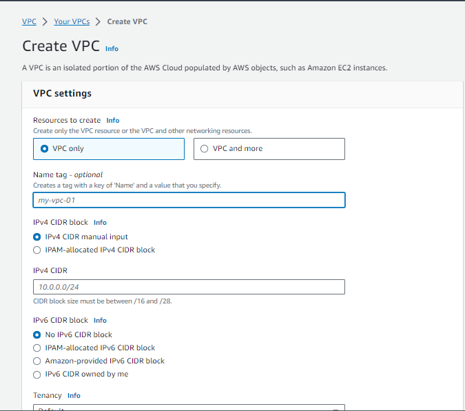

As soon as the VPC is created, its assigned with a vpc-id and there's a route table created that serves as the main route table.

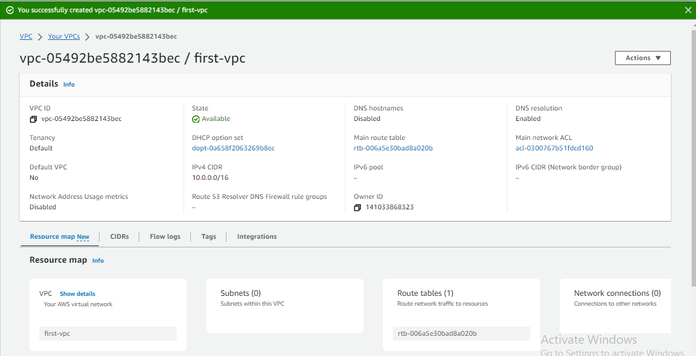

Now you have a vpc and a route table, but you can't put anything in it yet, as it still requires subnets.

## CREATING AND CONFIGURING SUBJECTS

Subnets are smaller segments within a vpc that help you organize and manage your resources.

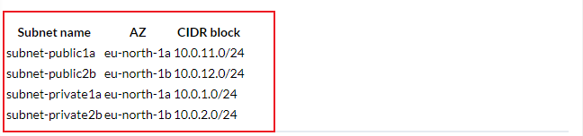

Go to VPC > Subnets > Create Subnets and select the VPC you have created previously - the  `my-vpc` or anything you tagged it as before.

- Click on `create subnet`

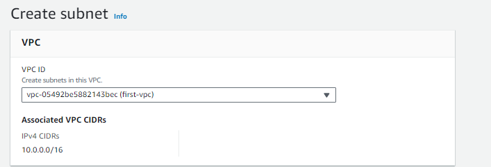

- Enter the subnet settings detail

- click the `add new subnet` 

- add remaining subnets then after completion 

- click on `create subnet`

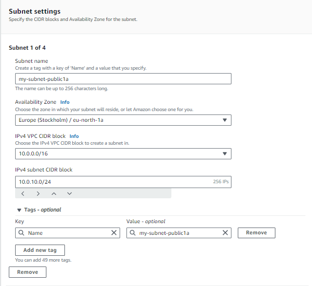

you should see a list of all the subnets created, you can deploy an EC2 instance now to your VPC by chhosing a subnet, but the public subnets don't have internet access at this stage. When you select a public subnet > route, you should see that it uses the main route table and only has the local route, no default route for internet access.

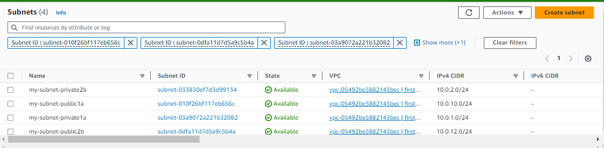

### UNDERSTANDING PUBLIC AND PRIVATE SUBNETS IN AWS VPC

Public subnets are subnets that have direct internet access like your webservers, while private subnets are subnets that dont have direct internet accessexaple is your database servers.

### Creating a public Subnet

- Go to the AWS VPC page

- Find the `subnets` and click on `Create subnets`

- Give the subnet a name tag, select the VPC to be used

- Attach an internet gateway to this subnet to provide internet access.

- Update the route table associated with this subnet to allow traffic to flow to and from the internet.

### Creating a private Subnet

- Go to the AWS VPC page

- Find the `subnets` and click on `Create subnets`

- Give the subnet a name tag, select the VPC to be used

- Don't attach an internet gateway to this subnet, keeping it secluded.

- The route table associated with this subnet does not allow traffic from the internet.

### WORKING WITH PUBLIC AND PRIVATE SUBNETS

Understanding public and private subnets helps to organize and protect your AWS resources better. Always remember use public subnets for resources that need internet access and private subnets for resources that you want to keep private.

## INTERNET GATEWAY AND ROUTING TABLE

An internet gateway in AWS is a link that allows the VPC to connect to the internet, without it data cnnot come in or out into the VPC.

to give your public subnet access to the internet, you need an internet gateway.

### PUBLIC GATEWAYS

Technically the subnets are still private, you'll need these to make it work as a public subnet:

- An internet gateway(IGW) attached to the VPC

- Route table with default route towards the IGW

- Public IP assinged to the AWS resources (eg EC2 instance)

Go to VPC > Internet gateway and click "Create internet gateway"

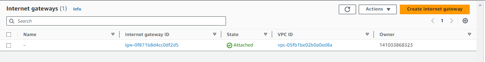

Put a name tag and click `Create internet gateway`

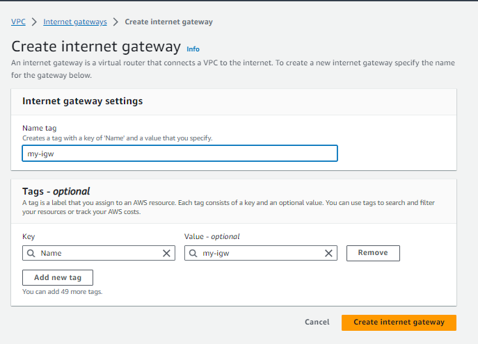

Attach the IGW to the VPC

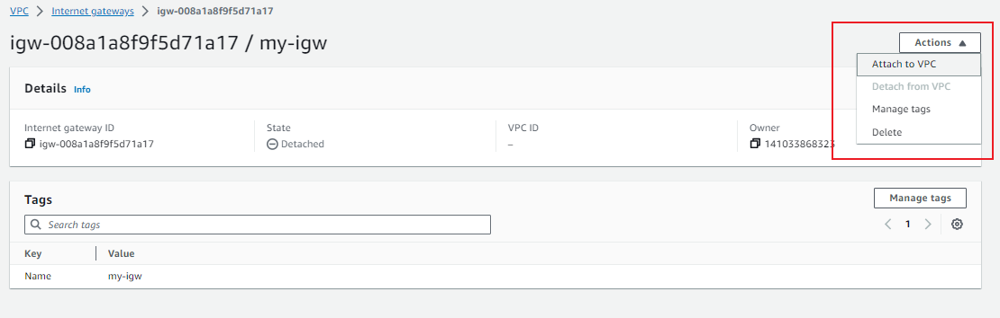

Select the VPC

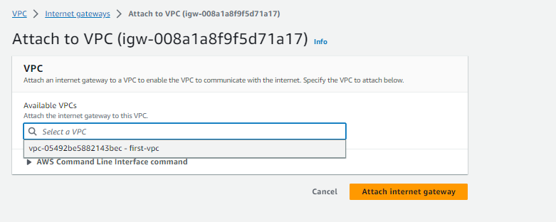

We want the private subnet to be private. we dont want the private subnets to have a default route to the internet. For that we need to create a separate igw for the public subnets.

### ROUTING TABLE

A routing table is like a map that lets data directions to their destinations. For example if the data wants to go to the internet the routing table will tell it take the IGW that we built.

### CREATING AND CONFIGURING ROUTING TABLES

Lets go to the route table menu and create a route table for the public subnets.

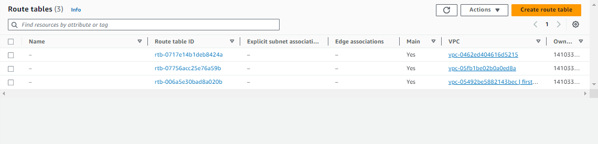

Put a name for the route table 

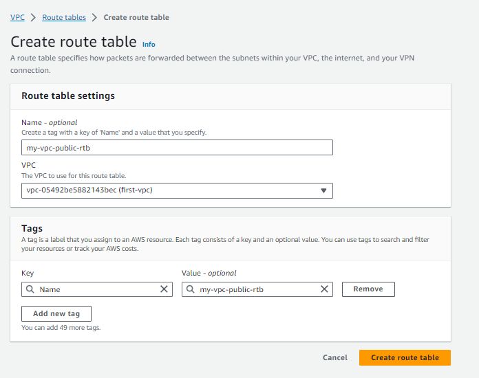

Once created, edit the route table, add a default route to the internet gateway (IGW)

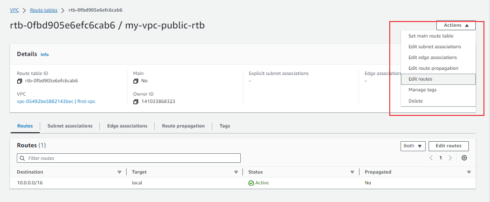

After select internet gateway

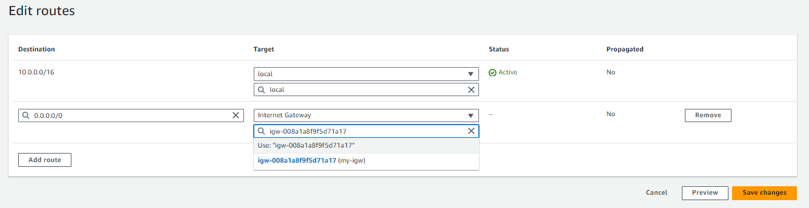

Next go to the 'subnet associations" tab and click `edit subnet associations`

- select the public subnets and click `Save associations`

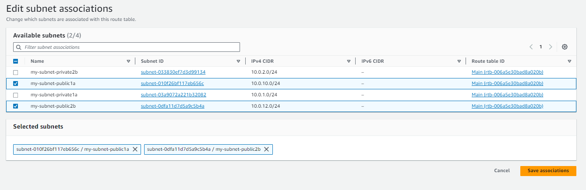

Now that the VPC is ready, you can run an EC2 instance in public subnets if they need internet access or in private subnets if they dont.

## NOTE:

- my-subnet-public-rtb: A route table with a target to internet gateway is a public route table.

- my-subnet-private-rtb: A route table with a target to NAT gateway is a private route table.

I will also create the route table for private, but subnets and routes are not yet attached to it only created.

## NAT GATEWAY AND PRIVATE SUBNETS

### INTRODUCTION TO PRIVATE SUBNETS AND NAT GATEWAY

In your AWS VPC, private subnets are secluded areas where you can place resources that should not be directly exposed to the internet. But what if these resources need to access the internet for updates or downloads, this is where a NAT gateway comes in.

### UNDERSTANDING NAT (NETWORK ADDRESS TRANSLATION) GATEWAY

A NAT gateway acts like a source door that only opens one way. It allows your resource inside the private subnet to access the internet fro things like updates and downloads, but it doesnt allow anything form the internet to enter your private subnet.

NAT allows instances in your private subnet to connect to outside services like databases but restricts external services to connecting to these instances.

### CREATING A NAT GATEWAY AND LINKING IT TO A PRIVATE SUBNET

We'll guide you step -by-step on how to create a NAT gateway and how to link it to your private subnet. WE'll also cover how to configure a route in your routing table to direct outbound internet traffic from your subnet to the NAT gateway.

Go to VPC > NAT gateways and click `create NAT gateway`

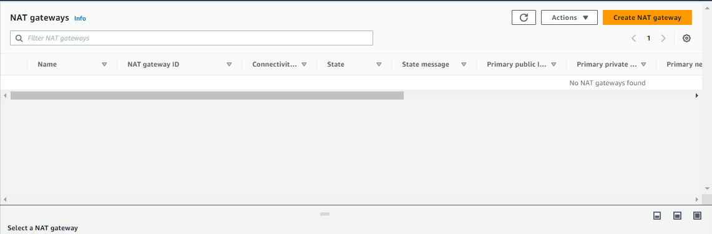

Create the NAT gateway named test-nat under one of the private subnets.

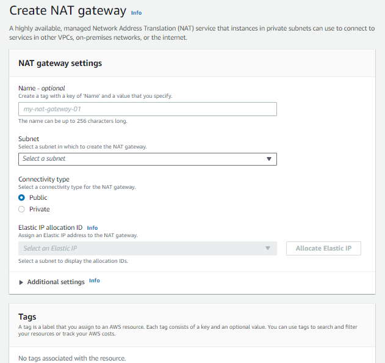

You need to allocate an Elastic IP because it is required for the creation of NAT gateways.

Lets go to the route table menu, and edit the route table, add a default route to the network address translation gateway.

Choose route table RTB-private, select routes tab and select add routes. Under the target, select the NAT gateway named "test-nat"

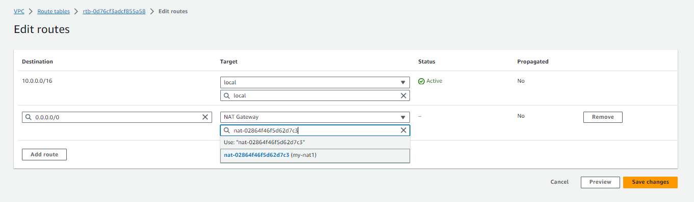

Next go to the `subnet associations` tab and click `edit subnet associations`

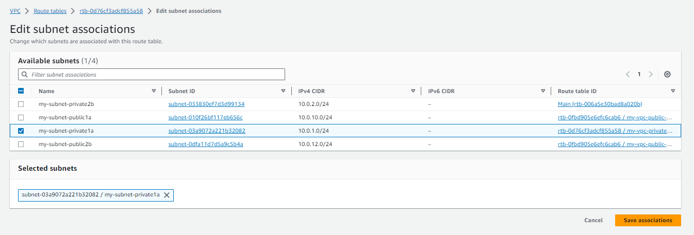

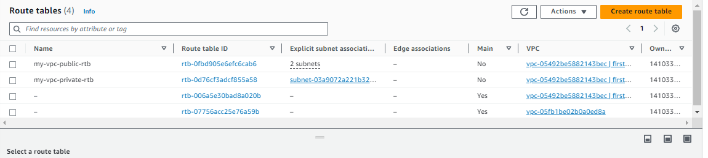

The whole setup is complete.

Thank you.