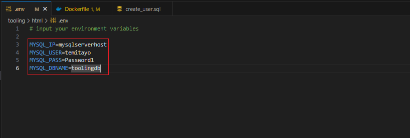

# CONTAINER MIGRATION PROJECT FROM VM(EC2) TO CONTAINERS

Discover the art of container migration from VM (EC2) to containers in this project, modernizing your application deployment and achieving scalability, portability, and resource efficiency

## MIGRATION TO THE СLOUD WITH CONTAINERIZATION

Until now, you have been using VMs (AWS EC2) in Amazon Virtual Private Cloud (AWS VPC) to deploy your web solutions, and it works well in many cases. You have learned how easy to spin up and configure a new EC2 manually or with such tools as Terraform and Ansible to automate provisioning and configuration. You have also deployed two different websites on the same VM; this approach is scalable, but to some extent; imagine what if you need to deploy many small applications (it can be web front-end, web-backend, processing jobs, monitoring, logging solutions, etc.) and some of the applications will require various OS and runtimes of different versions and conflicting dependencies - in such case you would need to spin up serves for each group of applications with the exact OS/runtime/dependencies requirements. When it scales out to tens/hundreds and even thousands of applications (e.g., when we talk of microservice architecture), this approach becomes very tedious and challenging to maintain.

In this project, we will learn how to solve this problem and begin to practice the technology that revolutionized application distribution and deployment back in 2013! We are talking of Containers and imply Docker. Even though there are other application containerization technologies, Docker is the standard and the default choice for shipping your app in a container.

PREREQUISITES

Install Docker and prepare for migration to the Cloud
First, we need to install Docker Engine, which is a client-server application that contains:

A server with a long-running daemon process dockerd.
APIs that specify interfaces that programs can use to talk to and instruct the Docker daemon.
A command-line interface (CLI) client docker.
You can learn how to install Docker Engine on your PC [here](https://docs.docker.com/engine/install/)

### Deploying Application Using Docker

MySQL in container

Let us start assembling our application from the Database layer - we will use a pre-built MySQL database container, configure it, and make sure it is ready to receive requests from our PHP application.

- Step 1: Pull MySQL Docker Image from [Docker Hub Registry](https://hub.docker.com/)

Start by pulling the appropriate Docker image for MySQL. You can download a specific version or opt for the latest release, as seen in the following command:

`docker pull mysql/mysql-server:latest`


If you are interested in a particular version of MySQL, replace latest with the version number. 

List the images to check that you have downloaded them successfully:

`docker images ls`


- Step 2: Deploy the MySQL Container to your Docker Engine

1. Once you have the image, move on to deploying a new MySQL container with:

Copy Below Code

`docker run --name <container_name> -e MYSQL_ROOT_PASSWORD=<my-secret-pw> -d mysql/mysql-server:latest`

- Replace <container_name> with the name of your choice. If you do not provide a name, Docker will generate a random one
- The -d option instructs Docker to run the container as a service in the background
- Replace <my-secret-pw> with your chosen password
- In the command above, we used the latest version tag. This tag may differ according to the image you downloaded

2. Then, check to see if the MySQL container is running: Assuming the container name specified is mysql-server

`docker ps -a`


You should see the newly created container listed in the output. It includes container details, one being the status of this virtual environment. The status changes from health: starting to healthy, once the setup is complete.

- Step 3: Connecting to the MySQL Docker Container
We can either connect directly to the container running the MySQL server or use a second container as a MySQL client. Let us see what the first option looks like.

Approach 1

Connecting directly to the container running the MySQL server:

`docker exec -it <container_name> mysql -uroot -p`


Provide the root password when prompted. With that, you have connected the MySQL client to the server.

Finally, change the server root password to protect your database.

Approach 2

First, create a network:

Copy Below Code

`docker network create --subnet=172.18.0.0/24 tooling_app_network `


Creating a custom network is not necessary because even if we do not create a network, Docker will use the default network for all the containers you run. By default, the network we created above is of DRIVER Bridge. So, also, it is the default network. You can verify this by running the docker network ls command.

But there are use cases where this is necessary. For example, if there is a requirement to control the cidr range of the containers running the entire application stack. This will be an ideal situation to create a network and specify the --subnet

For clarity's sake, we will create a network with a subnet dedicated for our project and use it for both MySQL and the application so that they can connect.

Run the MySQL Server container using the created network.

First, let us create an environment variable to store the root password:

`export MYSQL_PW=<root-secret-password>`

Then, pull the image and run the container, all in one command like below:

`docker run --network tooling_app_network -h mysqlserverhost --name=mysql-server -e MYSQL_ROOT_PASSWORD=$MYSQL_PW  -d mysql/mysql-server:latest `

Flags used

- -d runs the container in detached mode
- --network connects a container to a network
- -h specifies a hostname

If the image is not found locally, it will be downloaded from the registry.

Verify the container is running:

`docker ps -a`


As you already know, it is best practice not to connect to the MySQL server remotely using the root user. Therefore, we will create an SQL script that will create a user we can use to connect remotely.

Create a file and name it create_user.sql and add the below code in the file:

```
CREATE USER '<user>'@'%' IDENTIFIED BY '<client-secret-password>';
GRANT ALL PRIVILEGES ON * . * TO '<user>'@'%';
```
Run the script:

`docker exec -i mysql-server mysql -uroot -p$MYSQL_PW < ./create_user.sql`


### Container Registry and Image Push

Connecting to the MySQL server from a second container running the MySQL client utility

Run the MySQL Client Container:

`docker run --network tooling_app_network --name mysql-client -it --rm mysql mysql -h mysqlserverhost -u <user-created-from-the-SQL-script> -p`


Flags used:

- --name gives the container a name
- -it runs in interactive mode and Allocate a pseudo-TTY
- --rm automatically removes the container when it exits
- --network connects a container to a network
- -h a MySQL flag specifying the MySQL server Container hostname
- -u user created from the SQL script
- -p password specified for the user created from the SQL script

### Prepare database schema

Now you need to prepare a database schema so that the Tooling application can connect to it.

1. Clone the Tooling-app repository from here:

`git clone https://github.com/darey-devops/tooling.git`

2. On your terminal, export the location of the SQL file:

`export tooling_db_schema=~/tooling/html/tooling_db_schema.sql`

You can find the `tooling_db_schema.sql` in the `html` folder of cloned repo.

3. Use the SQL script to create the database and prepare the schema. With the docker exec command, you can execute a command in a running container.
Copy Below Code:

`docker exec -i mysql-server mysql -uroot -p$MYSQL_PW < $tooling_db_schema`


4. Update the `.env` file with connection details to the database

```
$servername = "mysqlserverhost";
$username = "<user>";
$password = "<client-secret-password>";
$dbname = "toolingdb";
```



5. Run the Tooling App

Containerization of an application starts with creation of a file with a special name - 'Dockerfile' (without any extensions). This can be considered as a 'recipe' or 'instruction' that tells Docker how to pack your application into a container. In this project, you will build your container from a pre-created `Dockerfile`, but as a DevOps, you must also be able to write Dockerfiles.

So, let us containerize our Tooling application; here is the plan:

- Make sure you have checked out your Tooling repo to your machine with Docker engine
- First, we need to build the Docker image the tooling app will use. The Tooling repo you cloned above has a `Dockerfile` for this purpose. Explore it and make sure you understand the code inside it.
- Run `docker build` command
- Launch the container with `docker run`
- Try to access your application via port exposed from a container

Let us begin:

Ensure you are inside the folder that has the Dockerfile and build your container:

`docker build -t tooling:0.0.1 .`

In the above command, we specify a parameter `-t`, so that the image can be tagged `tooling"0.0.1 `- Also, you have to notice the . at the end. This is important as that tells Docker to locate the `Dockerfile` in the current directory you are running the command. Otherwise, you would need to specify the absolute path to the `Dockerfile`.


6. Run the container:

`docker run --network tooling_app_network -p 8085:80 -it tooling:0.0.1`


Let us observe those flags in the command.

- We need to specify the `--network` flag so that both the Tooling app and the database can easily connect on the same virtual network we created earlier.
- The `-p` flag is used to map the container port with the host port. Within the container, `apache` is the webserver running and, by default, it listens on port 80. You can confirm this with the `CMD ["start-apache"]` section of the Dockerfile. But we cannot directly use port 80 on our host machine because it is already in use. The workaround is to use another port that is not used by the host machine. In our case, port 8085 is free, so we can map that to port 80 running in the container.

If everything works, you can open the browser and type`http://localhost:8085`


## PRACTICE: Implement a POC to migrate the PHP-Todo app into a containerized application.

Download php-todo repository from [here](https://github.com/dareyio/php-todo)

The project below will challenge you a little bit, but the experience there is very valuable for future projects.

Part 1

1. Write a Dockerfile for the TODO app
2. Run both database and app on your laptop Docker Engine
3. Access the application from the browser


Part 2

1. Create an account in Docker Hub
2. Create a new Docker Hub repository
3. Push the docker images from your PC to the repository


Part 3

1. Write a `Jenkinsfile` that will simulate a Docker Build and a Docker Push to the registry
2. Connect your repo to Jenkins
3. Create a multi-branch pipeline
4. Simulate a CI pipeline from a feature and master branch using previously created `Jenkinsfile`
5. Ensure that the tagged images from your `Jenkinsfile` have a prefix that suggests which branch the image was pushed from. For example, `feature-0.0.1.`
6. Verify that the images pushed from the CI can be found at the registry.


### Deployment with Docker Compose

All we have done until now required quite a lot of effort to create an image and launch an application inside it. We should not have to always run Docker commands on the terminal to get our applications up and running. There are solutions that make it easy to write declarative code in YAML, and get all the applications and dependencies up and running with minimal effort by launching a single command.

In this section, we will refactor the Tooling app POC so that we can leverage the power of Docker Compose.

1. First, install Docker Compose on your workstation from here
2. Create a file, name it tooling.yaml
3. Begin to write the Docker Compose definitions with YAML syntax. The YAML file is used for defining services, networks, and volumes:

```
version: "3.9"
services:
  tooling_frontend:
    build: .
    ports:
      - "5000:80"
    volumes:
      - tooling_frontend:/var/www/html
    links:
      - db
  db:
    image: mysql:5.7
    restart: always
    environment:
      MYSQL_DATABASE: <The database name required by Tooling app >
      MYSQL_USER: <The user required by Tooling app >
      MYSQL_PASSWORD: <The password required by Tooling app >
      MYSQL_RANDOM_ROOT_PASSWORD: '1'
    volumes:
      - db:/var/lib/mysql
volumes:
  tooling_frontend:
  db:
```

Run the command to start the containers

`docker-compose -f tooling.yaml  up -d `


You have started your journey into migrating an application running on virtual machines into the Cloud with containerization.

Now you know how to prepare a `Dockerfile`, build an image with `Docker build` and deploy it with `Docker Compose`!

