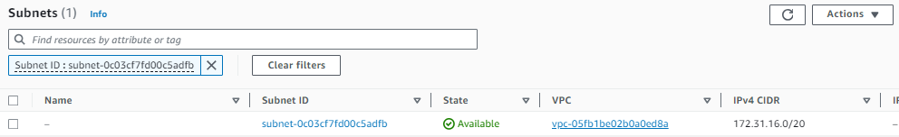
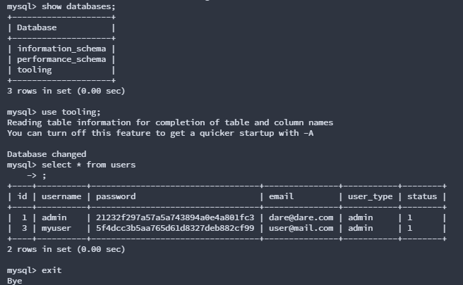

# DEVOPS TOOLING WEBSITE SOLUTION

In this project, I will be adding more value to this solution by implementing a tooling website solution that makes access to DevOps tools within the corporate infrastructure easily accessible.

In this project, you will implement a solution that consists of the following components:

- Infrastructure: AWS

- Webserver Linux: Red Hat Enterprise Linux 8

- Database Server: Ubuntu 20.04 + MySQL

- Storage Server: Red Hat Enterprise Linux 8 + NFS Server

- Programming Language: PHP

- GitHub Code Repository.

### Architecture

We will be implementing a solution that comprises multiple web servers sharing a common database and also accessing the same files using Network File System (NFS) as shared file storage.


In order to choose the appropriate storage solution for your needs, it is crucial to consider a number of factors. To do this, you must address several questions, such as what type of data will be stored, in what format, how the data will be accessed, who will have access to it, from where, and how often. Once you have answered these questions, you will be better equipped to select the appropriate storage system for your specific requirements.


## IMPLEMENTING A BUSINESS WEBSITE USING NFS FOR THE BACKEND FILE STORAGE

### ***Step 1:*** Prepare NFS Server

1. Spin up a new EC2 instance with RHEL Linux 8 operating system that will serve as an “NFS Server”. This instance should have three volumes in the same AZ as your EC2 instance, each of 10 GB.

2. Based on the steps documented in my previous project, configure LVM on the server but

 - Instead of formatting the disks as ext4, we will be formatting them as xfs.

 - Ensure there are 3 Logical Volumes. lv-opt lv-apps, and lv-logs

 - Create mount points on /mnt directory for the logical volumes as follows:

```
Mount lv-apps on /mnt/apps – To be used by web servers
Mount lv-logs on /mnt/logs – To be used by web server logs
Mount lv-opt on /mnt/opt – To be used by Jenkins server in a future project.
```


3. Install the NFS server, configure it to start on reboot, and make sure it is up and running.

```
sudo yum -y update
sudo yum install nfs-utils -y
sudo systemctl start nfs-server.service
sudo systemctl enable nfs-server.service
sudo systemctl status nfs-server.service
```


4. Export the mounts for webservers’ `subnet cidr` to connect as clients. In this project, we will keep things simple by installing all three webservers inside the same subnet, but in production, these will probably be kept in different subnets for a higher level of security. To check your `subnet cidr` open your EC2 details in AWS and locate the Networking tab  and open a subnetlink.



Make sure we set up permissions that will allow our web servers to read, write and execute files on NFS:

```
sudo chown -R nobody: /mnt/apps
sudo chown -R nobody: /mnt/logs
sudo chown -R nobody: /mnt/opt

sudo chmod -R 777 /mnt/apps
sudo chmod -R 777 /mnt/logs
sudo chmod -R 777 /mnt/opt

sudo systemctl restart nfs-server.service
```

configure access to NFS for clients within the same subnet( example of a subnet CIDR - 172.31.32.0/20)

open the `/etc/exports` file using:

`sudo vi /etc/exports`

Copy and past the following commands,

```
/mnt/apps <Subnet-CIDR>(rw,sync,no_all_squash,no_root_squash)
/mnt/logs <Subnet-CIDR>(rw,sync,no_all_squash,no_root_squash)
/mnt/opt <Subnet-CIDR>(rw,sync,no_all_squash,no_root_squash)
```

Save exit

`Esc + :wq!`

`sudo exportfs -arv`


5.  Check which port is used by NFS and open it using Security Groups. In order for NFS server to be accessible from your client, you must also open the following ports: TCP 111, UDP 111 and UDP 2049 in addition to the NFS ports TCP 2049.

`rpcinfo -p | grep nfs`


## CONFIGURE BACKEND DATABASE AS PART OF 3 TIER ARCHITECTURE

### ***Step 2:*** Configure the database server

In this section we would Install and configure a MySQL DBMS to work with remote Web Server, log into the mysql console, create a database, and then create a user with full privileges to the database.

- Install MySQL server.

- Create a database and name it `tooling`

- Create a database user called `webaccess`

- Grant permission to this `webaccess` user to have full permissions on the `tooling` database only from the `subnet cidr`.


### ***Step 3:*** Prepare the Webservers

we will be launching three web servers, We need to make sure that the web servers can serve the same content from shared storage solutions, which are MySQL database and NFS server.

For storing shared files that our Web Servers will use, we will utilize NFS and mount previously created logical Volume lv-apps to the folder where Apache stores files to be served to the users (/var/www).

This approach will make our Web Servers stateless, which means we will be able to add new ones or remove them whenever we need, and the integrity of the data (in the database and on NFS) will be preserved.

therefore in the next steps we shall 
- Configure NFS client 

- Deploy a Tooling application to our webservers in the shared NFS directory.

- Configure webservers to work with a single Mysql database.

1. Launch a new EC2 instance with RHEL 8 Operating System

2. Install NFS client

`sudo yum install nfs-utils nfs4-acl-tools -y`

3. mount `/var/www` and target the NFS server's export for apps

`sudo mkdir /var/www`
`sudo mount -t nfs -o rw,nosuid<NFS-Server-Private-IP-Address>:/mnt/apps /var/www`


`df -h` used to verify success.

4. To make sure changes will remain after reboot on the web server open :

`sudo vi /etc/fstab`

and add the following line

`<NFS-Server-Private-IP-Address>:/mnt/apps /var/www nfs defaults 0 0`


5. install Remi's repository, Apache and PHP

```
sudo yum install httpd -y

sudo dnf install https://dl.fedoraproject.org/pub/epel/epel-release-latest-8.noarch.rpm

sudo dnf install dnf-utils http://rpms.remirepo.net/enterprise/remi-release-8.rpm

sudo dnf module reset php

sudo dnf module enable php:remi-7.4

sudo dnf install php php-opcache php-gd php-curl php-mysqlnd

sudo systemctl start php-fpm

sudo systemctl enable php-fpm

sudo setsebool -P httpd_execmem 1
```

### NOTE - Repeat steps 1-5 for the other 2 webservers

6. Verify that Apache files and directories are available on the Web Server in /var/www and also on the NFS server in /mnt/apps. If you see the same files, it means NFS is mounted correctly. You can test this by creating a new file from one web server and check if it is accessible from other web servers.

From NFS-server 


From Webserver


7. Locate the log folder for Apache on the Web Server and mount it to NFS server’s export for logs. Repeat step №3 and №4 to make sure the mount point will persist after reboot

`sudo mount -t nfs -o rw,nosuid <NFS-Server-Private-IP-Address>:/mnt/logs /var/log/httpd`

To make sure changes will remain after reboot on the web server open :

`sudo vi /etc/fstab`

and add the following line

`<NFS-Server-Private-IP-Address>:/mnt/logs /var/log/httpd nfs defaults 0 0`


8. Fork the tooling source code from [Darey.io github account](https://github.com/darey-io/tooling) to your Github account.(Learn how to fork a Repo [here](https://www.youtube.com/watch?v=f5grYMXbAV0&feature=youtu.be))

9. Deploy the tooling website’s code to the Webserver. Ensure that the html folder from the repository is deployed to /var/www/html


To deploy, begin by installing git on the webserver using:

`sudo yum install git -y` 

Initialize Git: 

`git init`

Make a clone of the repository on the web server

`git clone https://github.com/temitayo-ob/tooling.git`

clone link is gotten from your git hub 


Copy the `html` directory and deploy to `/var/www/html` using cp command

`sudo cp -R tooling/html /var/www/ `

Using the -R flag to copy recursively.


Note 1 - Do not forget to open TCP port 80 on the web server.

Note 2 - check permissions to your `/var/www/html` folder to ensure that it is own by root, Disable SELinux by running `sudo setenforce 0`
To make this change permanent, open following config file `sudo vi /etc/sysconfig/selinux` and set `SELINUX=disabled` then restart httpd using `sudo systemctl restart httpd`.

10. Update the website’s configuration file `/var/www/html/functions.php`to connect to the database, and Apply `tooling-db.sql` script to your database using this command

`sudo mysql -h <Database-private-IP-address> -u webaccess -p -D tooling < tooling-db.sql`

open and edit the file configurations

`sudo vi /var/www/html/functions.php` 


To apply `tooling-db.sql` script first install Mysql client software

`sudo yum mysql -y`

open tooling directory 

`cd tooling`

run 

`sudo mysql -h <Database-private-IP-address> -u webaccess -p -D tooling < tooling-db.sql`


11.  Create in MySQL a new admin user with the username: myuser and password: password

- Change to the Devops_tooling directory

- Connect to the mySQL server from the webserver using the ‘webaccess’ user created earlier and the private IP of the DB server.

`sudo mysql -h <Database-private-IP-address> -u webaccess -p`

insert user

```
INSERT INTO tooling.users (id, username, password, email, user_type, status) VALUES ('2', 'myuser', '5f4dcc3b5aa765d61d8327deb882cf99', 'user@mail.com', 'admin', '1');
```




12. Open the website in your browser http://<webserver-public-IP>/index.php and make sure you can login into the website with myuser user.


### make sure u can access from the 2 other servers also

WEBSERVER 2


WEBSERVER 3


