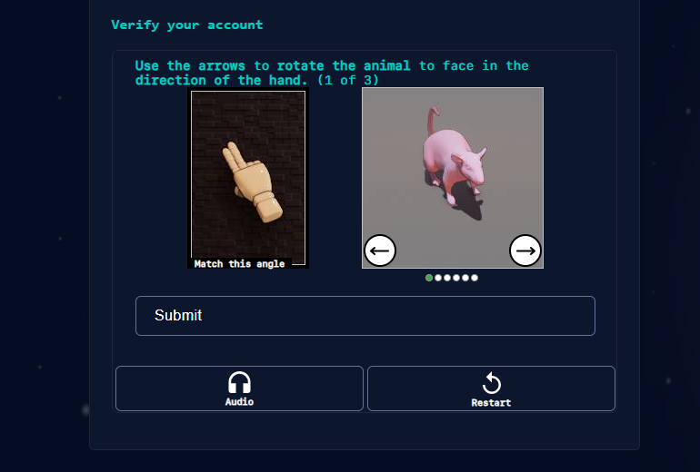
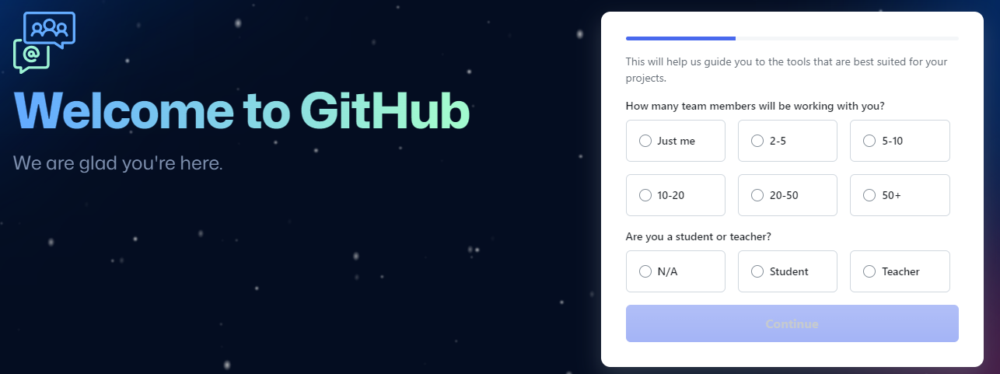
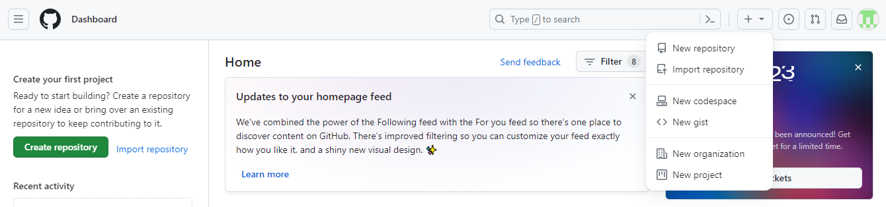
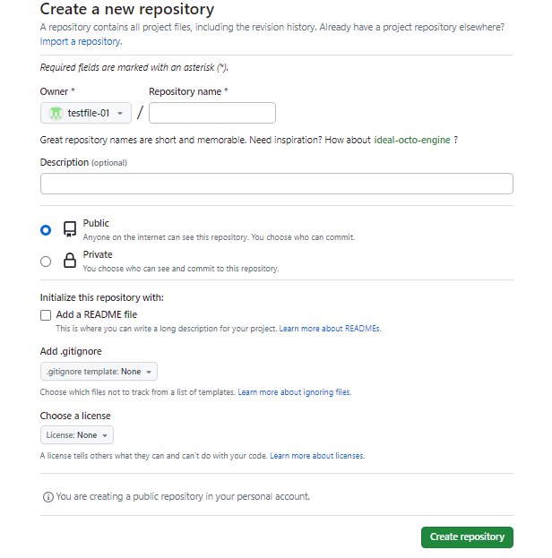
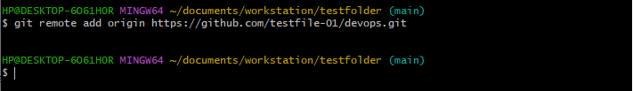
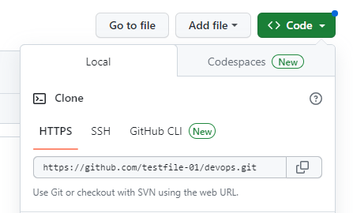

# GIT PROJECT BY TEMITAYO OBISAKIN

## INITIALIZING A REPOSITORY AND MAKING COMMITS

Lets start by introducing GIT

## what is Git 

Git is a distributed version control sytem, it solves the problem of sharuing code efficiently and keeping track of changes made to source code.

### initializing a Git repository

To initialize a git repository follow these steps:

- Open a terminal on your computer, example is gitbash.
- On your terminal create your working folder or directory, example testfolder using `mkdir testfolder`
- Change or move into your working directory using `cd testfolder`
- while inside the folder run `git init` command.

### Making your first commit 

in the last section we created a directoty and initialized a git repository, now we will make our first commit.

A commit is basically saving changes made to a repository either its by adding, modifying, or deleting text or files, it takes a snapshot of the current state of your repository and saves a copy in the .git folder inside your working directory.

follow these steps to make a commit
- inside your working directory create a file index.txt using command `touch index.txt`
- Write any sentence of your choice inside the text file afterwards and save your changes.
- Add your chsnges to git staging area using this command `git add .`
- To commit your changes to git, run the command `git commit -m "initial commit"`

-m flag is used to provide a commit message, when writing a commit message make it as descriptive as possible. let it explain why the commit was made.

## WORKING WITH BRANCHES

### Working with branches
A git branch helps create a copy of your source code, changes can be made to the new branch that are independent of the main copy.

Its commonly used to develpo a new feature of your application, it is also an important tool for collaboration within remote teams(developers working from different locations). they can make separate branches while working on the same feature, and at the end of the day merge their code into one branch.

### Make your first git branch 
to make a new branch run this command `git checkout -b`. The -b flag helps you create and change into a new branch.

Lets follow the following steps:
- Having made your first commit in the previous lesson
- make a new branch by running this command `git checkout -b my-new-branch`

### listing your branches

To list branches on your local git repository use the command `git branch`

### Change into an old branch 

to change into an existing or old branch use the command `git checkout <branch name>`

### Merging a branch into another branch

Assuming we have two branches A and B, and we want to add the content a branch B into A we first change into branch A and the run the git command `git merge B`

### deleting a branch 

After the new branch has fulfilled its purpose and has been tested and merged to the staging or development enviroment, ussually the branch is deleted depending on the branch strategy of the team.

a git branch can be deleted with the command `git branch -d <branch_name>`

to learn more about git branches type the command `git branch --help` on your terminal.

## COLLABORATION AND REMOTE REPOSITORIES

### collaboration and remote reposirories 

Git is can also be used for collaboration among remote teams, and this can be achieved with the use of Github. Github is a web based platform where git repositories are hosted. by hosting a local repository on git hub it becomes available in the public internet, It is also possible to create private repositories as well.

remote teams can now collaborate on projects efficiently.

### creating a Github account 

step 1: Head over to [github](https://github.com/)

step 2: Enter your username, email and password.

Step3 3: Next click on the verify button to verify your identity

Step 4: Next click on the create button to create your account 

Step 5: An activation code would be sent to your email, enter the code in textboxes provided and continue.

Step 6: Select your preferences and click continue

Step 7: a list of plans would be shown to you, choose the free plan

### Creating your first repository

Step 1: click on the plus sign at the top right corner of your github account, select new repository from the drop down menu.

Step 2: Fill out the form by adding a unique repository name, description and ticking the box to add a readme.md file.

Step 3: Click the green button below to create your repository.

### Pushing your local git repository to your git hub repository.

having created both a gitub account and github repository, Lets send a copy of our local git repository to our repository in github. 

We will achieve this by the following steps below:
- Add a remote repository to the local repository by using this command below:

`git remote add origin <link to your github repo>`

To get the remote link click on the green button code, copy the https link. a screen shot is shown below.

- After commiting your changes in your locl repo, you push the content to the remote repo using the command below:

`git push origin <branch name>`

