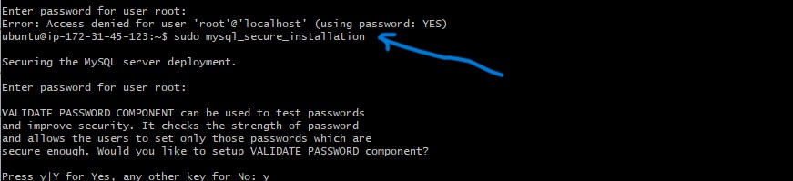

# LAMP STACK IMPLEMENTATION

A technology stack is a set of frameworks and tools used to develop a software product.this set of  framework and tools are very specially chosen to work together in creating a well functioning software.

We focus on LAMP (Linux,Apache,Mysql,Php or Python, or Pen)

## PREPARING PREREQUISITES

I have previously created an AWS account and a virtual server with ubuntu server OS.

I have also signed in and launched an EC2 instance using ssh. on my local machine using my private pem key.

## INSTALLING APACHE AND UPDATING THE FIREWALL

### Step 1 - Installing Apache and updating the firewall

Apache is a most widely used web server software, it can be highly customized to meet the needs of many different enviroments by using extentions and modules.

I installed apache using these commands 

`#update a list of packages in package manager`

`$ sudo apt update`

`#run apache2 package installation`

`$ sudo apt install apache2`

And verified it was running as a service on my os using:

`sudo systemctl status apache2`

Green and running means it was installed correctly.

To receive traffic to the web server i opened TCP port 80 the default port used by web browsers to access web pages on the internet, i previosly had only TCP 22 port open which is the default used to connect to the EC2 instance.

To achieve this i added a security rule to the EC2 config to open inbound connections through port 80.

And confirmed it was running by the following URL in my web browser:

`http://<Public-IP-Address>:80`

## INSTALLING MYSQL

### Step 2 - Installing Mysql

Mysql is a database management system used within PHP enviroments.

I installed Mysql using the command:

`sudo apt install mysql-server`

When the installation was finished i logged into the mysql console using:

`sudo mysql`

I set a password for my root user using :

`ALTER USER 'root'@'localhost' IDENTIFIED WITH mysql_native_password BY 'PassWord.1'`

Exited the shell using : `mysql> exit`

And ran an interactive security script that comes pre installed to remove insecure default settings and lockdown access to the database system.

`sudo mysql_secure_installation`

iIset my password, set other security protocols 

Tested if i could log into the mysql console using:

`sudo mysql -p`

The -p flag prompts for the password

Then exited, Mysql server is now installed and secure.

## INSTALLING PHP

### Step 3 - Installing PHP

PHP is used to process code to display dynamic content to the end user.in addition we'll need `php-mysql`, a php model that allows PHP to communicate with mysql based databases. `libapache2-mod-php` to enable Apache to handle PHP files.

To install all 3 at once: 

`sudo apt install php libapache2-mod-php php-mysql`

Afterwards i ran this command to confirm my php version 

`php -v`

The Lamp stack is completely installed and fully operational
- Linux(Ubunt)
- Apache HTTP server
- Mysql
- PHP

## CREATING A VIRTUAL HOST FOR YOUR WEBSITE USING APACHE

### step 4 - Creating a virtual host for your website using apache.

Setting up a domain called `projectlamp`.

To create a directory for `projectlamp` using ***'mkdir'*** command:

`sudo mkdir /var/www/projectlamp`

Next i assigned ownership of the directory with the `$user` enviroment variable.

`sudo chown -R $USER:$USER /var/www/projectlamp`

Created a new configuration file in apache's sites-available directory using vi command editor

`sudo vi /etc/apache2/sites-available/projectlamp.conf`

And inputed the following text

`<VirtualHost *:80>`

``
    `ServerName projectlamp`
    `ServerAlias www.projectlamp `
    `ServerAdmin webmaster@localhost`
    `DocumentRoot /var/www/projectlamp`
    `ErrorLog ${APACHE_LOG_DIR}/error.log`
    `CustomLog ${APACHE_LOG_DIR}/access.log combined`

`</VirtualHost>`

saved and exited

And confirmed its location using `ls`

`sudo ls /etc/apache2/sites-available`

`You will see something like this`

`000-default.conf  default-ssl.conf  projectlamp.conf`

With this we are telling apache to serve `projectlamp` **using /var/www/projectlamp** as its web root directory.

We can now use **a2ensite** command to enable the new virtual host:

`sudo a2ensite projectlamp`

To disable apache's default website use:

`sudo a2dissite 000-default`

To make make sure configuration file doesnt have syntax errors

`sudo apache2ctl configtest`

Finally we reload apache so these changes take effect

`sudo systemctl reload apache2`

The website is active,but the web root is empty.

Create an index.html file to test the website is working.

`sudo echo 'Hello LAMP from hostname' $(curl -s http://169.254.169.254/latest/meta-data/public-hostname) 'with public IP' $(curl -s http://169.254.169.254/latest/meta-data/public-ipv4) > /var/www/projectlamp/index.html`

Now went to the browser and opened : `http://<Public-IP-Address>:80`

Also tested using the DNS

`http://<Public-DNS-Name>:80`

## ENABLE PHP ON THE WEBSITE 

### Step 5 - Enable PHP on the website

I edited the default directory settings to make `index.php` file take precedence over the `index.html` file. using:

`sudo vim /etc/apache2/mods-enabled/dir.conf`

And changed the order of the files.

`<IfModule mod_dir.c>`

 `#Change this:`

 `#DirectoryIndex index.html index.cgi index.pl index.php `
 `index.xhtml index.htm`

 `#To this:`

 `DirectoryIndex index.php index.html index.cgi   index.pl index.xhtml index.htm`

`</IfModule>`

Saved, closed and reloaded apache so it would take effect.

`sudo systemctl reload apache2`

Finally created a php script to test that php is working correctly and configured well on the server.

`vim /var/www/projectlamp/index.php`

And pasted the php code inside the file.

`<?php`
`phpinfo();`

Save and close.

To test this script i inouted this URL into my browser.

`http://server_domain_or_IP/index.php`

This page provides information about your server from the perspective of PHP. It is useful for debugging and to ensure that your settings are being applied correctly.

If you see this page in your browser, then your PHP installation is working as expected.

After checking the relevant information about your PHP server through that page, it’s best to remove the file you created as it contains sensitive information about your PHP environment and your Ubuntu server. Use `rm` to do so:

`sudo rm /var/www/projectlamp/index.php`

you can always recreate the page if access is needed later.

Thank you.

