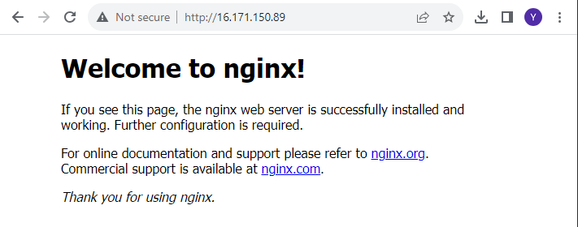
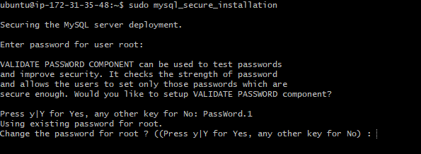
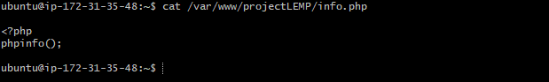
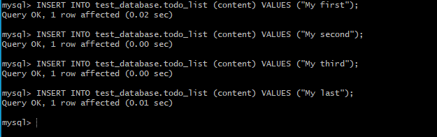

# LEMP STACK IMPLEMENTATION

A technology stack is a set of frameworks and tools used to develop a software product.this set of  framework and tools are very specially chosen to work together in creating a well functioning software.

We focus on LAMP (Linux,Nginx,Mysql,Php or Python, or Pen)

## PREPARING PREREQUISITES

I have previously created an AWS account and a virtual server with ubuntu server OS.

I have also signed in and launched an EC2 instance using ssh. on my local machine using my private pem key.


## INSTALLING NGINX WEB SERVER

### Step 1 - Installing Nginx web server

Nginx is a high performance web server software.

First we update our server's package inde, then install Nginx using `apt install` as shown:

`sudo apt update`

`sudo apt install nginx`


And verified it was running as a service on my os using:

`sudo systemctl status nginx`


Green and running means it was installed correctly.

To receive traffic to the web server i opened TCP port 80 the default port used by web browsers to access web pages on the internet, i previosly had only TCP 22 port open which is the default used to connect to the EC2 instance.

To achieve this i added a security rule to the EC2 config to open inbound connections through port 80.


And confirmed it was running by the following URL in my web browser:

`http://<Public-IP-Address>:80`



## INSTALLING MYSQL

### Step 2 - Installing Mysql

Mysql is a database management system used within PHP enviroments.

I installed Mysql using the command:

`sudo apt install mysql-server`

When the installation was finished i logged into the mysql console using:

`sudo mysql`


I set a password for my root user using :

`ALTER USER 'root'@'localhost' IDENTIFIED WITH mysql_native_password BY 'PassWord.1'`


Exited the shell using : `mysql> exit`

And ran an interactive security script that comes pre installed to remove insecure default settings and lockdown access to the database system.

`sudo mysql_secure_installation`



I set my password, set other security protocols. 


Tested if i could log into the mysql console using:

`sudo mysql -p`

The -p flag prompts for the password


Then exited, Mysql server is now installed and secure.

Note: At the time of this writing, the native MySQL PHP library mysqlnd doesn’t support caching_sha2_authentication, the default authentication method for MySQL 8. For that reason, when creating database users for PHP applications on MySQL 8, you’ll need to make sure they’re configured to use mysql_native_password instead. We’ll demonstrate how to do that in Step 6.

## INSTALLING PHP

### Step 3 - Installing PHP

PHP is used to process code to display dynamic content to the end user.in addition we'll need `php-mysql`, a php model that allows PHP to communicate with mysql based databases. `php-fpm` which stands for "PHP fastCGI process manager", and tells Nginx to pass PHP request to this software for processing.

To install all 3 at once: 

`sudo apt install php php-fpm php-mysql`


## CONFIGURING NGINX TO USE PHP PROCESSOR

### step 4 - configuring Nginx to use php processor

Setting up a domain called `projectLEMP`.

To create a root web directory for `projectLEMP` using ***'mkdir'*** command:

`sudo mkdir /var/www/projectLEMP`

Next i assigned ownership of the directory with the `$user` enviroment variable.

`sudo chown -R $USER:$USER /var/www/projectLEMP`

Created a new configuration file in apache's sites-available directory using nano command editor

`sudo nano /etc/apache2/sites-available/projectlamp.conf`

And inputed the following text :

#/etc/nginx/sites-available/projectLEMP


```
server {
    listen 80;
    server_name projectLEMP www.projectLEMP;
    root /var/www/projectLEMP;

    index index.html index.htm index.php;

    location / {
        try_files $uri $uri/ =404;
    }

    location ~ \.php$ {
        include snippets/fastcgi-php.conf;
        fastcgi_pass unix:/var/run/php/php8.1-fpm.sock;
     }

    location ~ /\.ht {
        deny all;
    }

}
```


- `listen` — Defines what port Nginx will listen on. In this case, it will listen on port 80, the default port for HTTP.
- root — Defines the document root where the files served by this website are stored.

- `index` — Defines in which order Nginx will prioritize index files for this website. It is a common practice to list `index.html` files with a higher precedence than `index.php` files to allow for quickly setting up a maintenance landing page in PHP applications. You can adjust these settings to better suit your application needs.

- `server_name` — Defines which domain names and/or IP addresses this server block should respond for. Point this directive to your server’s domain name or public IP address.

- `location /` — The first location block includes a `try_files` directive, which checks for the existence of files or directories matching a URI request. If Nginx cannot find the appropriate resource, it will return a 404 error.

- `location ~ \.php$` — This location block handles the actual PHP processing by pointing Nginx to the fastcgi-php.conf configuration file and the `php7.4-fpm.sock file`, which declares what socket is associated with `php-fpm`.

- `location ~ /\.ht` — The last location block deals with `.htaccess` files, which Nginx does not process. By adding the deny all directive, if any`.htaccess` files happen to find their way into the document root ,they will not be served to visitors.

After editing, save and close the file. If you’re using `nano`, you can do so by typing `CTRL+X` and then `y` and `ENTER` to confirm.

I activated my configuration by linking to the config file from Nginx’s sites-enabled directory:

`sudo ln -s /etc/nginx/sites-available/projectLEMP /etc/nginx/sites-enabled/`

This will tell Nginx to use the configuration next time it is reloaded. 

I tested my configuration for syntax errors by typing:

`sudo nginx -t`


If any errors are reported, go back to your configuration file to review its contents before continuing.

I also need to disable default Nginx host that is currently configured to listen on port 80. To do this, run:

`sudo unlink /etc/nginx/sites-enabled/default`

Reload Nginx to apply the changes:

`sudo systemctl reload nginx`

The new website is now active, but the web root /var/www/projectLEMP is still empty. Create an index.html file in that location so that we can test that your new server block works as expected:

`sudo echo 'Hello LEMP from hostname' $(curl -s http://169.254.169.254/latest/meta-data/public-hostname) 'with public IP' $(curl -s http://169.254.169.254/latest/meta-data/public-ipv4) > /var/www/projectLEMP/index.html`

tested on my browser using the URL format below:

http://Public-IP-Address:80


Test was successful.

The LEMP stack is now fully configured.

## TESTINT PHP WITH NGINX

### Step 5 - Testing php with nginx 

To test that Nginx can correctly hand over`.php` files to your processor. create a test php file in your document root called `info.php`.

`nano /var/www/projectLEMP/info.php`

Type or paste the following lines into the new file. This is valid PHP code that will return information about your server :

`<?php`
`phpinfo();`


Save and close the file by typing CTRL+X and then y and ENTER to confirm.




Access can be made to this page in your web browser by visiting the domain name or public IP address you’ve set up in your Nginx configuration file, followed by /info.php:

`http://server_domain_or_IP/info.php`


You can use rm to remove that file:

`sudo rm /var/www/your_domain/info.php`

You can always regenerate this file if you need it later.

## RETRIEVING DATA FROM MYSQL DATABASE WITH PHP

### Retrieving data from mysql database with php.

created a simple database with a simple to do list and configured access to it, so the Nginx website would be able to query data from it and display it.

created a new user with the mysql_native_password authentification method in other to be able to connect to the mysql database from php.

created a database called test_database and a user names test_user.

logged into the mysql console and created a new database:

`sudo mysql -p`
`mysql> CREATE DATABASE example_database;`


created a new user and granted full priviledges on the database.

Created a new user named test_user, using mysql_native_password as default authentication method. Defining this user’s password as PassWord.2.

`mysql>  CREATE USER 'test_user'@'%' IDENTIFIED WITH mysql_native_password BY 'PassWord.2';`


And to give permissions

`GRANT ALL ON example_database.* TO 'example_user'@'%';`


giving test_user full priviledges over test_database only without being able to adjust the server in general.

and exit the mysql console.

and tested the new permissions by logging in again using the users custom user credentials.

`mysql -u example_user -p`


Notice the -p flag in this command, which will prompt you for the password used when creating the test_user user. After logging in to the MySQL console, confirm that you have access to the test_database database:

`SHOW DATABASES;`


Next to create a test table named **todo_list** form the mysql console:

`CREATE TABLE test_database.todo_list (item_id INT AUTO_INCREMENT,content VARCHAR(255),PRIMARY KEY(item_id));`

and inserted details into the table, command was inputed a couple times.

`INSERT INTO example_database.todo_list (content) VALUES ("My first important item");`



And confirmed that the data was successful by running:

`SELECT * FROM example_database.todo_list;`


And exited.

Create a php script to connect to mysql and query for the content, to create a new file in the custom web root directory using:

`nano /var/www/projectLEMP/todo_list.php`

The following PHP script connects to the MySQL database and queries for the content of the todo_list table, exhibiting the results in a list. If there’s a problem with the database connection, it will throw an exception. Copy this content into your `todo_list.php` script:

```
<?php
$user = "test_user";
$password = "PassWord.2";
$database = "test_database";
$table = "todo_list";

try {
  $db = new PDO("mysql:host=localhost;dbname=$database", $user, $password);
  echo "<h2>TODO</h2><ol>";
  foreach($db->query("SELECT content FROM $table") as $row) {
    echo "<li>" . $row['content'] . "</li>";
  }
  echo "</ol>";
} catch (PDOException $e) {
    print "Error!: " . $e->getMessage() . "<br/>";
    die();
}
```


Save and close when done editing.

You can now access this page in your web browser by visiting the domain name or public IP address configured for your website, followed by `/todo_list.php`:

`http://<Public_domain_or_IP>/todo_list.php`

You should see a page like this, showing the content you’ve inserted in your test table:


This means your PHP evviroment is ready to connect and interact with your Mysql server.

### CONCLUSION

we have successfully built a flexible foundation for serving PHP websites and applications to your visitors, using Nginx as web server an mysql as database management system.

Thank you.
