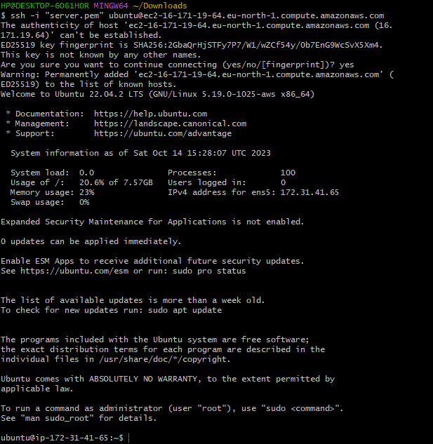
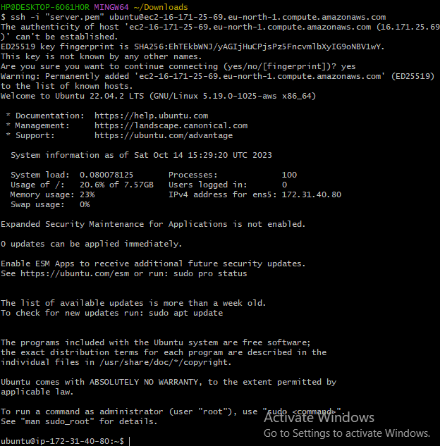
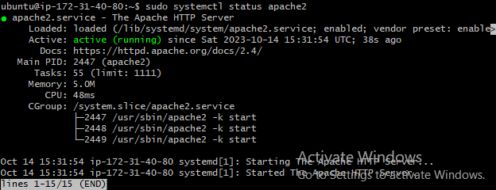
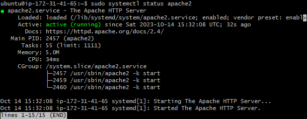
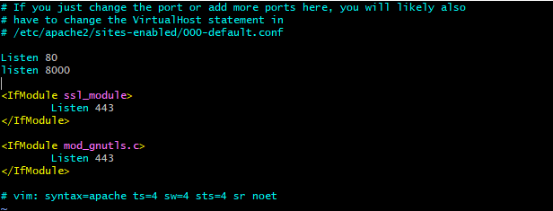
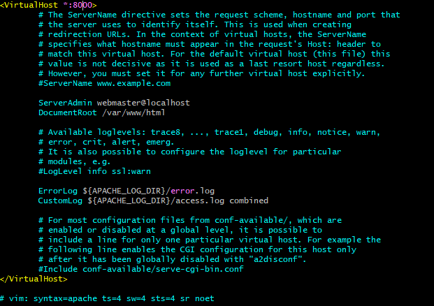
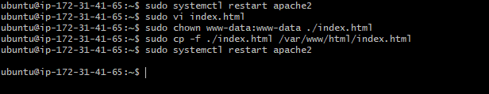
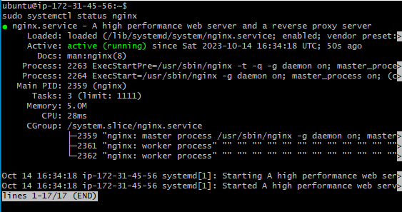
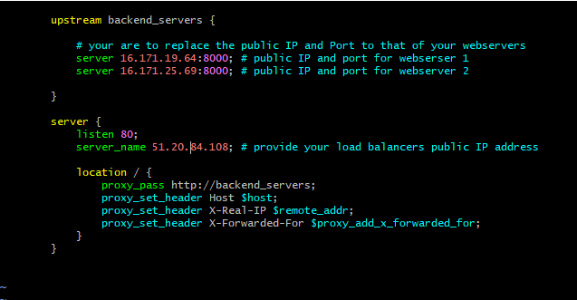

#   INTRODUCTION TO LOAD BALANCING AND NGINX

Load balancing is basically means distribution of work or tasks among several computers or servers so that no one computer gets overloaded with too much work, ensuring websites and apps work quickly and dont get too slow. Its team work for computers.

The loadbalancer stands in front of the webservers and receives request first then distributes traffic across the set of webservers. This ensures no webserver gets overworked,consistently improving system performance. 

In this project we will learn how to configure Nginx as a load balancer.

## SETTING UP A BASIC LOAD BALANCER

We are going to provision 2 EC2 instances running ubuntu 22.04 and install apache webserver in them. We will also open port 8000 to allow traffic from anywhere, and finaly update the default page of the webserver to display their public ip address.

next we will provision another EC2 instance running ubuntu 22.04, this time we will install Nginx and configure it to act as a load balancer distributing traffic across the webserver.

*Step 1:* Create 2 EC2 instances 

*Step 2:* Open port 8000, we will be running our webervers on port 8000 while the load balancer runs on port 80. to do this we add a rule to our webservers security group to open port 8000 to allow traffic from anywhere. 

*Step 3:* Install Apache webserver on our servers via our terminals using ssh as our mode of connection. as practiced in previous projects.

Then install apache with the commands below:

`sudo apt update -y &&  sudo apt install apache2 -y`

And verify its running using:

`sudo systemctl status apache2`

*Step 4:* Configure apache server to serve content on port 8000 instead of its default port 80, Then create an **index.html** file to contain code to display the public IP of the EC2 instance, and overide apache's default html file with our new file.

- Configuring apache to serve content on port 8000

  1. Using a text editor open the apache ports config file using:

  `sudo vi /etc/apache2/ports.conf `

  2. Add a new listen directive for port 8000 then save file.

  

  3. Next open the file /etc/apache2/sites-available/000-default.conf and change port;80 on the virtual host to port;8000.

  `sudo vi /etc/apache2/sites-available/000-default.conf`

  

  4. Save and close file using 

  `:wqa!`

  5. Restart apache to load the new configurationusing the command:

  `sudo systemctl restart apache2`

- Creating our new html file:

  1. Open a new **index.html** file with the command:

  `sudo vi index.html`

  2. Copy and paste the html file below, replacing the public ip of ur instance where the placeholder text for ip address in the html file.

***
          <!DOCTYPE html>
        <html>
        <head>
            <title>My EC2 Instance</title>
        </head>
        <body>
            <h1>Welcome to my EC2 instance</h1>
            
Public IP: YOUR_PUBLIC_IP

        </body>
        </html>

***

  3. Change the ownership of the index.html file with:

  `sudo chown www-data:www-data ./index.html`

  4. Replace the default html file of apache webserver using:

  `sudo cp -f ./index.html /var/www/html/index.html`

  5. Finally restart the webserver 

  `sudo systemctl restart apache2`

  

you should find a page on the browser like this:

*Step 5:* Configuring Nginx as a load balancer

 - Get a new EC2 instance running ubuntu 22.04 and open port 80 to accept traffic from anywhere.

 - SSH into ur instance from you terminal.

 - Install Nginx into the instance using:

 `sudo apt update -y && sudo apt install nginx -y`

 - Verify that nginx is running using:

 `sudo systemctl status nginx`

 

 - Open Nginx config file with the command:

 `sudo vi /etc/nginx/conf.d/loadbalancer.conf`

 - Paste the config file below to configure Nginx to act as a load balancer, Edit the file and provide info where neccessary.

 ***
         
        upstream backend_servers {

            # your are to replace the public IP and Port to that of your webservers
            server 127.0.0.1:8000; # public IP and port for webserser 1
            server 127.0.0.1:8000; # public IP and port for webserver 2

        }

        server {
            listen 80;
            server_name <your load balancer's public IP addres>; # provide your load balancers public IP address

            location / {
                proxy_pass http://backend_servers;
                proxy_set_header Host $host;
                proxy_set_header X-Real-IP $remote_addr;
                proxy_set_header X-Forwarded-For $proxy_add_x_forwarded_for;
            }
        }
    
 ***

 

  **Upstream backend_servers** Defines a group of backend servers.The **server** lines inside the upstream block list the addresses and the ports of your backend-servers. **Proxy_pass** inside the **location** block sets up the load balancing, passing the request to the backend servers.The **proxy_set_header** lines pass necessary header to the backend servers to correctly handle the request.

  - Test your configuration with the command:

  `sudo nginx -t`

  

  - Restart Nginx using:

 `sudo systemctl restart nginx`

 - Paste the public IP address of Nginx load balancer, you should see the same web pages served by the web servers

 
 

 On reloading the page you would notice that the loadbalancer toggles between servers to display its content.

 thank you.

 

