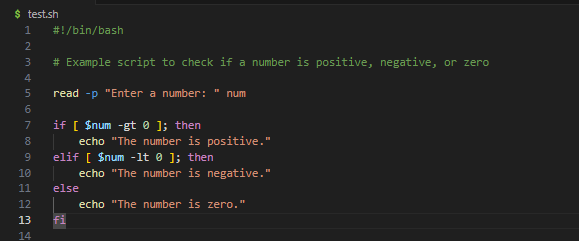
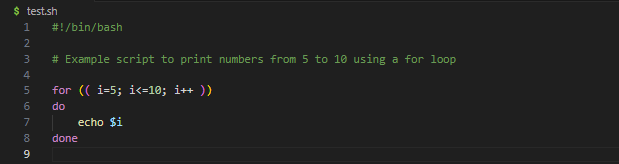
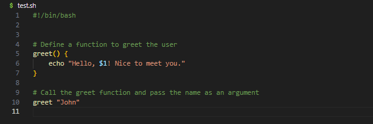
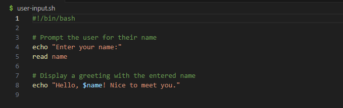
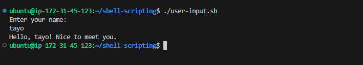
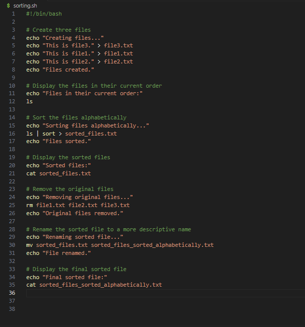
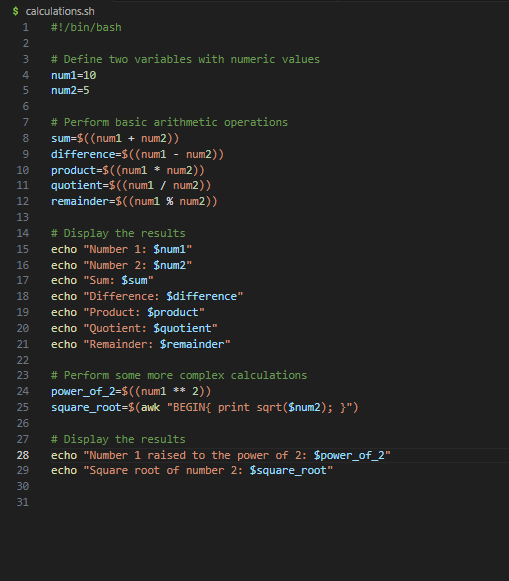
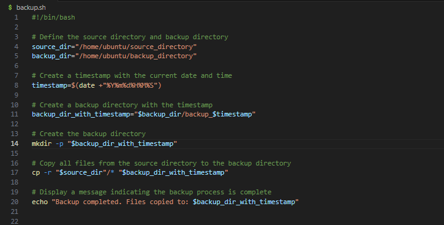

# INTRODUCTION TO SHELL SCRIPTING AND USER INPUT

Shell scripting helps to automate repititive tasks,Bash scripts are series of commands and instructions that are executed sequentially in a shell.

It has an extention `.sh`, a shell script is basically a text file with a `.sh` extention, and can be directly be executed from the command line or called from other scripts.

## SHELL SCRIPTING SYNTAX ELEMENTS
1. Variables:

Variables define work in bash scripts, they can be store various types such as numbers, strings,and arrays. the `=`sign is used to assign value to a variable, and it cn be accessed or called with the `$` sign folled by the variable name.

Example: Assigning value to a variable

`name="John" `

Example: to retrieve a variable 

`echo $name`

2. Control flow: bash provides control flow statements like if-else. for loops, while loops, and case statements to control the flow of execution in your scripts. These statements allows one to make decisions, iterate over lists, and execute different commands based on conditions.

Example: Using *if-else* to execute scripts based on a contition.

the piece of code promts you to type a number and prints a statement stating the number is positive or negative.

Example iterating through a list using a *for loop*

3. Command substsitution:
This allows you to capture the output of a command and use it as a value within your script. You can use the backtick or the `$()` syntax for the command substitution.

current_date=`date +%Y-%m-%d`

Example: Using `$()` syntax for command substitution

`current_date=$(date +%Y-%m-%d)`

4. Imput and output: Bash provides various ways to handle inout and output. read command can be used to accept user input, and echo command for output texts to the console.input and output can also be redirected using operators like >(output to a file), <(inout from a file), and | (pipe the output of one command as input to another).

Example: Accept user input

`echo "Enter your name:"`
`read name`

Example: Output texte to the terminal

`echo "Hello World"`

Example: Out the result of a command into a file

`echo "hello world" > index.txt`

Example:Pass the content of a file as input to a command

`grep "pattern" < input.txt`

Example: Pass the result of a command as input to another command

`echo "hello world" | grep "pattern"`

5. Functions: It allows you to define and use functions to group related commands together, functions provide a way to modurslize your code and make it more reusable.can be defined using the function keyword or by simply declaring the function name followed by parentheses.

## OUR FIRST SHELL SCRIPT

**Step 1:** Om our terminal open a folder called *shell-scripting* using thr command `mkdir shell-scripting`.

**Step 2:** Create a file named *user-input.sh* using: `touch user-input.sh`

**Step 3:** Inside the file write the following command

this code block prompts for your name, then displays the hello text *hello ! Nice to meet you*. Also `#!/bin/bash` helps to specify the type of bash interpreter to be used to execute the script.

**step 4:** save your file

**Step 5:** Run the command `sudo chmod +x user-input.sh` this makes the file executable.

**Step 6:** Run the script using `./user-input.sh`

## DIRECTORY MANIPULATION AND NAVIGATION

This script will display the current directory, create a new directory called 'my_directory", change to that directory, create two files inside it, list the files, move back one level up, remove the "my_directory" and its contents, and finally list the files in the current directory again.

**step 1:** opened a file called navigating-linux-filesystem.sh using touch command

`touch navigating-linux-filesystem.sh`

**step 2:** Write the comand into the file.

**step 3:** make the file executable using the chmod command

`chmod +x navigating-linux-filesystem.sh`

**step 4:** execute the file.

`./navigating-linux-filesystem.sh`

## FILE OPERATING AND SORTING

This script makes 3 files (file1.txt, file2.txt and file3.txt) displays the files in thier current order, sorts them alphabetically, saves the sorted file in sorted_files.txt, displays the sorted files, removes the original files, renames the sorted file to sorted_files_sorted_alphabetically.txt, and finally displays the contents of the sorted file.

**step 1:** create a file called sorting.sh using the touch command

`touch sorting.sh`

**Step 2:** write the code into the file.

**step 3:** make the file executable using the chmod command

`chmod +x sorting.sh`

**step 4:** execute the file.

`./sorting.sh`

## WORKING WITH NUMBERS AND CALCULATIONS

This script defines 2 variables num1 and num2 with numeric values, and performs basic arithmetic operations, it also displays the result. It also performs more complex calculations such as raising num1 tothe power of 2 and calculating the square root of num2 and displays the results also.

**step 1:** create a file called 'calculation.sh' using the touch command

`touch calculation.sh`

**step 2:** write the code into the file

**step 3:** made the file executable by changing the permission

`chmod +x calculation.sh`

**step 4:** executed the file

`./calculation.sh`

## FILE BACKUP AND TIMESTAMPING

This script defines the source directory and backup directory paths, it then creates a timestamp using the current date and time, and creates a backup directory with the timestamp appended to its name. The script then copies all files from the source directory to the backup directory using the cp command with the -r flag for recursive copying. Finally it displays a message indicating the completion of the backup process and shows the path of the backup directory with the timestamp.

**Step 1:** create a file called backup.sh using touch command

`touch backup.sh`

**step 2:** write the code into the script

**Step 3:** made the file executable by using the chmod command

`chmod +x backup.sh`

**Step 4:** execute the file

`./backup.sh`

