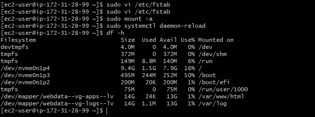

# IMPLEMENTING WORDPRESS WEBSITE WITH LOGICAL VOLUME MANAGEMENT(LVM) STORAGE MANAGEMENT

This course is tailored specifically to gain knowledge and skills needed to deploy and maintain a robust Wordpress site on the AWS cloud platform. 

This project consist of two parts:

1. Configure the storage subsytem for web and database servers based on linux OS.

2. Install wordpress and connect it to a remote Mysql database server.

## 3 TIER ARCHITECTURE

1. A laptop to serve as client

2. An EC2 linux server as a web server (this is where we install wordpress)

3. An EC2 linux server as database(DB) server.

We shall use `red hat` For this project.

## IMPLEMENTING LVM ON LINUX SERVERS (WEB AND DATABASE SERVERS)

### ***Step 1:*** Prepare a Web server 

1. Launch an EC2 instance that will serve as a "Web server". Create 3 volumes in the same AZ as your web server EC2, each of 10GIg.

2. Attach all 3 volumes one by one to your web server EC2 instance, and open the linux terminal to begin configuration.


3. `lsblk` command can be used to inspect what block devices are attached to the server, notice and take note of the device names created. Devices reside in `/dev/` directory and can be inspected with `ls /dev/`.


4. `df -h` can be used to all mounts and free space on the server.

5. `gdisk` utility creates a single partition on each of the disks.

`sudo gdisk /dev/nvme1n1`


follow the prompts and type in your required specifications for the partition you want to create. 

- Use `lsblk` to view the newly created partitions on the disks.


6. Install the `lvm2` package using:  `sudo yum install lvm2`.

run `lvmdiskscan` command to check for available partitions.


7. Use `pvcreate` utility to mark each of the 3 disks as physical volumes (PVs) to be used by LVM.

```
sudo pvcreate /dev/nvme1n1p1
sudo pvcreate /dev/nvme2n1p1
sudo pvcreate /dev/nvme3n1p1
```

8. Verify that your physical volumes have been created using `sudo pvs`


9. Use `vgcreate` utility to add all 3 PV's to a volume group (VG). name the VG webdata-vg

`sudo vgcreate webdata-vg /dev/nvme1n1p1 /dev/nvme2n1p1 /dev/nvme3n1p1`


10. Verify your VG has been created using `sudo vgs`


11. Use `lvcreate` utility to create 2 logical volumes each using half the size of the VG, named apps-lv (website data) and logs-lv (log data) respectively.

```
sudo lvcreate -n apps-lv -L 14G webdata-vg
sudo lvcreate -n logs-lv -L 14G webdata-vg
```

12. Verify the LV creation using `sudo lvs`


13. verify the entire setup

```
sudo vgdisplay -v #view complete setup - VG, PV, and LV
sudo lsblk 
```


14. Use `mkfs.ext4` to format the logical volume with the ext4 filesystem.

```
sudo mkfs -t ext4 /dev/webdata-vg/apps-lv
sudo mkfs -t ext4 /dev/webdata-vg/logs-lv
```


15. Create **/var/www/html** directory to store website files.

`sudo mkdir -p /var/www/html`

16. Create **/home/recovery/logs** directory to store backup of log data.

`sudo mkdir -p /home/recovery/logs`

17. Mount /var/www/html on apps-lv LV

`sudo mount /dev/webdata-vg/apps-lv /var/www/html/`

18. Back up existing files in the **/var/log/** directory before we mount unto the logs-lv volume, in the **/home/recovery/logs** directory created earlier using `rsync`

`sudo rsync -av /var/log/. /home/recovery/logs/`


19. Mount **/var/log/** on logs-lv LV 

`sudo mount /dev/webdata-vg/logs-lv /var/log`

20. Restore log files back to **/var/log/** directory


21. update **/etc/fstab/** file so that the mount configuration will persist after restart of the server, The UUID of the device will be used to update the **/etc/fstab/** file; 

`sudo blkid`


`sudo vi /etc/fstab/`


Update the **/etc/fstab/** in the formmat above using your own UUID and remember to remove the leading and ending quotes.

22. Test the cofiguration and reload daemon

```
sudo mount -a
sudo systemctl daemon-reload
```

23. Verify your setup by running `df -h`, output must look like this:



## INSTALLING WORDPRESS AND CONFIGURING TO USE MYSQL DATABASE

***Step 2:*** Prepare the database server

Launch a second Red Hat EC2 instance that will serve as database server and repeat all the processes as the webserver, instead of `apps-lv` create `db-lv` and mount it to `/db` directory instead.


***Step 3:*** Install Wordpress on your Web server EC2

1. Update the repository

`sudo yum -y update`

2. Install wget, Apache and its dependencies

`sudo yum -y install wget httpd php php-mysqlnd php-fpm php-json`

3. Start Apache

`sudo systemctl enable httpd`
`sudo systemctl start httpd`

4. Install PHP and its dependencies

```
sudo yum install https://dl.fedoraproject.org/pub/epel/epel-release-latest-8.noarch.rpm
sudo yum install yum-utils http://rpms.remirepo.net/enterprise/remi-release-8.rpm
sudo yum module list php
sudo yum module reset php
sudo yum module enable php:remi-7.4
sudo yum install php php-opcache php-gd php-curl php-mysqlnd
sudo systemctl start php-fpm
sudo systemctl enable php-fpm
sudo setsebool -P httpd_execmem 1
```
5. restart Apache

`sudo systemctl restart httpd`

6. Download Wordpres and copy wordpress to `/var/www/html` 

```
mkdir wordpress
cd   wordpress
sudo wget http://wordpress.org/latest.tar.gz
sudo tar xzvf latest.tar.gz
sudo rm -rf latest.tar.gz
cp wordpress/wp-config-sample.php wordpress/wp-config.php
cp -R wordpress /var/www/html/
``` 

7. Configure SElinux Polices

```
 sudo chown -R apache:apache /var/www/html/wordpress
 sudo chcon -t httpd_sys_rw_content_t /var/www/html/wordpress -R
 sudo setsebool -P httpd_can_network_connect=1
```

***Step 4:*** Install Mysql on your DB server EC2, and ensure it is running

`sudo yum update`
`sudo yum install mysql-server`

to check status:

`sudo systemctl status mysqld`

If not running restart the service and Enable it

`sudo systemctl restart mysqld`
`sudo systemctl enable mysqld`

***Step 5:*** Configure DB to work with Wordpress

```
sudo mysql
CREATE DATABASE wordpress;
CREATE USER `myuser`@`<Web-Server-Private-IP-Address>` IDENTIFIED BY 'mypass';
GRANT ALL ON wordpress.* TO 'myuser'@'<Web-Server-Private-IP-Address>';
FLUSH PRIVILEGES;
SHOW DATABASES;
exit
```


***Step 6:*** Configure Wordpress to connect to remote database.

**hint:** Dont forget to open mysql port 3306 on the database server, and for security allow access only to the private IP of your web server. this change can be made in inbound rules in your security settings of your Ec2 instance.


1. Install Mysql client and test that you can connect to your database server from your webserver using `mysql-client`

`sudo yum install mysql`
`sudo mysql -u admin -p -h <DB-Server-Private-IP-address>`


2. Verify u can successfully execute `SHOW DATABASES;` command.


3. Change permissions and configuration so Apache could use Wordpress

`sudo chmod 777 wp-config.php`


Open /var/www/html/wordpress/wp-config.php file and input configurations.


Include Database: Name, username, password,and  hostname(Server private IP) .

4. Enable TCP port 80 in inbound rules config for your web server EC2.

5. Access from your browser the link to your wordpress

`http://<web-server-public-address>/wordpress/`


If you see this message it means wordpress has successfully connected to your remote Mysql database.

Thank you.


