# AUTOMATING AWS INFRASTRUCTURE IN CODE (TERRAFORM)

Its time to automate the process of building websites using terraform.

we'll build our setup using the power of infrastructure as code (Iac).

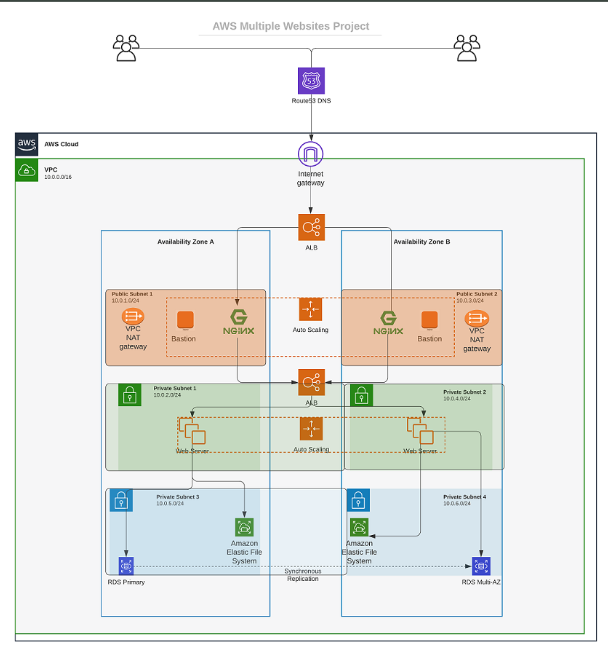

## PREREQUISITES

- Create an IAM user, name it `terraform` (ensure that the user has only programatic access to your AWS account) and grant this user `AdministratorAccess` permissions.

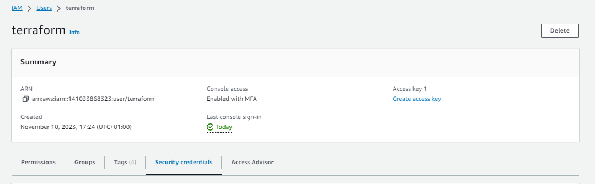

- Copy the secret access key and access key ID. Save them in a notepad temporarily.

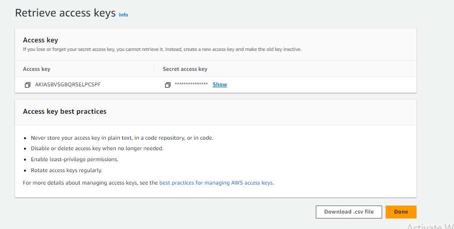

- Configure programmatic access from your workstation to connect to AWS using the access keys copied above and a Python SDK (boto3). You must have Python 3.6 or higher on your workstation. 

`pip install boto3`

For easy authentication configuration use the AWS CLI with `aws configure` command.

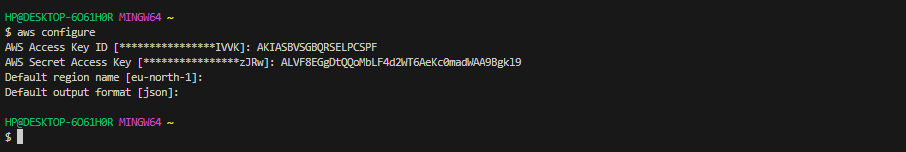

- Create an `s3` bucket to store Terraform state file.

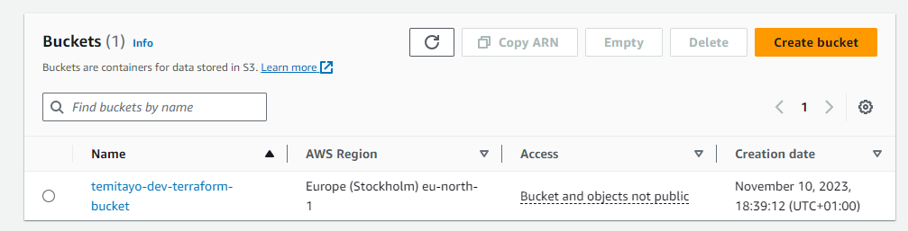

Make sure u can programmatically access AWS account by running the following command in the python enviroment.

`py`

```
import boto3
s3 = boto3.resource('s3')
for bucket in s3.buckets.all():
    print(bucket.name)
```

You shall see your previously created S3 buckect name.

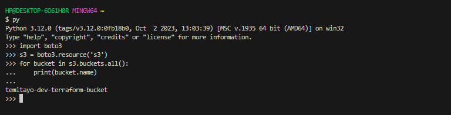

The secret recipe of writing a successful terraform code

- Your ability to understand your desired aws infrastructure end state

- Your knowledge of Terraform

- Ability to use up to date terraform documentation.

## BASE INFRASTRUCTURE AUTOMATION (VPC | SUBNETS | SECURITY GROUPS)

Let us create a directory structure

Open your Visual Studio Code and:

- Create a folder called `PBL`

- Create a file in the folder, name it `main.tf`

### PROVIDER AND VPC RESOURCE SECTION

Set up Terraform CLI as instructed below

- Add AWS as a provider, and a resource to create a VPC in the `main.tf` file.

- Provider block informs Terraform that we intend to build infrastructure within AWS.

- Resource block will create a VPC.

```
provider "aws" {
  region = "eu-north-1"
}

# Create VPC
resource "aws_vpc" "main" {
  cidr_block                     = "172.16.0.0/16"
  enable_dns_support             = "true"
  enable_dns_hostnames           = "true"
  enable_classiclink             = "false"
  enable_classiclink_dns_support = "false"
}
```

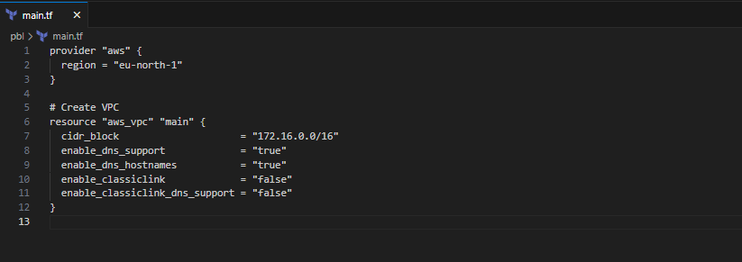

Note: You can change the configuration above to create your VPC in other region that is closer to you. The same applies to all configuration snippets that will follow.

- The next thing we need to do, is to download necessary plugins for Terraform to work. These plugins are used by `providers` and `provisioners`. At this stage, we only have provider in our `main.tf` file. So, Terraform will just download plugin for AWS provider.

- We'll use `terraform init`command as shown below.

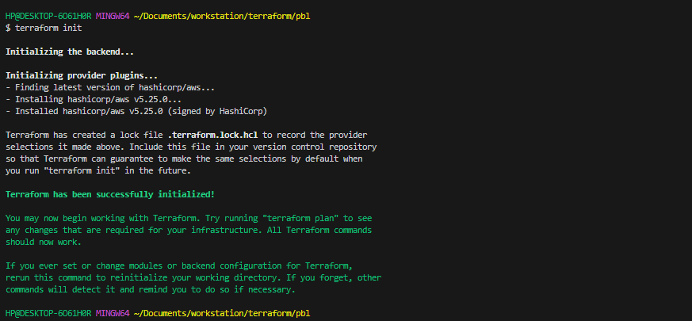

Notice that a new directory has been created: `.terraform\...`. This is where Terraform keeps plugins. Generally, it is safe to delete this folder. It just means that you must execute `terraform init` again, to download them.

- Lets create the `aws_vpc` resource, but befor then lets check what terraform intends to create before we confirm creation.

- Run `terraform plan`

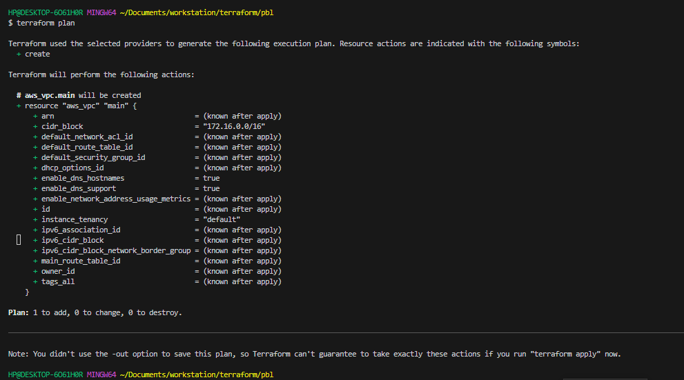

- Then, if you are happy with changes planned, execute `terraform apply`


Observation

- A file `terraform.tfstate` was created to store and log the current infrastructure state.

- `terraform.tfstate.lock.info` this helps terraform to keep track of who is running code against the infrastructure at any point in time. it gets deleted after also.


### REFACTORING BAD PRACTICE

Subnet resource section

According to our architectural design, we require 6 subnets:

- 2 public

- 2 private for webservers

- 2 private for data layer

Let us create the first 2 public subnets.

Add below configuration to the `main.tf` file:

```
# Create public subnets1
    resource "aws_subnet" "public1" {
    vpc_id                     = aws_vpc.main.id
    cidr_block                 = "172.16.0.0/24"
    map_public_ip_on_launch    = true
    availability_zone          = "eu-north-1a"

}

# Create public subnet2
    resource "aws_subnet" "public2" {
    vpc_id                     = aws_vpc.main.id
    cidr_block                 = "172.16.1.0/24"
    map_public_ip_on_launch    = true
    availability_zone          = "eu-north-1b"
}
```
- We are creating 2 subnets, therefore declaring 2 resource blocks – one for each of the subnets. 

- We are using the `vpc_id` argument to interpolate the value of the VPC `id` by setting it to `aws_vpc.main.id`. This way, Terraform knows inside which VPC to create the subnet. 

Run `terraform plan` and `terraform apply`

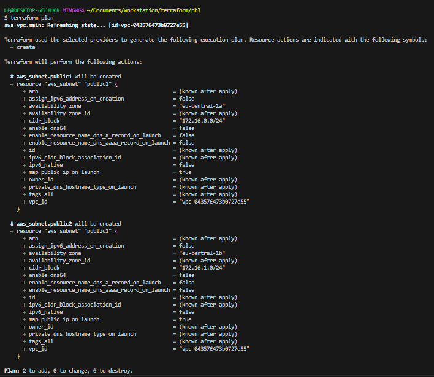

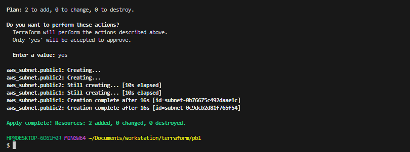

Observations:

Hard coded values: Remember our best practice hint from the beginning? Both the `availability_zone` and `cidr_block` arguments are hard coded. We should always endeavour to make our work dynamic.

Multiple Resource Blocks: Notice that we have declared multiple resource blocks for each subnet in the code. This is bad coding practice. We need to create a single resource block that can dynamically create resources without specifying multiple blocks.we will introduce a `count` argument.
 
 
Now let us improve our code by refactoring it.

First, destroy the current infrastructure. Since we are still in development, this is totally fine. Otherwise, DO NOT DESTROY an infrastructure that has been deployed to production.

To destroy whatever has been created run `terraform destroy` command, and type yes after evaluating the plan.

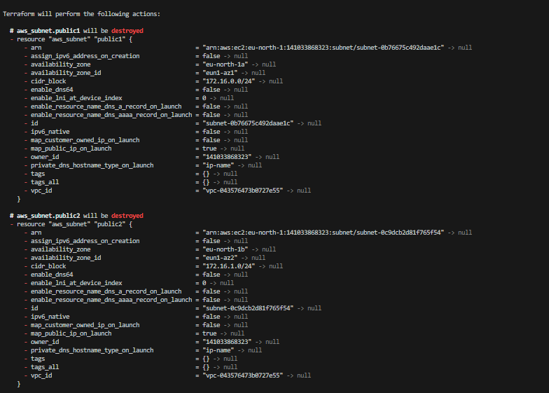
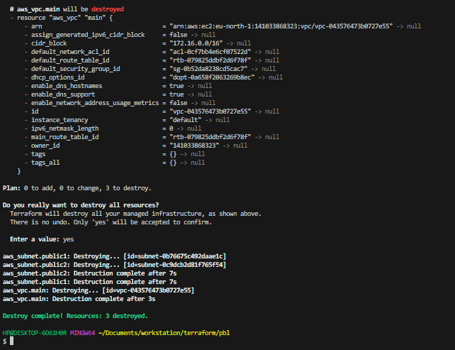

### FIXING THE PROBLEM BY CODE REFACTORING

1 Fixing hard coded values

We would introduce variables and remove hard coding

- Starting with the provider block, declare a variable named `region`, give it a default value, and update the provider section by referring to the declared variable.

```
    variable "region" {
        default = "eu-north-1"
    }

    provider "aws" {
        region = var.region
    }

```

- Do the same for the `cidr` and `vpc` block and all other arguments

```
    variable "region" {
        default = "eu-north-1"
    }

    variable "vpc_cidr" {
        default = "172.16.0.0/16"
    }

    variable "enable_dns_support" {
        default = "true"
    }

    variable "enable_dns_hostnames" {
        default ="true" 
    }

    variable "enable_classiclink" {
        default = "false"
    }

    variable "enable_classiclink_dns_support" {
        default = "false"
    }

    provider "aws" {
    region = var.region
    }

    # Create VPC
    resource "aws_vpc" "main" {
    cidr_block                     = var.vpc_cidr
    enable_dns_support             = var.enable_dns_support 
    enable_dns_hostnames           = var.enable_dns_support
    enable_classiclink             = var.enable_classiclink
    enable_classiclink_dns_support = var.enable_classiclink

    }

```

2 Fixing multiple resource blocks (loops and data sources)

Terraform has a functionality that allows us to pull data which exposes information to us. 

Let us fetch Availability zones from AWS, and replace the hard coded value in the subnet’s `availability_zone` section.

```
        # Get list of availability zones
        data "aws_availability_zones" "available" {
        state = "available"
        }
```

To use this new `data` resource, we will introduce a `count` argument in the subnet block: Something like this.

```
    # Create public subnet1
    resource "aws_subnet" "public" { 
        count                   = 2
        vpc_id                  = aws_vpc.main.id
        cidr_block              = "172.16.1.0/24"
        map_public_ip_on_launch = true
        availability_zone       = data.aws_availability_zones.available.names[count.index]

    }

```
- The `count` tells us we need 2 subnets

- the `data` resource will return a list of objects that contain a list of AZ's, internally terraform will receive the data like this

`  ["eu-north-1a", "eu-north-1b"]`

But we still have a problem. If we run Terraform with this configuration, it may succeed for the first time, but by the time it goes into the second loop, it will fail because we still have `cidr_block` hard coded. The same `cidr_block` cannot be created twice within the same VPC. So, we have a little more work to do.

### LETS MAKE THE CIDR_BLOCK DYNAMIC

We will introduce a function `cidrsubnet()` to make this happen. It accepts 3 parameters.

```
    # Create public subnet1
    resource "aws_subnet" "public" { 
        count                   = 2
        vpc_id                  = aws_vpc.main.id
        cidr_block              = cidrsubnet(var.vpc_cidr, 4 , count.index)
        map_public_ip_on_launch = true
        availability_zone       = data.aws_availability_zones.available.names[count.index]

    }

```

The parameters are cidrsubnet(prefix, newbits, netnum)

- The `prefix` must be given in cidr notation same as for vpc

- `newbits` is the number of additional bits with which to extend the prefix

- `netnum` is a whole number that can be represented as a binary integer with no more than `newbits` binary digits, which will be used to populate the additional bits added to the prefix

u can experiment on the `terraform console`, on the terminal run

`cidrsubnet("172.16.0.0/16", 4, 0)`

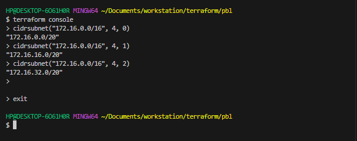

you can change the numbers to see what happens.

### REMOVING HARD CODED COUNT VALUE

We'll use the `data` resource for the AZ's and pass the resulting number to the `count`argument.

We can introuduce `length()` function, which basically determines the length of a given list, map, or string.

Since `data.aws_availability_zones.available.names` returns a list like `["eu-central-1a", "eu-central-1b", "eu-central-1c"]` we can pass it into a `lenght` function and get number of the AZs.

`lenght(["eu-north-1a", "eu-north-1b", "eu-north-1c"])`

this can also be tested on the `terraform console`

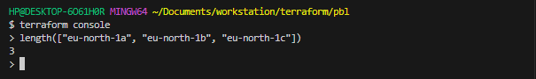

Now simply update the subnet block

```
# Create public subnet1
    resource "aws_subnet" "public" { 
        count                   = length(data.aws_availability_zones.available.names)
        vpc_id                  = aws_vpc.main.id
        cidr_block              = cidrsubnet(var.vpc_cidr, 4 , count.index)
        map_public_ip_on_launch = true
        availability_zone       = data.aws_availability_zones.available.names[count.index]

    }
```

Observations:

- What we have now, is sufficient to create the subnet resource required. But if you observe, it is not satisfying our business requirement of just 2 subnets. The length function will return number 3 to the count argument, but what we actually need is 2. 

Now, let us fix this.

- Declare a variable to store the desired number of public subnets, and set the default value

```
  variable "preferred_number_of_public_subnets" {
      default = 2
}
```

Next, update the `count` argument with a condition. Terraform needs to check first if there is a desired number of subnets. Otherwise, use the data returned by the `lenght` function. See how that is presented below.

```
# Create public subnets
resource "aws_subnet" "public" {
  count  = var.preferred_number_of_public_subnets == null ? length(data.aws_availability_zones.available.names) : var.preferred_number_of_public_subnets   
  vpc_id = aws_vpc.main.id
  cidr_block              = cidrsubnet(var.vpc_cidr, 4 , count.index)
  map_public_ip_on_launch = true
  availability_zone       = data.aws_availability_zones.available.names[count.index]

}
```

Now lets break it down:

- The first part `var.preferred_number_of_public_subnets == null` checks if the value of the variable is set to null or has some value defined.

- The second part `?` and `length(data.aws_availability_zones.available.names)` means, if the first part is true, then use this. In other words, if preferred number of public subnets is null (Or not known) then set the value to the data returned by lenght function.

- The third part `:` and `var.preferred_number_of_public_subnets` means, if the first condition is false, i.e preferred number of public subnets is not null then set the value to whatever is definied in `var.preferred_number_of_public_subnets`.

Now the entire configuration should look like this

```
# Get list of availability zones
data "aws_availability_zones" "available" {
state = "available"
}

variable "region" {
      default = "eu-north-1"
}

variable "vpc_cidr" {
    default = "172.16.0.0/16"
}

variable "enable_dns_support" {
    default = "true"
}

variable "enable_dns_hostnames" {
    default ="true" 
}

variable "enable_classiclink" {
    default = "false"
}

variable "enable_classiclink_dns_support" {
    default = "false"
}

  variable "preferred_number_of_public_subnets" {
      default = 2
}

provider "aws" {
  region = var.region
}

# Create VPC
resource "aws_vpc" "main" {
  cidr_block                     = var.vpc_cidr
  enable_dns_support             = var.enable_dns_support 
  enable_dns_hostnames           = var.enable_dns_support
  enable_classiclink             = var.enable_classiclink
  enable_classiclink_dns_support = var.enable_classiclink

}


# Create public subnets
resource "aws_subnet" "public" {
  count  = var.preferred_number_of_public_subnets == null ? length(data.aws_availability_zones.available.names) : var.preferred_number_of_public_subnets   
  vpc_id = aws_vpc.main.id
  cidr_block              = cidrsubnet(var.vpc_cidr, 4 , count.index)
  map_public_ip_on_launch = true
  availability_zone       = data.aws_availability_zones.available.names[count.index]

}

```

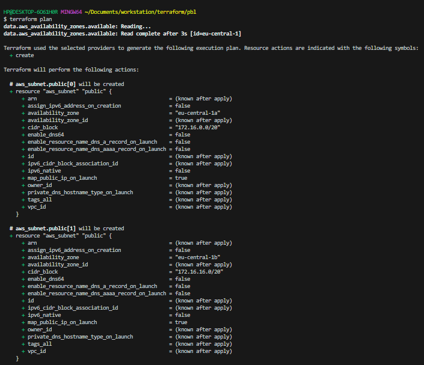

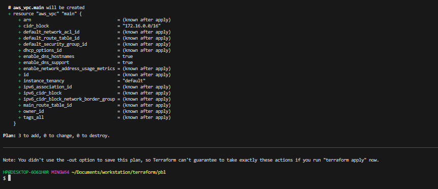

Note: You should try changing the `preferred_number_of_public_subnets` variaqble to `null` and notice how many subnets get created.

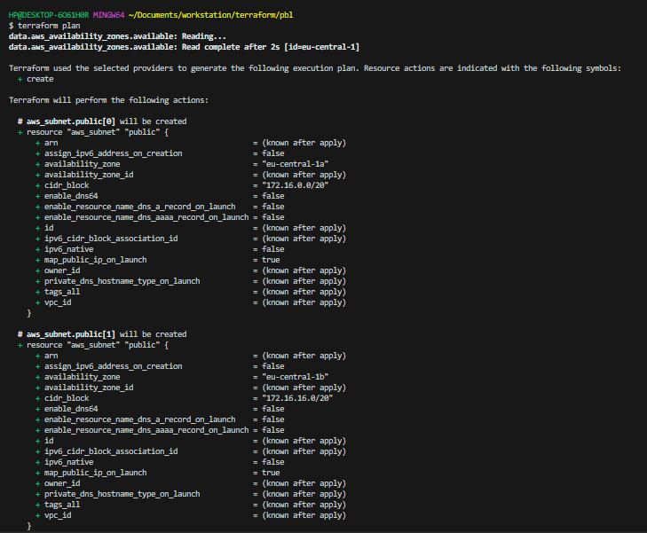

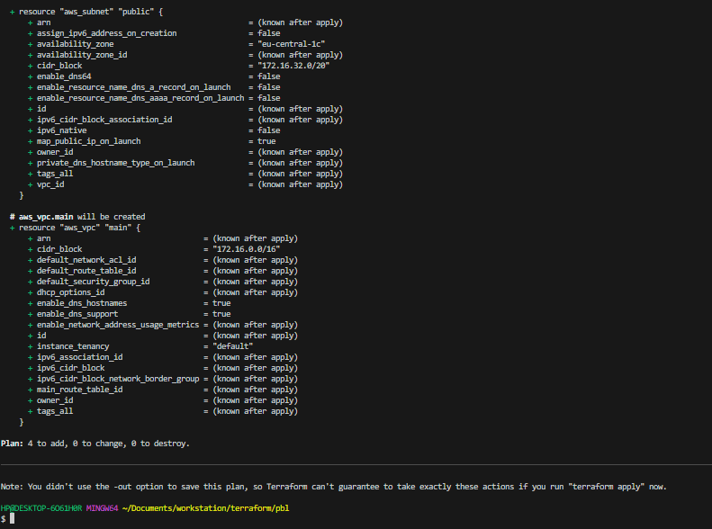

### VARIABLES AND TFVARS

Introducing variables.tf and terraform.tfvars

We can make our code a lot more readable and better structured by moving out some parts of the configuration content to other files.

- We will put all variable declarations in a separate file

- And provide non default values to each of them

1 Create a new file and name it `variables.tf`

2 Copy all the variable declarations into the new file.
`
3 Create another file, name it `terraform.tfvars`

4 Set values for each of the variables.

### Main.tf

```
# Get list of availability zones
data "aws_availability_zones" "available" {
state = "available"
}

provider "aws" {
  region = var.region
}

# Create VPC
resource "aws_vpc" "main" {
  cidr_block                     = var.vpc_cidr
  enable_dns_support             = var.enable_dns_support 
  enable_dns_hostnames           = var.enable_dns_support
  enable_classiclink             = var.enable_classiclink
  enable_classiclink_dns_support = var.enable_classiclink

}

# Create public subnets
resource "aws_subnet" "public" {
  count  = var.preferred_number_of_public_subnets == null ? length(data.aws_availability_zones.available.names) : var.preferred_number_of_public_subnets   
  vpc_id = aws_vpc.main.id
  cidr_block              = cidrsubnet(var.vpc_cidr, 4 , count.index)
  map_public_ip_on_launch = true
  availability_zone       = data.aws_availability_zones.available.names[count.index]
}
```

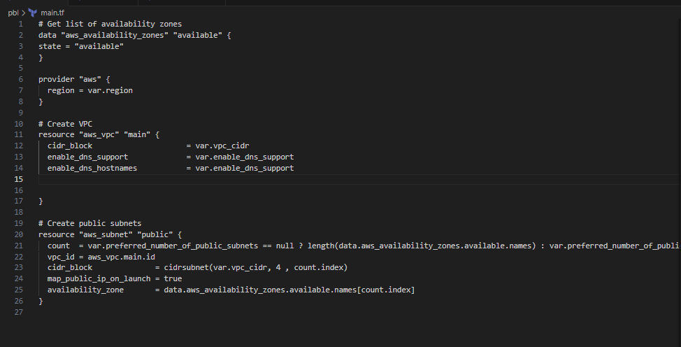

### Variables.tf

```
variable "region" {
      default = "eu-central-1"
}

variable "vpc_cidr" {
    default = "172.16.0.0/16"
}

variable "enable_dns_support" {
    default = "true"
}

variable "enable_dns_hostnames" {
    default ="true" 
}

variable "enable_classiclink" {
    default = "false"
}

variable "enable_classiclink_dns_support" {
    default = "false"
}

  variable "preferred_number_of_public_subnets" {
      default = null
}
```
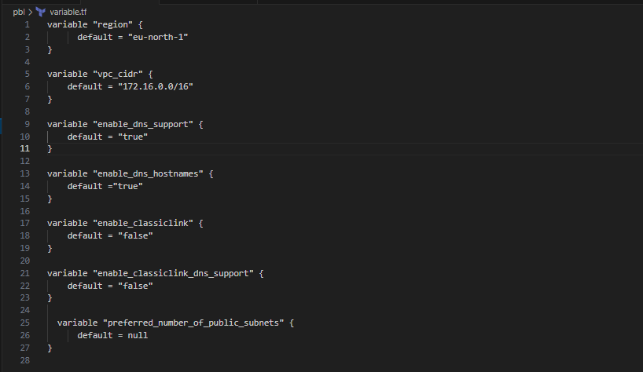

### Terraform.tfvars

```
region = "eu-central-1"

vpc_cidr = "172.16.0.0/16" 

enable_dns_support = "true" 

enable_dns_hostnames = "true"  

enable_classiclink = "false" 

enable_classiclink_dns_support = "false" 

preferred_number_of_public_subnets = 2
```

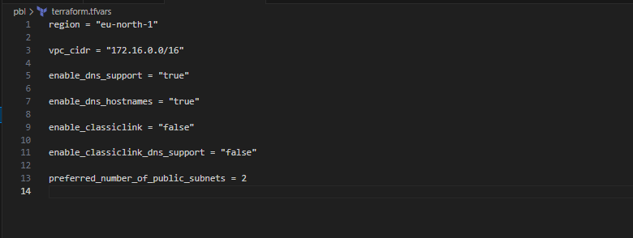

you should also have this file structure 

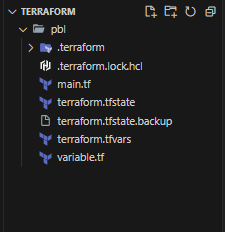

Run `terraform plan` and ensure everything works

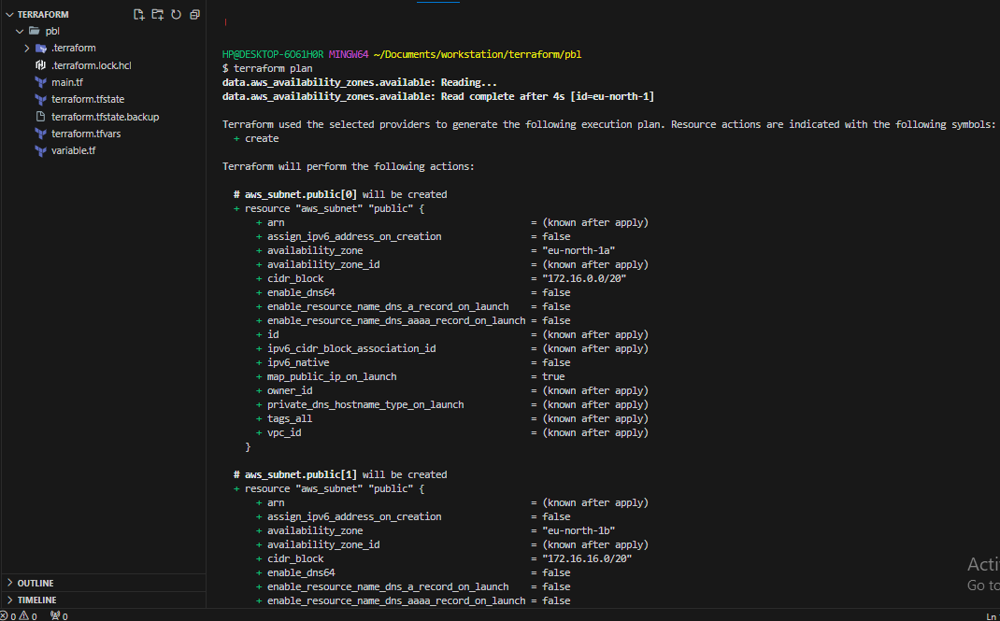

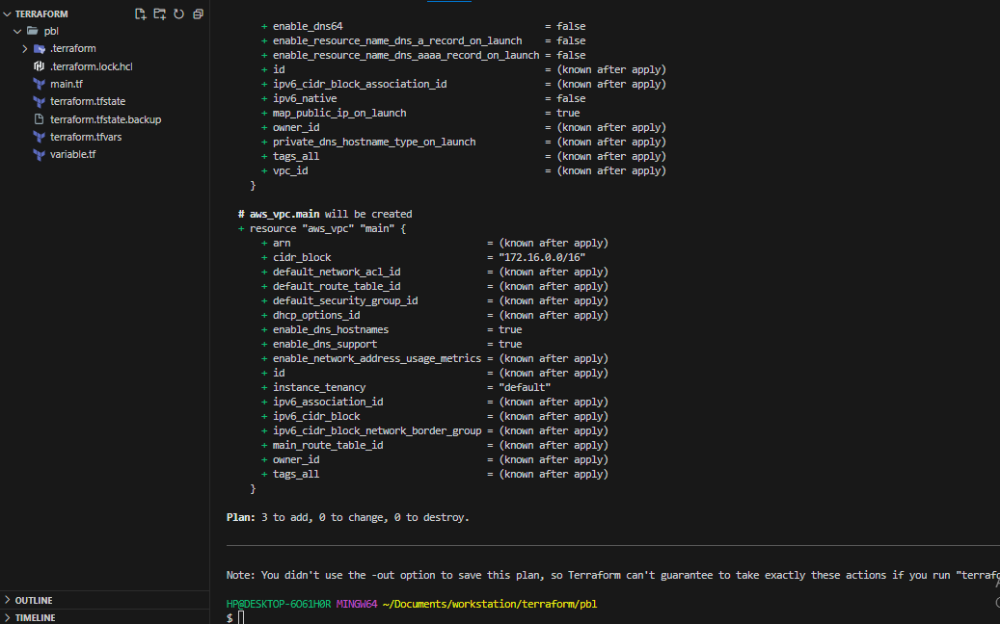

Thank you.